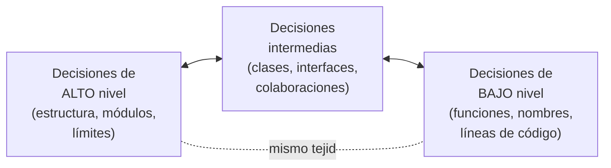

# 1. Diseño vs. Arquitectura — no son cosas distintas

## La afirmación de Uncle Bob

Existe la creencia popular de que:

- **Arquitectura** = las decisiones "grandes", de alto nivel, estructurales.
- **Diseño** = las decisiones "pequeñas", de bajo nivel, de detalle.

Robert C. Martin sostiene que **esta separación es una ilusión**. No hay una línea real que divida ambas cosas: forman un continuo. Las decisiones de alto nivel y las de bajo nivel se apoyan unas en otras y son parte del mismo tejido.

> El "diseño" de bajo nivel y la "arquitectura" de alto nivel son parte de un mismo todo. No se pueden separar de forma coherente; juntos definen la forma del sistema.

## El continuo de decisiones



No existe un punto donde puedas decir "aquí termina la arquitectura y empieza el diseño". Es como una casa:

```
   Arquitectura              Diseño
   (planos, estructura)      (acabados, cableado, tuberías)
        │                          │
        └──────────┬───────────────┘
                   ▼
        Si el detalle está mal hecho,
        la "buena estructura" no sirve de nada.
```

## La analogía de la casa

Uncle Bob usa esta imagen: cuando ves los planos de una casa (arquitectura), también ves los detalles: dónde van los enchufes, los interruptores, las luces, qué caldera se usa. Sin esos detalles, los planos no sirven para construir.

**Conclusión:** los detalles de bajo nivel y la estructura de alto nivel **son igualmente importantes** y están entrelazados. No puedes tener buena arquitectura con mal diseño de detalle, ni al revés.

## Por qué importa esta idea

| Consecuencia | Explicación |
|--------------|-------------|
| No delegues la calidad | No puedes decir "el arquitecto piensa la estructura y los juniors escriben el detalle sin cuidado". Todo suma. |
| El detalle también es arquitectura | Un nombre confuso, una función mal ubicada o un acoplamiento innecesario degradan la arquitectura tanto como una mala decisión de módulos. |
| Un solo objetivo | Como es un solo tejido, tiene un solo objetivo (ver el siguiente documento): minimizar el esfuerzo humano. |

## Punto clave para recordar

> **Diseño y arquitectura son lo mismo visto a distinta distancia.** Cambian el nivel de detalle, no la naturaleza. Cuidar uno sin el otro es engañarse.

---

Siguiente: [El objetivo de la arquitectura →](./02-objetivo-de-la-arquitectura.md)
