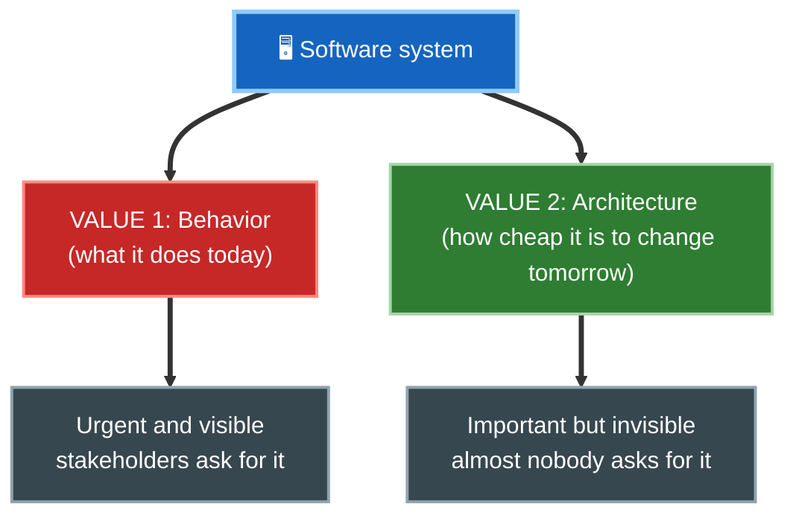
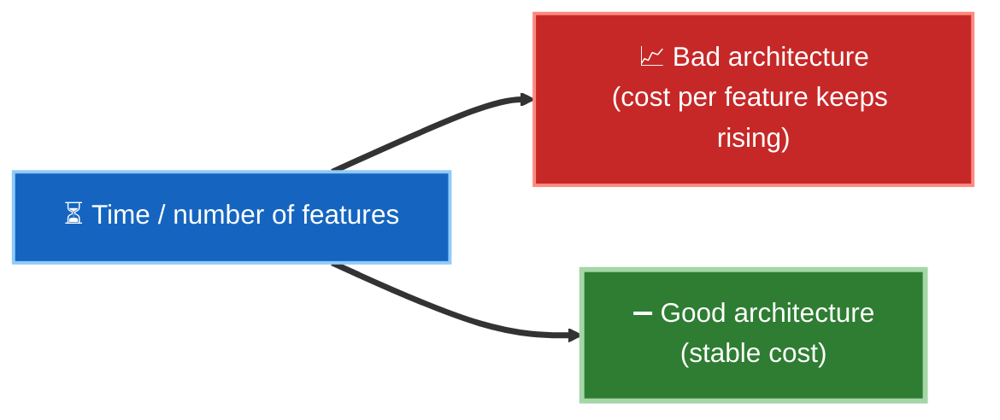
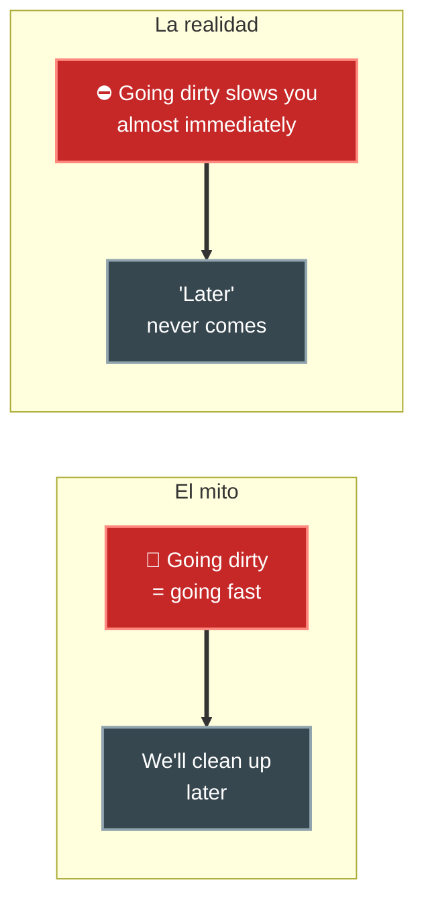

# 2. El objetivo de la arquitectura

## La definición de Uncle Bob

> **El objetivo de la arquitectura de software es minimizar los recursos humanos necesarios para construir y mantener el sistema requerido.**

Fíjate en lo que *no* dice:

- No dice "hacer el sistema más rápido".
- No dice "usar la tecnología más moderna".
- No dice "que sea elegante".

El criterio es **económico y humano**: cuánto esfuerzo (personas × tiempo × dinero) cuesta entregar el comportamiento que el negocio necesita, hoy y en el futuro.

## Comportamiento vs. costo del comportamiento

Todo sistema tiene dos valores:

La buena arquitectura ataca el **VALOR 2**: hace que el costo de cada nuevo cambio se mantenga **bajo y estable** a lo largo de la vida del sistema.

## La señal de una buena vs. mala arquitectura

La medida no es una foto de un instante, sino la **tendencia del costo por feature**:

- **Mala arquitectura:** al inicio se avanza rápido, pero el costo por cada nueva funcionalidad crece hasta que el equipo casi no puede entregar nada.
- **Buena arquitectura:** el costo por funcionalidad se mantiene plano; el sistema sigue siendo "blando" (fácil de cambiar), que es literalmente el sentido de *soft*ware.

## El error de "primero rápido, luego limpiamos"

Uncle Bob desmonta el mito de que ir sucio al principio te hace ir más rápido:

El código desordenado te ralentiza **el mismo día**, no en un futuro lejano. La única forma de ir rápido es ir bien (*the only way to go fast is to go well*).

## Resumen

| Pregunta | Respuesta de Clean Architecture |
|----------|--------------------------------|
| ¿Qué mide una buena arquitectura? | El esfuerzo humano por cada cambio a lo largo del tiempo. |
| ¿Qué valor protege? | El VALOR 2: la capacidad de cambiar barato (no solo el comportamiento de hoy). |
| ¿Ir sucio es más rápido? | No. Te frena de inmediato; ir bien es la única forma de ir rápido. |

## Punto clave para recordar

> **Una buena arquitectura mantiene bajo y constante el costo de cambiar el software.** Su métrica no es el rendimiento ni la estética, sino el esfuerzo humano en el tiempo.

---

Anterior: [← Diseño vs. Arquitectura](./01-diseno-vs-arquitectura.md) · Siguiente: [Caso de estudio: productividad →](./03-caso-de-estudio-productividad.md)
