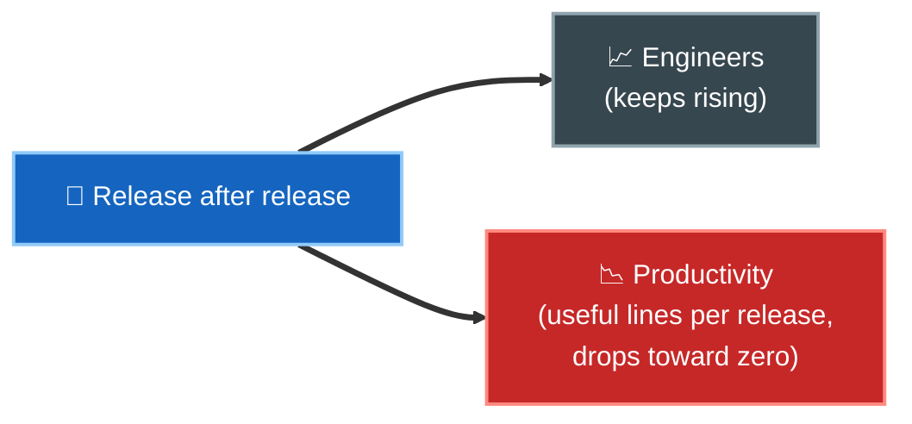
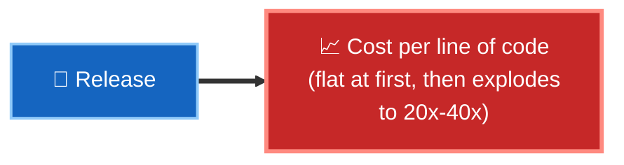
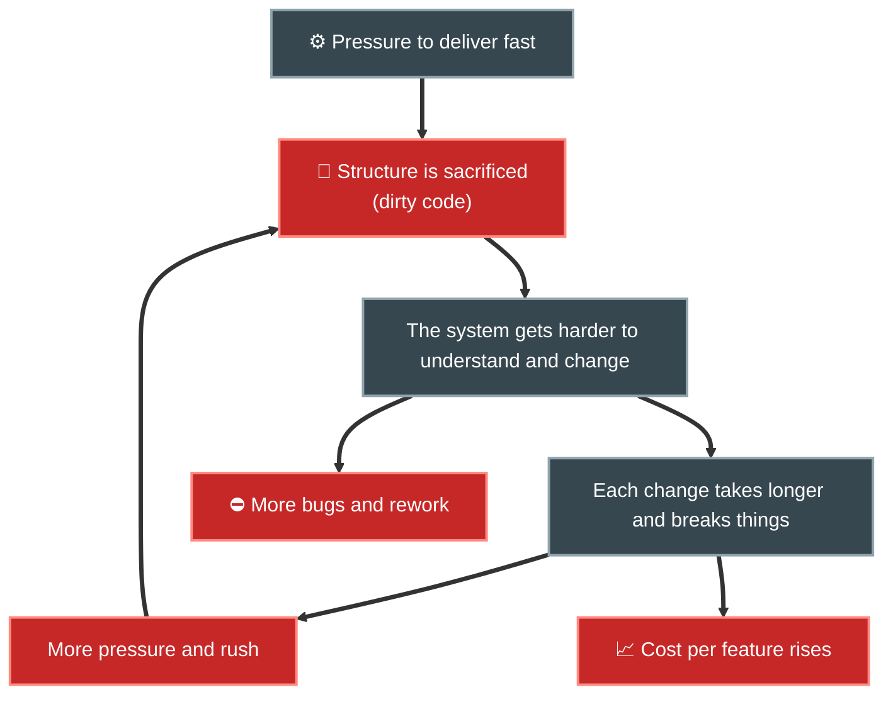

# 3. Caso de estudio: cómo el desorden frena la productividad

## El experimento mental de Uncle Bob

En el libro, Robert C. Martin presenta datos de una empresa real (anonimizada) para mostrar un patrón que se repite en muchos proyectos: **cuanto más código se acumula sin cuidar la estructura, más caro se vuelve producir cada nueva línea útil.**

## Señal 1 — El equipo crece, la productividad cae

A lo largo de sucesivas *releases*, el número de ingenieros crece de forma sostenida. Uno esperaría que más gente produjera más. Ocurre lo contrario:

Más personas, pero cada release entrega menos valor. La productividad tiende asintóticamente a cero.

## Señal 2 — El costo por línea de código se dispara

Cuando se mira el **costo por línea de código** entre releases, la curva sube de forma explosiva:

Lo que en la primera release costaba una unidad, releases más tarde puede costar 20, 40 veces más. El negocio paga cada vez más por cada vez menos.

## Por qué ocurre: la espiral del desorden

Es un **ciclo que se retroalimenta**: la prisa genera desorden, el desorden genera lentitud, la lentitud genera más prisa.

## La percepción vs. la realidad

Los desarrolladores suelen creer que podrán "recuperar el tiempo después" limpiando el código. Los datos del caso de estudio muestran que:

| Creencia | Realidad medida |
|----------|-----------------|
| "Vamos sucio ahora y limpiamos luego" | El 'luego' no llega; el costo ya subió. |
| "Reescribir desde cero lo arreglará" | El equipo nuevo repite el mismo error si no cambia la disciplina. |
| "Ir rápido justifica el desorden" | El desorden te hace ir más lento casi de inmediato. |

## La lección

> El desorden **no** es un préstamo que pagas después: es un impuesto que empiezas a pagar de inmediato y que crece con intereses.

La causa raíz no es la falta de talento ni de herramientas, sino haber tratado la arquitectura como algo secundario frente a la entrega inmediata de features.

## Punto clave para recordar

> **El costo real del código desordenado se mide en productividad perdida release tras release.** Ignorar la estructura no acelera el proyecto; lo condena a frenarse.

---

Anterior: [← El objetivo de la arquitectura](./02-objetivo-de-la-arquitectura.md) · Siguiente: [Comportamiento vs. Estructura →](./04-comportamiento-vs-estructura.md)
