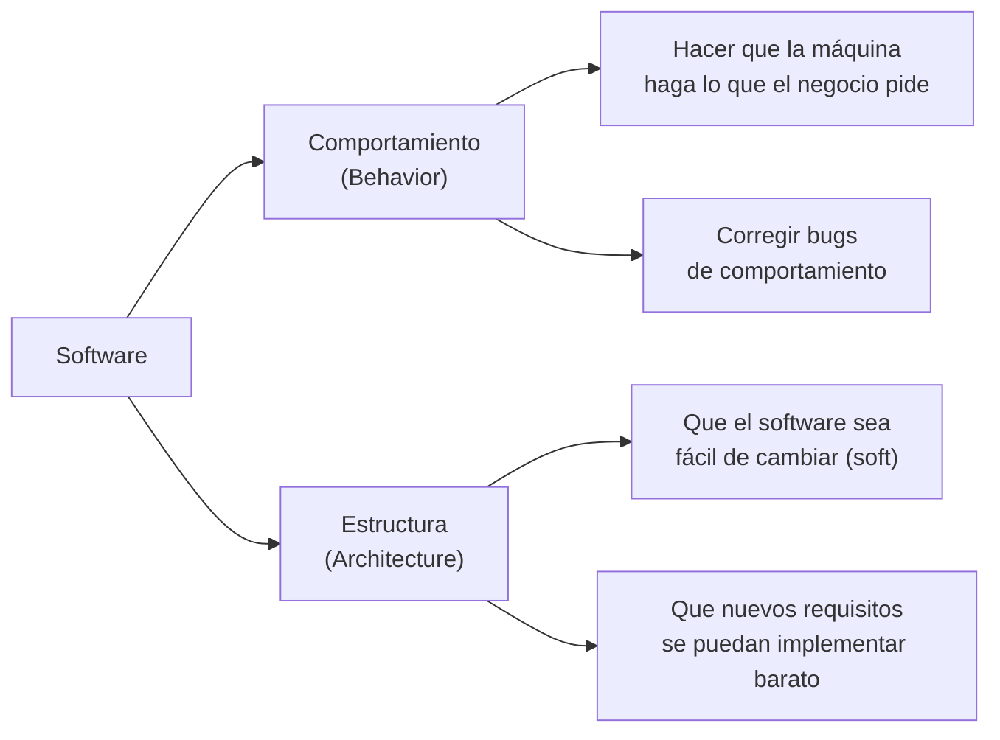
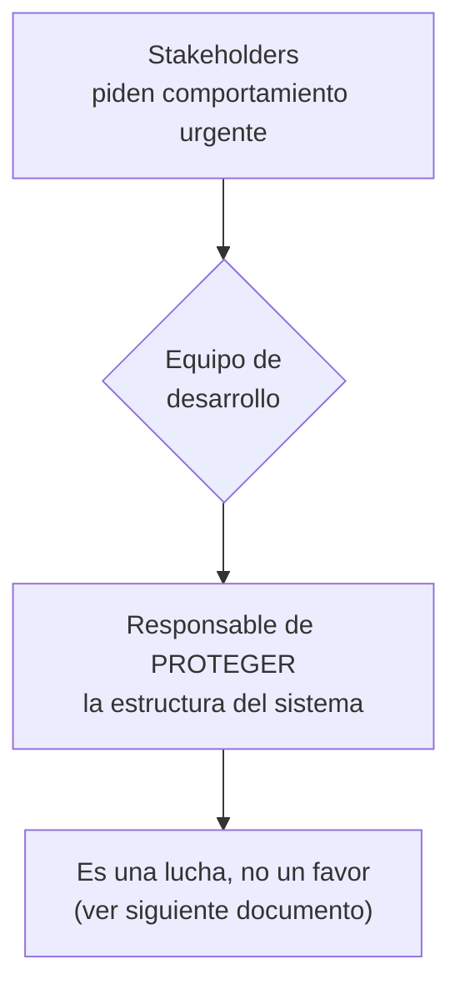

# 4. El dilema de los desarrolladores: comportamiento vs. estructura

## Los dos valores del software

Todo sistema de software aporta a sus stakeholders **dos valores distintos**:



1. **Comportamiento:** lo que el sistema hace. Es urgente, visible y lo que todos piden. "Que funcione".
2. **Estructura:** la capacidad de que el software siga siendo *blando* (fácil de cambiar). Es importante pero invisible; casi nadie lo pide de forma explícita.

## La palabra "software"

Uncle Bob juega con la etimología: *soft-ware* significa "producto blando". La razón de existir del software (frente al *hardware*) es precisamente que se puede **cambiar con facilidad**. Si un sistema es difícil de cambiar, ha traicionado su propia naturaleza.

> El valor de una funcionalidad no está solo en que funcione hoy, sino en poder **cambiarla** cuando el negocio cambie.

## La matriz de Eisenhower aplicada

Aquí aparece la trampa. El dilema se entiende con la matriz **urgente / importante**:

```
                 IMPORTANTE                 NO IMPORTANTE
              ┌───────────────────────┬───────────────────────┐
   URGENTE    │  1                    │  3                     │
              │  Comportamiento       │  Comportamiento        │
              │  crítico              │  urgente pero trivial  │
              │  (hazlo ya)           │  (parece prioridad #1) │
              ├───────────────────────┼───────────────────────┤
   NO         │  2                    │  4                     │
   URGENTE    │  ARQUITECTURA         │  Ruido                 │
              │  (importante,         │  (ignorar)             │
              │   no urgente)         │                        │
              └───────────────────────┴───────────────────────┘
```

- El **comportamiento** suele ser **urgente** pero no siempre importante.
- La **arquitectura** es **importante** pero casi nunca urgente.

El error clásico del negocio (y de muchos devs) es **elevar el cuadrante 3 (urgente pero no importante) por encima del cuadrante 2 (importante pero no urgente)**. Se atienden urgencias triviales y se abandona la arquitectura, que es lo que sostiene el proyecto a largo plazo.

## Cuál importa más

La respuesta contraintuitiva de Uncle Bob:

| Escenario | ¿Qué prefieres? |
|-----------|-----------------|
| Programa que **funciona** pero es **imposible de cambiar** | Servirá hasta que cambien los requisitos… y entonces dejará de servir. Al final: **inútil**. |
| Programa que **no funciona** pero es **fácil de cambiar** | Se puede hacer funcionar y mantenerlo funcionando. Al final: **útil**. |

> Un sistema que funciona pero no se puede cambiar quedará obsoleto en cuanto cambien los requisitos. Un sistema que se puede cambiar puede hacerse funcionar y mantenerse vivo.

Por eso, a largo plazo, **la estructura (arquitectura) tiene más valor que el comportamiento inmediato**. No porque el comportamiento no importe, sino porque la estructura es lo que permite seguir entregando comportamiento en el futuro.

## El deber del equipo de desarrollo

Los stakeholders no están capacitados para evaluar la arquitectura: solo ven el comportamiento. Por eso:



Es **responsabilidad del equipo de desarrollo** defender la arquitectura, porque son los únicos que entienden su importancia. No es traición al negocio: es proteger el activo del negocio.

## Punto clave para recordar

> **El comportamiento es urgente; la estructura es importante.** Priorizar siempre lo urgente sobre lo importante mata al sistema a mediano plazo. Un software que no se puede cambiar termina siendo inútil.

---

Anterior: [← Caso de estudio: productividad](./03-caso-de-estudio-productividad.md) · Siguiente: [La lucha por la arquitectura →](./05-la-lucha-por-la-arquitectura.md)
