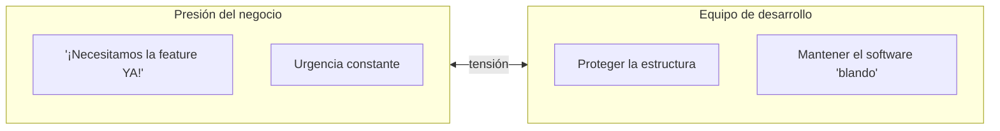
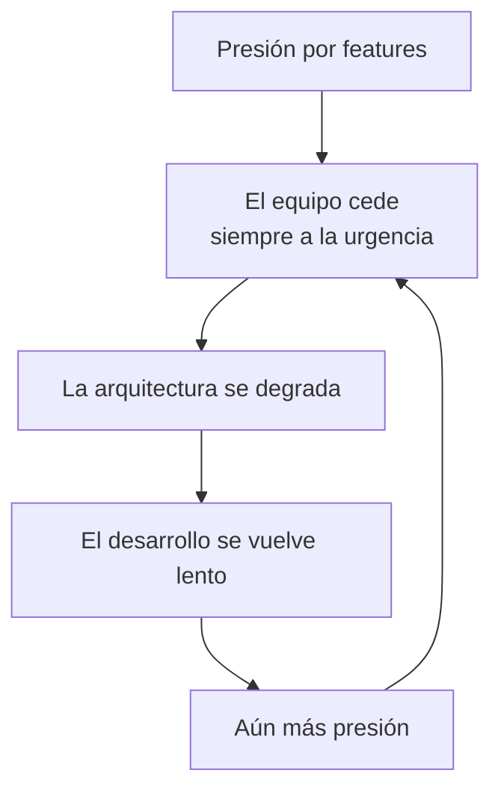
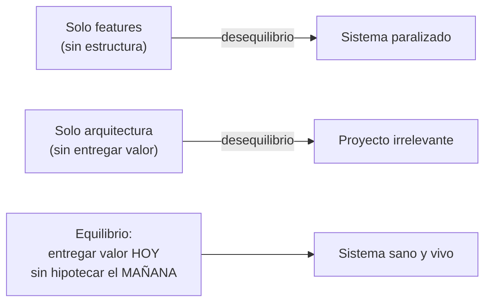
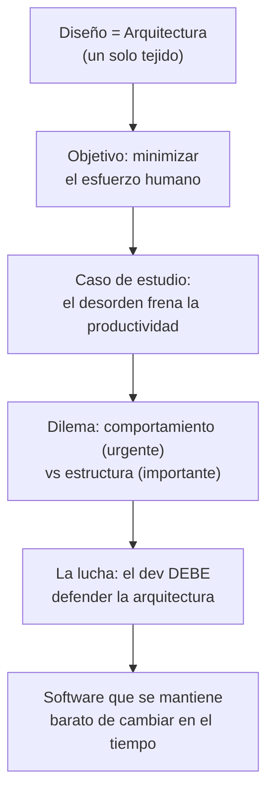

# 5. La lucha por la arquitectura frente a la presión por "sacar features"

## Por qué es una lucha

Defender la arquitectura no es una tarea pacífica: es un **conflicto permanente** entre dos fuerzas dentro de la organización.



El negocio empuja por **comportamiento urgente**; el equipo debe empujar por **estructura sostenible**. Si una fuerza gana siempre, el sistema pierde.

## El error del equipo pasivo

Muchos equipos ceden por completo a la presión de features:



Este ciclo (el mismo del caso de estudio) termina con un sistema paralizado. Al ceder "para ayudar al negocio", el equipo en realidad **daña al negocio** a mediano plazo.

## La postura correcta: defender la estructura

Uncle Bob es enfático: **el equipo de desarrollo debe luchar por la arquitectura como lo hace por cualquier otro requisito.**

Analogías que usa el libro:

| Rol | Comportamiento esperado |
|-----|-------------------------|
| Equipo de gestión | Lucha por el cronograma y el presupuesto. |
| Equipo de marketing | Lucha por sus objetivos de mercado. |
| Equipo de operaciones | Lucha por la estabilidad y la operación. |
| **Equipo de desarrollo** | **Debe luchar por la arquitectura con la misma firmeza.** |

> Si eres desarrollador de software, **tú** eres un stakeholder. Tienes que luchar por lo que sabes que el sistema necesita para sobrevivir. Ese es tu rol y tu deber.

## No es una cuestión de "pedir permiso"

La arquitectura no debe negociarse como si fuera un lujo opcional. Es parte del trabajo, igual que la seguridad o la corrección:

```
   ❌ "¿Nos dan tiempo para hacer buena arquitectura?"
   ✅ La buena arquitectura es parte de hacer el trabajo bien,
      no un extra que se pide aparte.
```

Un cirujano no pide permiso para lavarse las manos; forma parte de operar bien. Del mismo modo, la estructura sana es parte de programar bien.

## El equilibrio, no el extremo

Defender la arquitectura **no** significa ignorar al negocio ni caer en el *gold plating* (sobre-ingeniería). Significa mantener la tensión sana:



El objetivo es entregar el comportamiento que el negocio necesita **sin** destruir la capacidad de cambiar el sistema en el futuro.

## Resumen del tópico completo



## Punto clave para recordar

> **La arquitectura no se regala: se defiende.** El equipo de desarrollo es un stakeholder más y su deber es luchar por la estructura del sistema con la misma firmeza con que otros luchan por sus objetivos, buscando el equilibrio entre entregar hoy y poder cambiar mañana.

---

Anterior: [← Comportamiento vs. Estructura](./04-comportamiento-vs-estructura.md) · Volver al [índice del tópico](./README.md)
