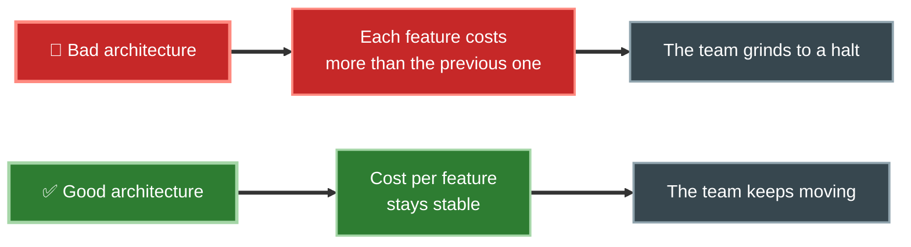

# Tópico 1 — Introducción y visión general

> Primer bloque de la guía sobre **Clean Architecture** de Robert C. Martin (Uncle Bob).
> Aquí se establece el *para qué* de la arquitectura antes de entrar en principios y patrones.

## Idea central del tópico

Antes de hablar de círculos, capas, SOLID o boundaries, Uncle Bob dedica el primer bloque del libro a responder una pregunta fundamental:

> **¿Por qué molestarse en tener una buena arquitectura?**

La respuesta corta: porque el objetivo de la arquitectura de software es **minimizar el esfuerzo humano necesario para construir y mantener el sistema**. Todo lo demás (patrones, principios, diagramas) son medios para ese fin.

## Documentos de este tópico

| # | Documento | Punto que cubre |
|---|-----------|-----------------|
| 1 | [01-diseno-vs-arquitectura.md](./01-diseno-vs-arquitectura.md) | Qué es diseño y qué es arquitectura (no son cosas distintas) |
| 2 | [02-objetivo-de-la-arquitectura.md](./02-objetivo-de-la-arquitectura.md) | El objetivo: minimizar el costo de recursos humanos por comportamiento |
| 3 | [03-caso-de-estudio-productividad.md](./03-caso-de-estudio-productividad.md) | Cómo el desorden arquitectónico frena la productividad |
| 4 | [04-comportamiento-vs-estructura.md](./04-comportamiento-vs-estructura.md) | El dilema de los desarrolladores: comportamiento vs. estructura |
| 5 | [05-la-lucha-por-la-arquitectura.md](./05-la-lucha-por-la-arquitectura.md) | Arquitectura frente a la presión por "sacar features" |

## Diagrama del tópico

```mermaid
flowchart TD
    ROOT["🧠 Introducción<br/>y visión general"]

    ROOT ==> A["Diseño = Arquitectura"]
    A ==> A1["Mismo objetivo"]
    A ==> A2["Solo cambia el nivel de detalle"]

    ROOT ==> B["Objetivo"]
    B ==> B1["Minimizar esfuerzo humano"]
    B ==> B2["Bajo costo por comportamiento"]

    ROOT ==> C["Caso de estudio"]
    C ==> C1["Productividad cae con el desorden"]
    C ==> C2["Costo por línea sube"]

    ROOT ==> D["Comportamiento vs Estructura"]
    D ==> D1["Urgente vs Importante"]
    D ==> D2["'Funciona' no basta"]

    ROOT ==> E["La lucha"]
    E ==> E1["Devs vs Managers"]
    E ==> E2["Defender la estructura"]

    style ROOT fill:#2e7d32,stroke:#a5d6a7,color:#fff,stroke-width:3px
    style A fill:#1565c0,stroke:#90caf9,color:#fff,stroke-width:2px
    style B fill:#1565c0,stroke:#90caf9,color:#fff,stroke-width:2px
    style C fill:#1565c0,stroke:#90caf9,color:#fff,stroke-width:2px
    style D fill:#1565c0,stroke:#90caf9,color:#fff,stroke-width:2px
    style E fill:#1565c0,stroke:#90caf9,color:#fff,stroke-width:2px
    style A1 fill:#37474f,stroke:#90a4ae,color:#fff,stroke-width:2px
    style A2 fill:#37474f,stroke:#90a4ae,color:#fff,stroke-width:2px
    style B1 fill:#37474f,stroke:#90a4ae,color:#fff,stroke-width:2px
    style B2 fill:#37474f,stroke:#90a4ae,color:#fff,stroke-width:2px
    style C1 fill:#37474f,stroke:#90a4ae,color:#fff,stroke-width:2px
    style C2 fill:#37474f,stroke:#90a4ae,color:#fff,stroke-width:2px
    style D1 fill:#37474f,stroke:#90a4ae,color:#fff,stroke-width:2px
    style D2 fill:#37474f,stroke:#90a4ae,color:#fff,stroke-width:2px
    style E1 fill:#37474f,stroke:#90a4ae,color:#fff,stroke-width:2px
    style E2 fill:#37474f,stroke:#90a4ae,color:#fff,stroke-width:2px
```

## Cómo leer este tópico

1. Empieza por **Diseño vs Arquitectura** para desarmar el falso dualismo entre ambos términos.
2. Continúa con **El objetivo de la arquitectura** para fijar el criterio con el que se juzga todo lo demás.
3. Los tres documentos restantes son el argumento económico y político: por qué descuidar la estructura sale caro y cómo defenderla.

## Referencia

- Robert C. Martin, *Clean Architecture: A Craftsman's Guide to Software Structure and Design*, Prentice Hall, 2017 — Parte I ("Introduction") y capítulos iniciales.
