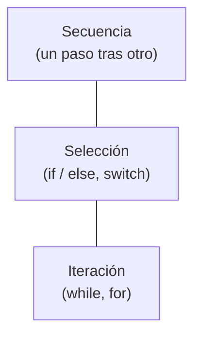
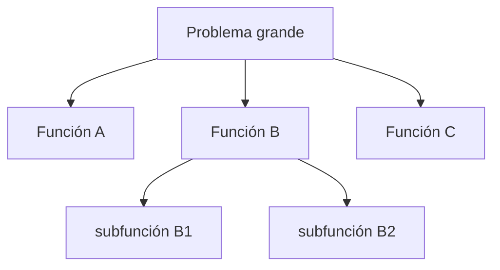

# 1. Programación estructurada

## Qué restringe

> **La programación estructurada impone disciplina sobre la transferencia directa de control.**

En términos prácticos: **elimina el `goto`** y lo reemplaza por tres estructuras de control disciplinadas.

## El descubrimiento de Dijkstra

Edsger Dijkstra demostró que cualquier programa puede construirse con solo **tres estructuras**, sin saltos arbitrarios:



El `goto` permitía saltar a cualquier parte del código, creando "código spaghetti" imposible de razonar. Al prohibirlo, cada bloque tiene una entrada y una salida claras.

```
   Con goto (caos)                Estructurada (orden)
   ┌───┐                          ┌───────────┐
   │   │──┐   ┌──►┌───┐           │ entrada   │
   └───┘  │   │   │   │           ├───────────┤
   ┌───┐◄─┘   │   └───┘           │  bloque   │
   │   │──────┘                   ├───────────┤
   └───┘  saltos cruzados         │  salida   │
                                  └───────────┘
                                  1 entrada, 1 salida
```

## Por qué importa: descomposición y prueba

La disciplina estructurada permite **descomponer** un problema grande en funciones más pequeñas, cada una razonable por separado:



## La conexión con la ciencia y las pruebas

Uncle Bob subraya un punto profundo: **no se puede probar que un programa es correcto, solo se puede probar que es incorrecto** (falsación, como en la ciencia).

| Idea | Explicación |
|------|-------------|
| No hay prueba matemática de corrección | Como en física, las pruebas no "demuestran" corrección; buscan fallos. |
| Los tests muestran presencia de bugs | Un test que pasa no garantiza ausencia de errores, solo que no encontró ese. |
| La estructura hace testeable el código | Bloques con entrada/salida claras son unidades falsables (probables por tests). |

> La programación estructurada nos da unidades de código que pueden **falsarse** mediante pruebas. Esa testeabilidad es la base para confiar en el software.

## Relevancia arquitectónica

La descomposición funcional disciplinada es lo que permite dividir un sistema en módulos y componentes comprobables. Sin ella, no habría forma de razonar sobre las piezas de una arquitectura.

## Punto clave para recordar

> **La programación estructurada quita el `goto` y a cambio da bloques comprobables.** Es la base para razonar, descomponer y testear el software.

---

Siguiente: [Programación orientada a objetos →](./02-programacion-orientada-a-objetos.md)
