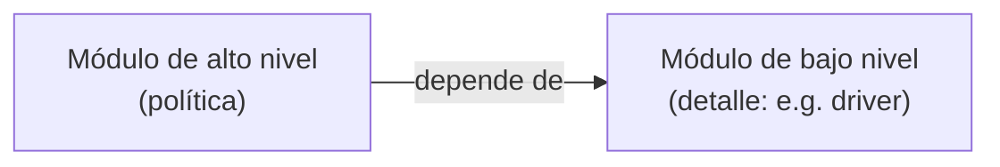
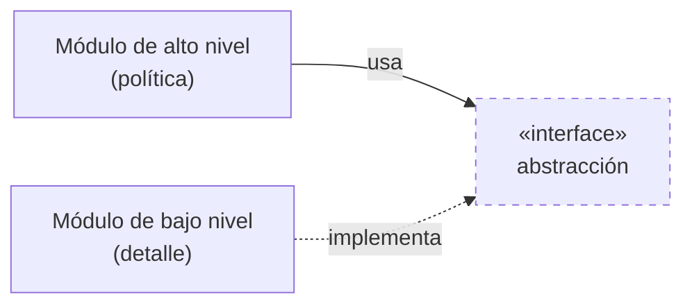
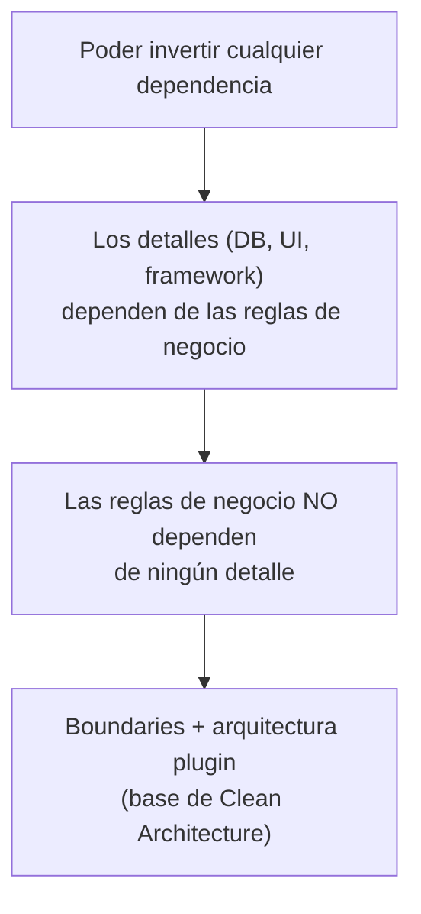

# 2. Programación orientada a objetos

## Qué restringe

> **La OO impone disciplina sobre la transferencia indirecta de control** (los punteros a función).

El polimorfismo, bajo el capó, se implementa con punteros a función. La OO nos da una forma **segura y disciplinada** de usar ese mecanismo, en lugar de manipular punteros a mano (peligroso y propenso a errores).

## Qué NO es la OO (según Uncle Bob)

Martin descarta las definiciones populares:

| Definición popular | Por qué no basta |
|--------------------|------------------|
| "Encapsulación" | C ya encapsulaba con `.h`/`.c`; la OO incluso la debilita. |
| "Herencia" | Se podía simular en C antes de la OO. |
| "Es modelar el mundo real" | Vago y no distingue a la OO de nada. |

Lo que **sí** define a la OO de forma distintiva es el **polimorfismo seguro**.

## El verdadero poder: inversión de dependencias

El polimorfismo permite invertir la dirección de una dependencia respecto al flujo de control. Este es el aporte arquitectónico decisivo.

### Sin inversión (flujo y dependencia van juntos)



El alto nivel queda atado al detalle. Cambiar el detalle obliga a recompilar y redeployar el alto nivel.

### Con inversión (una interfaz invierte la flecha)



Ahora el detalle **depende** de la abstracción, y el flujo de control (alto → bajo) va en dirección **opuesta** a la dependencia de código (bajo → abstracción ← alto).

```
   Flujo de control:   Alto nivel ─────────►  Bajo nivel
   Dependencia código: Alto nivel ─►(interfaz)◄───── Bajo nivel
                                    (¡invertida!)
```

## Por qué esto es la clave de la arquitectura

Con inversión de dependencias puedes decidir **qué depende de qué**, sin importar quién llama a quién. Eso permite:



Esto habilita el **despliegue y desarrollo independiente**: puedes compilar y desplegar los componentes de bajo nivel por separado de las políticas de negocio.

## Punto clave para recordar

> **La OO es polimorfismo seguro, y su regalo a la arquitectura es la inversión de dependencias.** Gracias a ella, los detalles pueden depender de las reglas de negocio y no al revés.

---

Anterior: [← Programación estructurada](./01-programacion-estructurada.md) · Siguiente: [Programación funcional →](./03-programacion-funcional.md)
