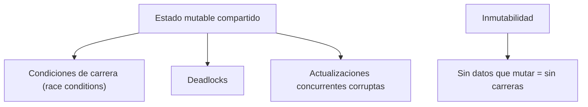
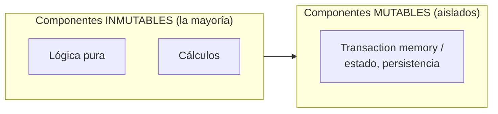

# 3. Programación funcional

## Qué restringe

> **La programación funcional impone disciplina sobre la asignación de variables.**

En su forma pura, **las variables no se mutan**: una vez asignado un valor, no cambia. No hay reasignación, no hay estado mutable.

```
   Imperativo (mutable)          Funcional (inmutable)
   x = 1                         let x = 1
   x = x + 1   ← muta x          let y = x + 1   ← nuevo valor, x intacto
```

## Por qué la inmutabilidad importa en arquitectura

Todos los problemas de concurrencia nacen del **estado mutable compartido**:



> Si nada muta, no hay condiciones de carrera, ni problemas de actualización concurrente, ni deadlocks. La inmutabilidad **elimina la causa raíz** de los bugs de concurrencia.

## El problema práctico: no todo puede ser inmutable

Un sistema real necesita cambiar de estado en algún punto (guardar datos, responder al usuario). La solución arquitectónica es **segregar** el estado mutable:



Se empuja la mutación hacia **componentes pequeños y bien delimitados**, protegidos (por ejemplo, con memoria transaccional), mientras el grueso del sistema permanece inmutable.

## Event Sourcing: llevar la idea al extremo

Una estrategia asociada es **no almacenar el estado, sino los eventos** que lo producen:

```
   Enfoque tradicional              Event Sourcing
   ┌──────────────┐                 ┌──────────────────────────┐
   │ saldo = 100  │  ← se sobre-    │ +100, -30, +50, ...       │
   │ (se muta)    │    escribe      │ (solo se agregan eventos) │
   └──────────────┘                 └──────────────────────────┘
                                     saldo = suma de eventos
```

Si solo **agregas** eventos y nunca borras ni actualizas, no hay mutación. El estado actual se **calcula** reproduciendo los eventos. Con suficiente almacenamiento y potencia, aplicaciones enteras pueden ser funcionales.

## Punto clave para recordar

> **La programación funcional quita la asignación y a cambio da robustez frente a la concurrencia.** La arquitectura sana aísla el estado mutable en componentes pequeños y mantiene inmutable todo lo demás.

---

Anterior: [← Programación orientada a objetos](./02-programacion-orientada-a-objetos.md) · Siguiente: [Por qué quitan capacidades →](./04-por-que-quitan-capacidades.md)
