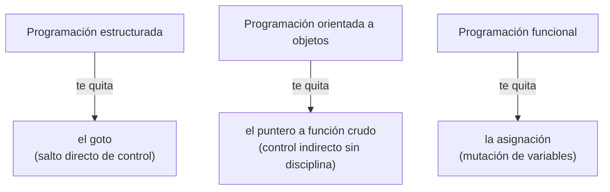
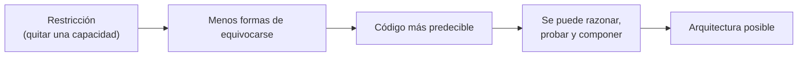
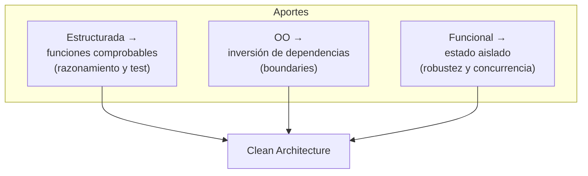

# 4. Por qué los paradigmas *quitan* capacidades

## La observación central de Uncle Bob

Cada uno de los tres paradigmas se define por lo que **prohíbe**, no por lo que habilita:



> Cada paradigma **le quita** algo al programador. Ninguno agrega una capacidad nueva; todos imponen una restricción sobre cómo se escribe el código.

## Las tres transferencias de control

No es casualidad que sean exactamente tres. Corresponden a las tres formas de transferir control en un programa:

| Forma de transferir control | Paradigma que la disciplina |
|-----------------------------|-----------------------------|
| Directa (salto/goto) | Estructurada |
| Indirecta (puntero a función) | Orientada a objetos |
| Asignación / variables | Funcional |

```
   1969  Estructurada  ─► disciplina el salto directo
   1966  OO            ─► disciplina el salto indirecto
   1958  Funcional     ─► disciplina la asignación
   (los tres se descubrieron en un lapso corto; no habrá un cuarto)
```

Como no quedan más mecanismos de transferencia de control por restringir, Martin argumenta que **no habrá un cuarto paradigma**.

## Por qué quitar impone orden

Restringir lo que un programador *puede* hacer reduce el espacio de errores y hace el código más razonable:



La libertad total (por ejemplo, `goto` a cualquier parte, mutar cualquier variable, saltar por punteros sin control) produce caos. La disciplina produce estructura.

## El aporte de cada uno a la arquitectura



- La **estructurada** hace posible descomponer y probar el sistema.
- La **OO** hace posible dibujar boundaries e invertir dependencias.
- La **funcional** hace posible gestionar el estado y la concurrencia con seguridad.

Los tres, juntos, son las herramientas con las que se construye una arquitectura limpia.

## Punto clave para recordar

> **Los paradigmas no te dan poderes: te quitan hábitos peligrosos.** Esa disciplina es precisamente lo que hace posible razonar sobre el software y construir arquitectura.

---

Anterior: [← Programación funcional](./03-programacion-funcional.md) · Volver al [índice del tópico](./README.md)
