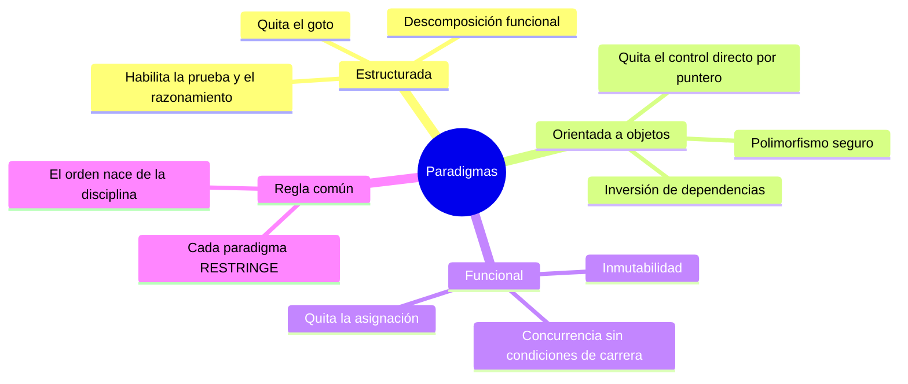

# Tópico 2 — Paradigmas de programación

> Segundo bloque de la guía sobre **Clean Architecture** de Robert C. Martin.
> Los paradigmas son los bloques con los que se construye todo lo demás.

## Idea central del tópico

Un **paradigma de programación** es una forma de programar, más o menos independiente del lenguaje. Uncle Bob observa algo contraintuitivo:

> Cada paradigma **quita** capacidades al programador, no las agrega. Le dice qué **no** debe hacer.

Solo existen tres paradigmas y, según Martin, no habrá más porque cada uno elimina una de las tres formas de transferir el control:

```
   Programación estructurada  ─►  restringe el salto directo (goto)
   Programación orientada a O. ─►  restringe el puntero a función (control indirecto)
   Programación funcional      ─►  restringe la asignación (mutación de variables)
```

Cada restricción, lejos de limitar, **impone orden** y habilita la arquitectura.

## Documentos de este tópico

| # | Documento | Punto que cubre |
|---|-----------|-----------------|
| 1 | [01-programacion-estructurada.md](./01-programacion-estructurada.md) | Disciplina sobre la transferencia directa de control (eliminar `goto`) |
| 2 | [02-programacion-orientada-a-objetos.md](./02-programacion-orientada-a-objetos.md) | Disciplina sobre el control indirecto (polimorfismo) e inversión de dependencias |
| 3 | [03-programacion-funcional.md](./03-programacion-funcional.md) | Disciplina sobre la asignación (inmutabilidad) |
| 4 | [04-por-que-quitan-capacidades.md](./04-por-que-quitan-capacidades.md) | Por qué cada paradigma quita en vez de agregar, y cómo eso impone orden |

## Diagrama del tópico



## Relación con la arquitectura

Los tres paradigmas aportan cada uno una herramienta clave para la arquitectura:

- **Estructurada** → base del razonamiento y de los algoritmos comprobables.
- **OO** → la **inversión de dependencias**, motor de los boundaries de Clean Architecture.
- **Funcional** → la separación de estado mutable, clave para la robustez y la concurrencia.

## Referencia

- Robert C. Martin, *Clean Architecture*, Prentice Hall, 2017 — Parte II ("Starting with the Bricks: Programming Paradigms").
