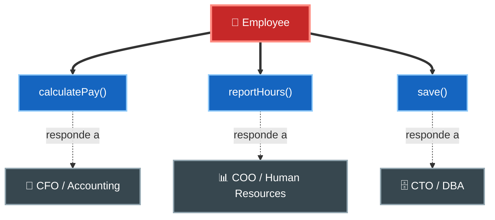
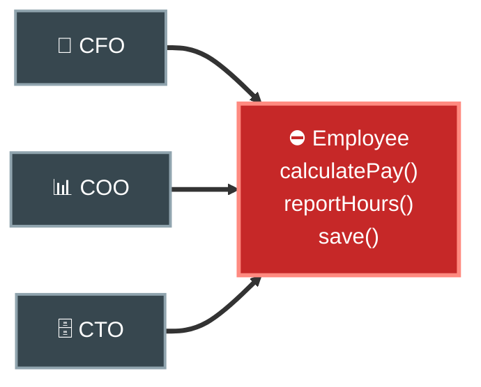
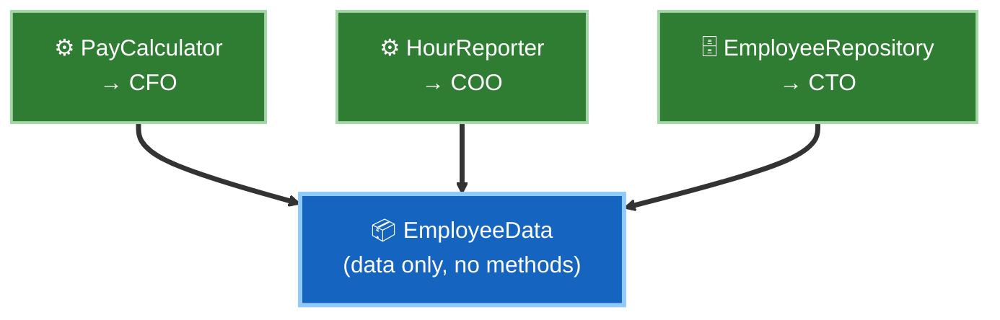

# 1. SRP — El Principio de Responsabilidad Única

## El malentendido más común

Casi todo el mundo cree que SRP significa *"una función (o clase) debe hacer una sola cosa"*. **Eso no es SRP.** Esa idea existe, pero es un principio distinto que se aplica al refactorizar funciones grandes en pequeñas.

La definición correcta que da Uncle Bob es:

> **Un módulo debe tener una, y solo una, razón para cambiar.**

Y como las razones para cambiar son las **personas** que solicitan los cambios, la formulación final es:

> **Un módulo debe ser responsable ante uno, y solo un, actor.**

Un **actor** es un grupo de personas (usuarios, stakeholders) que quieren que el sistema cambie de la misma manera y por las mismas razones.

## El ejemplo clásico: la clase `Employee`

Imaginemos una clase `Employee` con tres métodos que sirven a **tres actores distintos**:



Esta clase viola SRP: **tres actores dependen del mismo módulo**. Un cambio pedido por uno puede romper el trabajo de otro.



Tres actores apuntan a **un solo módulo** `Employee`. Es justo lo que SRP prohíbe.

## Los síntomas de violar SRP

### Síntoma 1 — Colisiones accidentales

Supón que `calculatePay()` (del CFO) y `reportHours()` (del COO) comparten un método privado `regularHours()`. Un día, Contabilidad pide cambiar cómo se calculan las horas regulares para el pago.

El desarrollador modifica `regularHours()`… y sin saberlo **rompe el reporte del COO**, porque ambos compartían ese código.

| Actor | Método que usa | Cambio pedido | Efecto colateral |
|-------|----------------|---------------|------------------|
| CFO (Contabilidad) | `calculatePay()` | Ajustar horas regulares | ✅ Su cálculo cambia |
| COO (RR. HH.) | `reportHours()` | *(no pidió nada)* | ❌ Su reporte queda mal |

### Síntoma 2 — Merges (fusiones) peligrosas

Dos equipos, sirviendo a dos actores distintos, tocan la misma clase `Employee`. Al hacer merge, los cambios chocan. El control de versiones se vuelve un campo de batalla.

## La solución: separar por actor

La forma más simple es **separar los datos de las funciones**. Los datos quedan en una estructura sin comportamiento, y cada responsabilidad va a su propia clase.



Ahora cada actor tiene su propia clase. Un cambio del CFO no puede romper el reporte del COO.

## Ejemplo conceptual

### ❌ Mal aplicado — un módulo, varios actores

```
class Employee {
    calculatePay()      // wanted by the CFO
    reportHours()       // wanted by the COO
    save()              // wanted by the CTO
    regularHours()      // shared -> source of accidents
}
```

Cambiar algo para un actor arriesga romper a los demás.

### ✅ Bien aplicado — un módulo por actor

```
struct EmployeeData { ... }                     // data only

class PayCalculator      { calculatePay(EmployeeData) }   // CFO
class HourReporter       { reportHours(EmployeeData) }    // COO
class EmployeeRepository { save(EmployeeData) }           // CTO
```

Cada clase tiene **una sola razón para cambiar**. (Un patrón como *Facade* puede reunir las tres si se quiere una única puerta de entrada.)

## Nivel de aplicación

SRP se aplica en el nivel de **clases**. El mismo principio, escalado, reaparece:

- En **componentes** → *Common Closure Principle* (CCP).
- En la **arquitectura** → los límites que separan por actores y capas.

## Punto clave para recordar

> **SRP no trata de "hacer una sola cosa".** Trata de que un módulo tenga **una sola razón para cambiar**, es decir, **un solo actor** al que rendir cuentas. Separa el código que sirve a actores distintos.

---

Siguiente: [OCP — Open-Closed Principle →](./02-ocp-open-closed.md)

Volver al [índice del tópico](./README.md)
