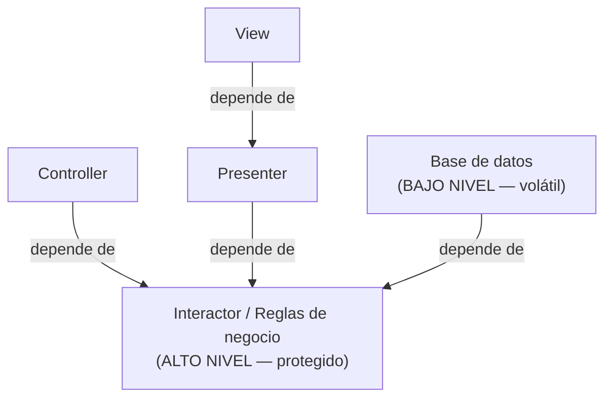

# 2. OCP — El Principio Abierto-Cerrado

## La definición

Formulado por Bertrand Meyer en los años 80, dice:

> **Un artefacto de software debe estar abierto para la extensión, pero cerrado para la modificación.**

En otras palabras: el comportamiento de un sistema debe poder **extenderse** (agregar cosas nuevas) **sin modificar** el código que ya funciona. Si añadir una funcionalidad simple te obliga a hacer cambios masivos en el código existente, el diseño falla en OCP.

## La meta real: controlar la dirección del cambio

Uncle Bob replantea OCP a nivel arquitectónico. No se trata solo de no tocar código, sino de **organizar las dependencias** para que:

> Los componentes de **alto nivel** (las políticas importantes) queden **protegidos** de los cambios en los componentes de **bajo nivel** (los detalles).



Fíjate que **todas las flechas apuntan hacia el interactor**. El alto nivel no sabe que existen la vista, el presenter ni la base de datos. Puede cambiar cualquier detalle sin tocar la política central.

## Cómo se logra: inversión y ocultamiento

OCP se apoya en dos ideas combinadas:

1. **Inversión de dependencias (DIP):** el alto nivel define una interfaz; el bajo nivel la implementa. La flecha del código apunta *contra* el flujo de datos.
2. **Ocultamiento de información (ISP y encapsulación):** un componente no debe conocer más de otro de lo estrictamente necesario, así los cambios no se propagan.

```
     Flujo de datos  ───────────────────►
   ┌──────────┐      ┌────────────┐      ┌──────────┐
   │Controller│─────►│ Interactor │◄─────│ Database │
   └──────────┘      │ <interfaz> │      └──────────┘
                     └────────────┘
     Flechas de dependencia del código  ◄──── apuntan al alto nivel
```

Aunque los datos fluyan del controller a la base de datos, **las dependencias del código apuntan al interactor**. Así el interactor queda cerrado a modificación.

## Jerarquía de protección

Los componentes se ordenan por su nivel. Cuanto más alto el nivel, más protegido debe estar:

| Nivel | Componente | ¿Cambia seguido? | ¿A quién protege? |
|-------|------------|------------------|-------------------|
| Alto | Reglas de negocio (Interactor) | Casi nunca | Se protege a sí mismo |
| Medio | Presenters, Controllers | A veces | Protege al alto nivel |
| Bajo | Views, Base de datos, UI | Muy seguido | No protege a nadie |

> Un cambio en la base de datos (bajo nivel) **no debe** obligar a recompilar el interactor (alto nivel). La flecha nunca apunta hacia abajo.

## Ejemplo conceptual

Un sistema debe generar un reporte financiero. Mañana pedirán mostrarlo también en PDF además de en web.

### ❌ Mal aplicado — cerrado a extensión

```
class GeneradorDeReporte {
    generar(datos, formato) {
        if (formato == "web")  { ...html... }
        if (formato == "pdf")  { ...pdf...  }   // hay que EDITAR la clase
    }
}
```

Cada nuevo formato **modifica** una clase existente y probada. Viola OCP.

### ✅ Bien aplicado — abierto a extensión

```
interface Presentador { presentar(datos) }

class PresentadorWeb implements Presentador { presentar(datos){ ...html... } }
class PresentadorPDF implements Presentador { presentar(datos){ ...pdf...  } }

class GeneradorDeReporte {
    constructor(Presentador p)      // depende de la ABSTRACCIÓN
    generar(datos) { p.presentar(datos) }
}
```

Para un nuevo formato solo se **agrega** una clase nueva. El `GeneradorDeReporte` nunca se toca: está cerrado a modificación, abierto a extensión.

## Punto clave para recordar

> **OCP se cumple organizando las dependencias, no evitando escribir código.** Se logra haciendo que las flechas de dependencia apunten hacia el alto nivel, de modo que las políticas importantes queden **cerradas** ante los cambios de los detalles y el sistema quede **abierto** a nuevas extensiones.

---

Anterior: [← SRP — Single Responsibility Principle](./01-srp-single-responsibility.md)

Siguiente: [LSP — Liskov Substitution Principle →](./03-lsp-liskov-substitution.md)
