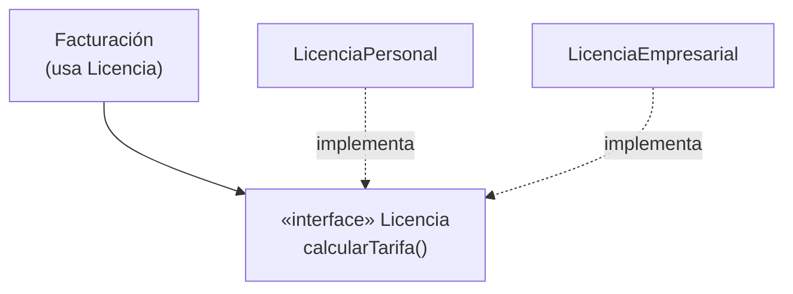

# 3. LSP — El Principio de Sustitución de Liskov

## La definición

Barbara Liskov lo formuló en 1988. La idea, resumida por Uncle Bob:

> **Para construir software con partes intercambiables, esas partes deben adherirse a un contrato que permita sustituir unas por otras.**

Dicho de otra forma: si `S` es un subtipo de `T`, entonces los objetos de tipo `T` deben poder **reemplazarse** por objetos de tipo `S` **sin alterar la corrección** del programa. El usuario del supertipo no debería notar la diferencia.

## Un buen uso del LSP

Piensa en una interfaz `Licencia` con un método `calcularTarifa()`. Dos implementaciones la respetan perfectamente:



La clase `Facturación` funciona con cualquier `Licencia`. Se pueden intercambiar libremente: **LSP se cumple.**

## El ejemplo canónico de violación: cuadrado / rectángulo

Parece natural decir "un cuadrado ES un rectángulo", así que `Cuadrado` hereda de `Rectángulo`. Pero un `Rectángulo` permite fijar alto y ancho **por separado**, y un `Cuadrado` no.

```
   Rectángulo                    Cuadrado (como subtipo)
   ┌───────────────┐             ┌───────┐
   │               │             │       │
   │   ancho ≠     │             │ ancho │  al cambiar el ancho,
   │   alto        │             │ = alto│  ¡el alto cambia solo!
   └───────────────┘             └───────┘
   setAncho / setAlto            setAncho fuerza setAlto  ❌
   independientes
```

El código que usa un `Rectángulo` asume esto:

```
r.setAncho(5)
r.setAlto(4)
assert(r.area() == 20)   // ✅ con Rectángulo
                         // ❌ con Cuadrado da 16, porque setAlto(4) cambió el ancho a 4
```

Si le pasas un `Cuadrado` donde se esperaba un `Rectángulo`, **el programa se comporta mal**. El usuario tendría que preguntar "¿de qué tipo eres realmente?", lo que rompe la sustituibilidad.

## LSP no es solo herencia

Uncle Bob insiste en que LSP se aplica a **cualquier** relación de subtipos: herencia, interfaces implementadas, o incluso servicios REST que responden a un mismo contrato. Cuando se viola, el sistema se llena de mecanismos especiales (`if type == X`) para atender los casos que no encajan.

| Situación | ¿Respeta LSP? | Consecuencia |
|-----------|---------------|--------------|
| Subtipos que cumplen el contrato completo | ✅ Sí | Intercambiables, sin `if` de tipo |
| Subtipo que restringe lo permitido (cuadrado) | ❌ No | El cliente necesita casos especiales |
| Servicio REST con un campo distinto | ❌ No | El consumidor mete `if` por proveedor |

> Cada violación de LSP obliga a añadir lógica especial de tipo. Esa lógica es una fuga que contamina y complica el sistema.

## Ejemplo conceptual

### ❌ Mal aplicado — el subtipo rompe el contrato

```
class Rectangulo { setAncho(w); setAlto(h); area() }
class Cuadrado extends Rectangulo {
    setAncho(w){ super.setAncho(w); super.setAlto(w) }   // efecto oculto
    setAlto(h){  super.setAncho(h); super.setAlto(h) }   // rompe la suposición del cliente
}
```

### ✅ Bien aplicado — respetar el contrato del supertipo

```
interface Figura { area() }

class Rectangulo implements Figura { setAncho(w); setAlto(h); area() }
class Cuadrado   implements Figura { setLado(l);            area() }
```

`Cuadrado` y `Rectángulo` ya no fingen ser intercambiables: comparten solo lo que de verdad comparten (`area()`). No hay suposiciones traicionadas.

## Punto clave para recordar

> **LSP dice que un subtipo debe ser usable en lugar de su supertipo sin sorpresas.** Cuando un subtipo rompe las suposiciones del cliente (como el cuadrado frente al rectángulo), el diseño se llena de lógica especial y pierde su capacidad de tener partes intercambiables.

---

Anterior: [← OCP — Open-Closed Principle](./02-ocp-open-closed.md)

Siguiente: [ISP — Interface Segregation Principle →](./04-isp-interface-segregation.md)
