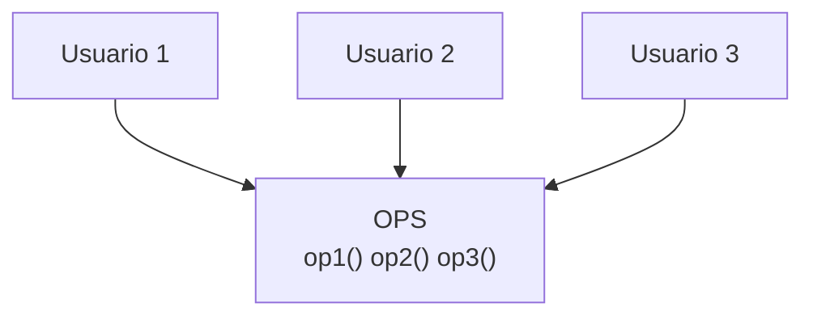
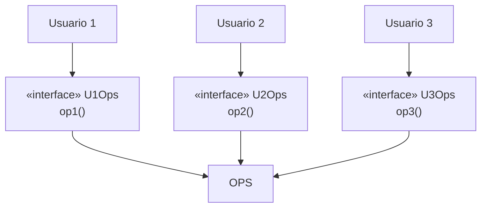

# 4. ISP — El Principio de Segregación de Interfaces

## La definición

> **Ningún cliente debería verse forzado a depender de métodos que no usa.**

Cuando una interfaz (o clase) reúne muchos métodos, y distintos clientes usan solo un subconjunto de ellos, todos quedan **acoplados a lo que no necesitan**. ISP nos pide **dividir** esas interfaces gordas en otras más pequeñas y específicas para cada cliente.

## El problema de la interfaz gorda

Imagina una clase `OPS` con tres operaciones, usada por tres usuarios distintos:



- El **Usuario 1** solo usa `op1()`.
- El **Usuario 2** solo usa `op2()`.
- El **Usuario 3** solo usa `op3()`.

Aun así, los tres dependen de **toda** la clase `OPS`. Si cambia `op2()` (que solo interesa al Usuario 2), en muchos lenguajes hay que **recompilar y redesplegar** también al Usuario 1 y al Usuario 3, aunque su código no cambió.

```
   Usuario1 ──┐
   Usuario2 ──┼──► [ OPS: op1 op2 op3 ]   ❌ todos atados a todo
   Usuario3 ──┘
```

## La solución: segregar por cliente

Se crean interfaces separadas, una por necesidad, y cada usuario depende solo de la suya:



Ahora un cambio en `op2()` solo afecta a `U2Ops` y al Usuario 2. Los demás quedan aislados.

## Lenguajes estáticos vs. dinámicos

Uncle Bob hace una observación importante sobre el **alcance** del problema:

| Tipo de lenguaje | Ejemplos | ¿Sufre el acoplamiento de ISP? |
|------------------|----------|-------------------------------|
| **Estáticamente tipado** | Java, C#, C++ | ✅ Sí. Depender de un módulo con métodos extra obliga a `import`/`include` y fuerza recompilaciones y redeploys. |
| **Dinámicamente tipado** | Ruby, Python, JS | ⚠️ Menos. No hay declaraciones de tipo en el fuente, así que el acoplamiento existe pero es más débil. |

> Esto lleva a una conclusión clave: **ISP es, en el fondo, un problema arquitectónico.** El daño de depender de algo que no usas no es solo de compilación; es que **arrastras cambios innecesarios** de un componente a otros.

## El riesgo arquitectónico

Depender de un módulo que contiene más de lo que necesitas es dañino aunque nunca uses lo extra:

```
   Sistema S  ──►  Framework F  ──►  Base de datos D
```

Si `S` no usa una función de `F`, pero `F` la necesita por causa de `D`, entonces un cambio en `D` puede forzar redeploy de `F` y, en cascada, de `S`. **Se depende de cosas innecesarias que traen problemas.**

## Ejemplo conceptual

### ❌ Mal aplicado — una interfaz para todos

```
interface Trabajador {
    trabajar()
    comer()      // un robot no come, pero debe implementarlo igual
}

class RobotDeFabrica implements Trabajador {
    trabajar() { ... }
    comer()    { throw "no aplica" }   // método inútil forzado
}
```

### ✅ Bien aplicado — interfaces segregadas

```
interface Trabajable { trabajar() }
interface Alimentable { comer() }

class Humano implements Trabajable, Alimentable { trabajar(); comer() }
class RobotDeFabrica implements Trabajable       { trabajar() }
```

Cada cliente depende **solo** de lo que usa. El robot ya no carga con `comer()`.

## Punto clave para recordar

> **No dependas de lo que no usas.** Segrega las interfaces gordas en otras pequeñas y específicas por cliente. En lenguajes estáticos evita recompilaciones innecesarias; en el fondo, evita que los cambios se propaguen entre componentes que no tenían por qué estar acoplados.

---

Anterior: [← LSP — Liskov Substitution Principle](./03-lsp-liskov-substitution.md)

Siguiente: [DIP — Dependency Inversion Principle →](./05-dip-dependency-inversion.md)
