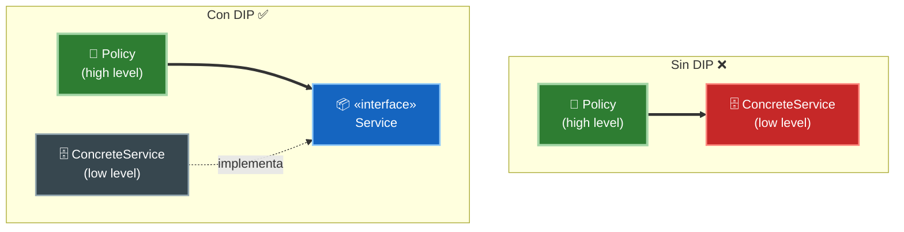
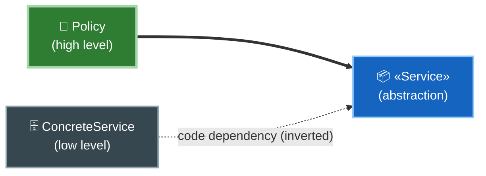
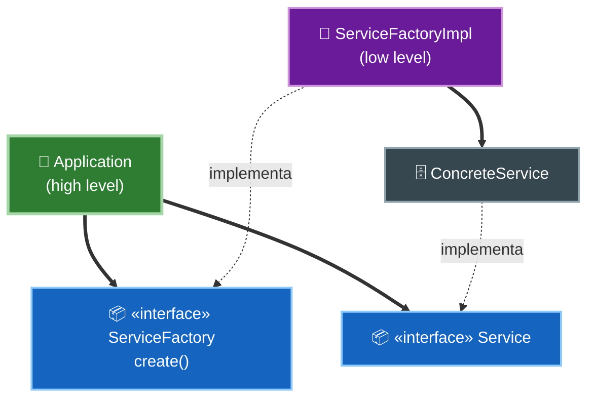

# 5. DIP — El Principio de Inversión de Dependencias

## La definición

> **Los sistemas más flexibles son aquellos en los que las dependencias del código fuente se refieren a abstracciones, no a concreciones.**

En su forma clásica se enuncia en dos partes:

1. Los módulos de **alto nivel no deben depender** de los módulos de bajo nivel. Ambos deben depender de **abstracciones**.
2. Las **abstracciones no deben depender de los detalles**. Los detalles deben depender de las abstracciones.

## Por qué abstracciones y no concreciones

Uncle Bob matiza el principio: seguirlo al 100% es imposible, porque *algo* concreto tiene que existir. La clave está en **qué es volátil**:

> Dependemos con confianza de las **abstracciones estables** (interfaces que cambian poco) y evitamos depender de **concreciones volátiles** (implementaciones que cambian mucho).

No pasa nada por depender de `String` o del sistema operativo: son estables. El peligro son los detalles concretos que están en desarrollo activo y cambian a menudo.

| Depender de… | ¿Recomendado? | Razón |
|--------------|---------------|-------|
| Interfaces / clases abstractas | ✅ Sí | Estables, cambian poco |
| Componentes muy estables (p. ej. `String`) | ✅ Sí | No van a cambiar |
| Clases concretas volátiles | ❌ No | Cada cambio se propaga a quien depende |

## La inversión: la flecha se voltea

Sin DIP, el alto nivel apunta al bajo nivel (a la concreción). Con DIP, se **interpone una abstracción** y la flecha del código fuente se **invierte**:



Ahora el bajo nivel apunta hacia arriba, hacia la abstracción que define el alto nivel. **El flujo de control y el flujo de dependencias del código van en sentidos opuestos.**



El flujo de control va de `Policy` hacia `ConcreteService`, pero la **dependencia del código se invierte**: el concreto apunta hacia la abstracción y cruza el boundary. Esa línea de la interfaz es el **límite arquitectónico (boundary)**. DIP es el mecanismo que permite trazarlo.

## El problema de crear las concreciones: Abstract Factory

Hay una regla incómoda: para *usar* un objeto concreto, alguien debe **crearlo** con `new`, y eso es una dependencia directa a la concreción. Uncle Bob resuelve esto con el patrón **Abstract Factory**.



La aplicación pide un `Servicio` a una `ServicioFactory` (ambas abstracciones). La **fábrica concreta** —que vive del lado de los detalles— es la única que conoce la clase concreta y hace el `new`. Así, la creación de concreciones queda **aislada** al otro lado del boundary.

## Ejemplo conceptual

### ❌ Mal aplicado — el alto nivel depende de la concreción

```
class SmtpMailService { send(msg) { ... } }

class Notifier {                        // high level
    s = new SmtpMailService()           // depends on the concretion and creates it
    notify(m) { s.send(m) }
}
```

Cambiar de SMTP a otro proveedor obliga a editar `Notifier`.

### ✅ Bien aplicado — el alto nivel depende de la abstracción

```
interface MessagingService { send(msg) }

class Notifier {                        // high level
    constructor(MessagingService s)     // depends on the abstraction (injected)
    notify(m) { s.send(m) }
}

class SmtpMail    implements MessagingService { send(m){...} }   // low level
class SmsProvider implements MessagingService { send(m){...} }   // low level
```

`Notifier` no sabe ni le importa qué implementación recibe. Los detalles concretos dependen de la abstracción, no al revés.

## Punto clave para recordar

> **DIP es el corazón de Clean Architecture.** Haz que el código fuente dependa siempre de **abstracciones estables**, nunca de concreciones volátiles. Al interponer una interfaz, la flecha de dependencia se invierte y cruza el boundary hacia el alto nivel. Aísla la creación de concreciones con un **Abstract Factory**.

---

Anterior: [← ISP — Interface Segregation Principle](./04-isp-interface-segregation.md)

Volver al [índice del tópico](./README.md)
