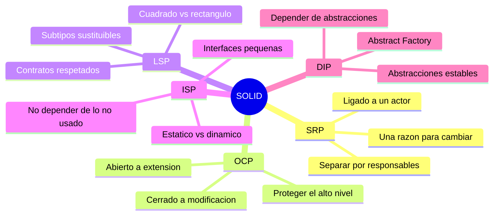

# Tópico 3 — Principios de diseño SOLID

> Tercer bloque de la guía sobre **Clean Architecture** de Robert C. Martin.
> Si los paradigmas son los ladrillos, los principios SOLID son las reglas para colocar esos ladrillos en **funciones y clases** bien formadas.

## Idea central del tópico

Los principios **SOLID** nos dicen cómo agrupar funciones y estructuras de datos en clases, y cómo esas clases deben relacionarse entre sí. El objetivo de SOLID no es el rendimiento ni la elegancia: es crear **estructuras de software de nivel intermedio** que sean:

- **Tolerantes al cambio.**
- **Fáciles de entender.**
- **La base de componentes reutilizables** en muchos sistemas.

> SOLID aplica al **nivel de módulos** (clases y funciones). Los mismos principios, reformulados, reaparecen en el nivel de componentes y en el de la arquitectura completa.

El acrónimo agrupa cinco principios:

```
   S  ─►  Single Responsibility Principle   (una razón para cambiar)
   O  ─►  Open-Closed Principle             (abierto a extensión, cerrado a modificación)
   L  ─►  Liskov Substitution Principle      (los subtipos son sustituibles)
   I  ─►  Interface Segregation Principle    (no dependas de lo que no usas)
   D  ─►  Dependency Inversion Principle      (depende de abstracciones)
```

## Documentos de este tópico

| # | Documento | Punto que cubre |
|---|-----------|-----------------|
| 1 | [01-srp-single-responsibility.md](./01-srp-single-responsibility.md) | Un módulo tiene una sola razón para cambiar, ligada a un único actor |
| 2 | [02-ocp-open-closed.md](./02-ocp-open-closed.md) | Extender el comportamiento sin modificar el código existente |
| 3 | [03-lsp-liskov-substitution.md](./03-lsp-liskov-substitution.md) | Los subtipos deben ser sustituibles por sus supertipos |
| 4 | [04-isp-interface-segregation.md](./04-isp-interface-segregation.md) | No depender de métodos ni módulos que no se usan |
| 5 | [05-dip-dependency-inversion.md](./05-dip-dependency-inversion.md) | Depender de abstracciones estables, no de concreciones volátiles |

## Diagrama del tópico



## Relación con la arquitectura

SOLID no se queda en la clase. Cada principio escala hacia arriba:

- **SRP** → en componentes se convierte en el **Common Closure Principle**; en la arquitectura, en la separación por **capas y actores**.
- **OCP** → es la razón de ser de los **límites arquitectónicos (boundaries)**: proteger los componentes de alto nivel de los cambios en los de bajo nivel.
- **LSP** → habilita el uso seguro de **interfaces intercambiables** (plugins, drivers, adaptadores).
- **ISP** → advierte contra **dependencias innecesarias** entre componentes, que arrastran recompilaciones y redeploys.
- **DIP** → es el **mecanismo central** de Clean Architecture: las flechas de dependencia del código fuente cruzan los boundaries apuntando siempre hacia las políticas de alto nivel.


## Referencia

- Robert C. Martin, *Clean Architecture*, Prentice Hall, 2017 — Parte III ("Design Principles").
