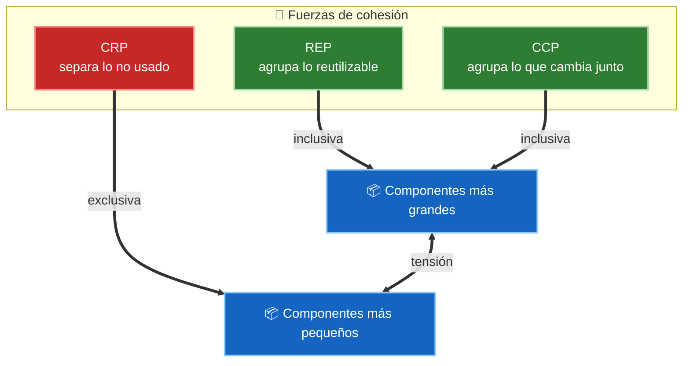
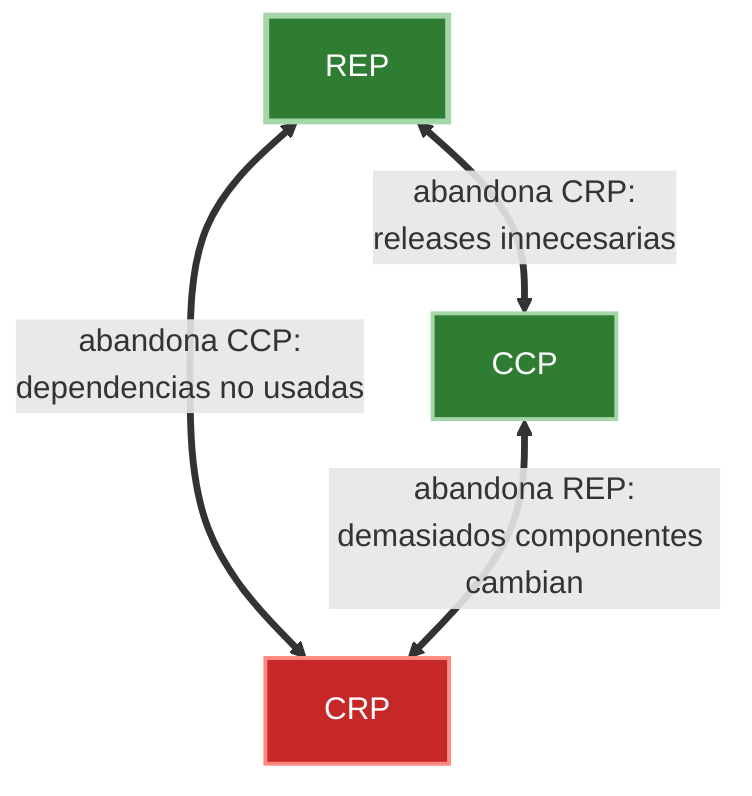

# 1. Cohesión de componentes

La cohesión de componentes responde a una pregunta engañosamente simple: **¿qué clases deben pertenecer al mismo componente?** No es una decisión estética ni arbitraria. Robert C. Martin propone tres principios que guían esa decisión, y lo más importante es que **los tres están en tensión** entre sí. No existe una agrupación perfecta y permanente: el arquitecto ajusta las fronteras según madura el proyecto.

Los tres principios son:

- **REP** — Reuse/Release Equivalence Principle (Principio de Equivalencia de Reutilización y Liberación).
- **CCP** — Common Closure Principle (Principio de Clausura Común).
- **CRP** — Common Reuse Principle (Principio de Reutilización Común).

## REP — Equivalencia entre reutilización y liberación

> *La granularidad de la reutilización es la granularidad de la liberación.*

Solo puedes reutilizar código que se libera (release) a través de algún sistema de versionado. Un componente debe agrupar clases y módulos que tengan **sentido reutilizar juntos** y que compartan un mismo ciclo de liberación con su número de versión. Si liberas una versión, todo lo que hay dentro del componente debe formar un conjunto coherente y utilizable como una sola unidad.

Consecuencia práctica: las clases de un componente deben pertenecer a una **familia cohesionada**. No tiene sentido meter en el mismo release un cliente HTTP y una utilidad de formato de fechas si nadie los usará en conjunto.

## CCP — Clausura común

> *Reúne en un componente las clases que cambian por las mismas razones y en los mismos momentos. Separa las que cambian por razones distintas.*

El CCP es la versión a nivel de componente del **Principio de Responsabilidad Única (SRP)** y del Principio Abierto/Cerrado (OCP). Si un cambio afecta a varias clases, es preferible que todas vivan en el mismo componente para que solo haya que reliberar **un** componente. Así se minimiza la carga de trabajo de despliegue y validación ante un cambio.

CCP es el principio que **más pesa durante el desarrollo activo**, porque en esa fase la capacidad de mantenimiento importa más que la reutilización.

## CRP — Reutilización común

> *No obligues a los usuarios de un componente a depender de cosas que no necesitan.*

El CRP dice qué clases **no** deben estar juntas. Cuando dependes de un componente, dependes de **todo** lo que contiene. Si un componente incluye clases que no usas, cada vez que esas clases cambien y se relibere el componente, te verás forzado a revalidar y redesplegar tu código sin motivo real.

CRP es la versión a nivel de componente del **Principio de Segregación de Interfaces (ISP)**. Su fuerza es **separadora**: tiende a partir componentes para que nadie cargue con dependencias inútiles.

## La tensión entre REP, CCP y CRP

REP y CCP son **inclusivos**: empujan hacia componentes más grandes (agrupa lo reutilizable, agrupa lo que cambia junto). CRP es **exclusivo**: empuja hacia componentes más pequeños (no cargues con lo que no usas). Un arquitecto que solo atiende a REP y CCP crea componentes enormes con demasiadas razones de cambio; uno que solo atiende a CRP crea tantos componentes minúsculos que cada cambio dispara reliberaciones en cadena.

El **diagrama de tensión de cohesión** de Martin coloca los tres principios en los vértices de un triángulo. Cada arista representa el coste de ignorar el principio del vértice opuesto: la arista REP–CCP surge al abandonar CRP (releases innecesarias), la arista REP–CRP al abandonar CCP (dependencias no usadas), y la arista CCP–CRP al abandonar REP (demasiados componentes cambian por un cambio).

La posición dentro del triángulo se mueve con el tiempo. Un proyecto **joven** vive cerca del vértice CCP (prioriza el mantenimiento). Un proyecto **maduro** se desplaza hacia REP/CRP (prioriza la reutilización estable para consumidores externos).

| Principio | Equivalente SOLID | Fuerza | Optimiza | Predomina cuando |
|-----------|-------------------|--------|----------|-------------------|
| REP | — | Inclusiva | Reutilización coherente | El proyecto es maduro y se distribuye |
| CCP | SRP + OCP | Inclusiva | Mantenimiento y despliegue | El proyecto está en desarrollo activo |
| CRP | ISP | Exclusiva | Evitar dependencias inútiles | Hay muchos consumidores del componente |

## Punto clave para recordar

> No existe una agrupación de clases correcta para siempre. REP y CCP hacen los componentes grandes; CRP los hace pequeños. El arquitecto vive dentro del triángulo de tensión y **mueve las fronteras** según el proyecto madura: empieza cerca del CCP (mantenimiento) y se desplaza hacia REP/CRP (reutilización) con el tiempo.

---

Siguiente: [2. Acoplamiento de componentes](./02-acoplamiento-de-componentes.md)
