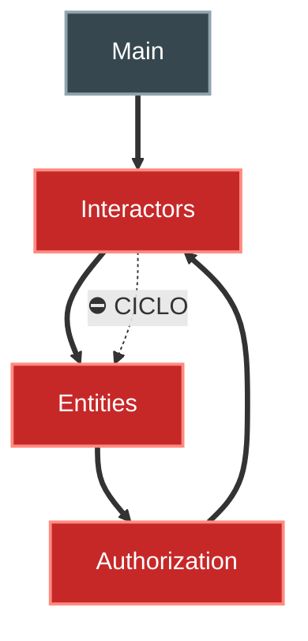
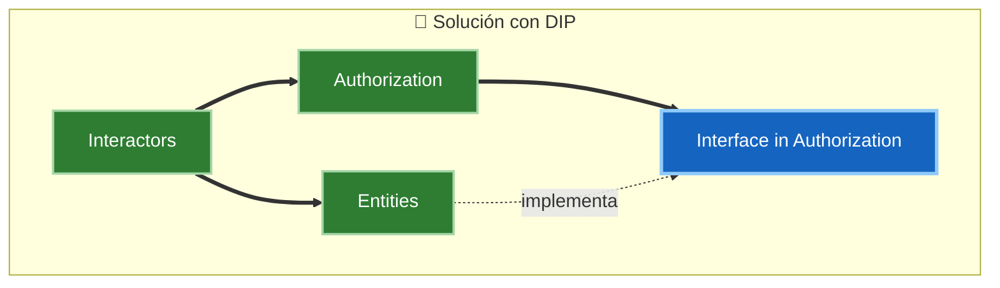
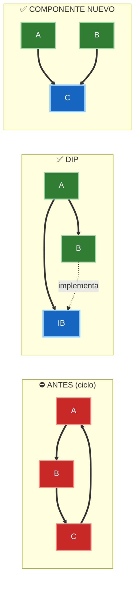
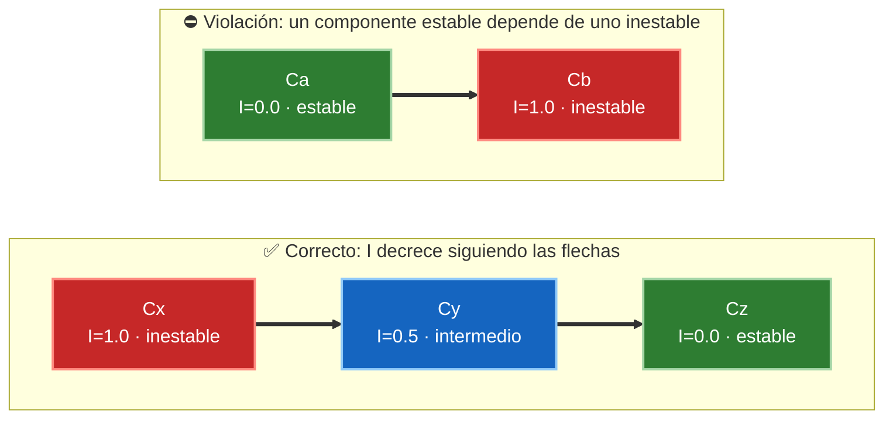

# 2. Acoplamiento de componentes

Si la cohesión decide *qué clases van juntas*, el acoplamiento decide *cómo se conectan los componentes entre sí*. Robert C. Martin propone tres principios que gobiernan el grafo de dependencias entre componentes:

- **ADP** — Acyclic Dependencies Principle (Principio de Dependencias Acíclicas).
- **SDP** — Stable Dependencies Principle (Principio de Dependencias Estables).
- **SAP** — Stable Abstractions Principle (Principio de Abstracciones Estables).

## ADP — Dependencias acíclicas

> *No permitas ciclos en el grafo de dependencias de componentes.*

El grafo de dependencias entre componentes debe ser un **DAG** (grafo dirigido acíclico). Un ciclo hace que dos o más componentes queden atados: no puedes compilar, probar ni liberar uno sin arrastrar a los demás. El clásico "síndrome de la mañana siguiente": alguien tocó un componente del ciclo y ahora nada compila.

Considera este grafo con un ciclo entre `Entities`, `Authorization` e `Interactors`:



`Authorization → Interactors → Entities → Authorization` forma un ciclo. Ninguno de esos tres se puede liberar de forma independiente.

### Cómo romper un ciclo

Hay **dos técnicas** para eliminar un ciclo:

1. **Aplicar DIP (Inversión de Dependencias):** creas una interfaz en el componente que *quiere* invertir la dependencia. La clase que antes se llamaba directamente pasa a implementar esa interfaz. La flecha de dependencia se invierte.

2. **Crear un componente nuevo:** extraes las clases de las que ambos dependen a un componente adicional. Todos apuntan hacia el componente nuevo y el ciclo desaparece.



Comparación de las dos técnicas. En **DIP** se introduce la interfaz `IB` y la flecha `B → IB` queda invertida respecto al ciclo original; en **Componente nuevo** todos apuntan hacia `C`, de modo que el ciclo desaparece:



## SDP — Dependencias estables

> *Depende en la dirección de la estabilidad.* Un componente solo debe depender de componentes **más estables** que él.

La **estabilidad** no mide con qué frecuencia cambia un componente, sino cuánto **esfuerzo** cuesta cambiarlo. Un componente del que dependen muchos otros es difícil de cambiar (hay que coordinar a todos sus dependientes): es *estable*. Un componente que no depende de nadie y del que nadie depende es *inestable*: se cambia sin consecuencias.

Se cuantifica con la **métrica de inestabilidad I**:

```
        Fan-out
I = -----------------
    Fan-in + Fan-out
```

- **Fan-in (dependencias entrantes):** número de clases fuera del componente que dependen de clases dentro de él.
- **Fan-out (dependencias salientes):** número de clases dentro del componente que dependen de clases fuera de él.
- **I = 0** → máxima estabilidad (muchos dependen de él, él no depende de nadie).
- **I = 1** → máxima inestabilidad (no depende nadie de él, él depende de todos).

El SDP exige que **la I disminuya en la dirección de las flechas**: cada dependencia debe apuntar hacia un componente con I menor o igual.



## SAP — Abstracciones estables

> *Un componente debe ser tan abstracto como estable.*

Aquí surge una pregunta: si los componentes estables son difíciles de cambiar, ¿cómo evitamos que esa rigidez impida evolucionar el sistema? La respuesta es hacerlos **abstractos**. Un componente estable pero **abstracto** (lleno de interfaces y clases abstractas) puede extenderse sin modificarse, cumpliendo el OCP. Así, la estabilidad no impide la flexibilidad.

Se cuantifica con la **métrica de abstracción A**:

```
    Número de clases abstractas e interfaces
A = ----------------------------------------
              Número total de clases
```

- **A = 0** → componente totalmente concreto.
- **A = 1** → componente totalmente abstracto (solo interfaces y clases abstractas).

El SAP conecta con el SDP: **estabilidad y abstracción deben ir de la mano.** Un componente estable (I≈0) debería ser abstracto (A≈1); un componente inestable (I≈1) debería ser concreto (A≈0). Cuando esta proporción se rompe, el componente cae en zonas problemáticas que se estudian en el siguiente documento.

| Principio | Regla | Métrica | Valor ideal |
|-----------|-------|---------|-------------|
| ADP | Sin ciclos en el grafo | — | DAG (0 ciclos) |
| SDP | Depender hacia lo estable | I = Fan-out / (Fan-in + Fan-out) | I decrece siguiendo flechas |
| SAP | Tan abstracto como estable | A = abstractas / totales | A ≈ 1 − I |

## Punto clave para recordar

> El grafo de componentes debe ser **acíclico** (ADP), sus dependencias deben apuntar **hacia lo estable** (SDP: I = Fan-out / (Fan-in + Fan-out)), y lo estable debe ser **abstracto** (SAP: A = abstractas / totales). Juntos garantizan que los detalles volátiles dependan de políticas estables y abstractas, y nunca al revés.

---

Anterior: [1. Cohesión de componentes](./01-cohesion-de-componentes.md) · Siguiente: [3. Main Sequence y tensión](./03-main-sequence-y-tension.md)
