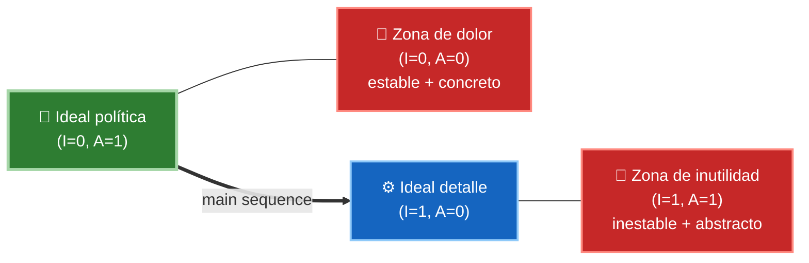
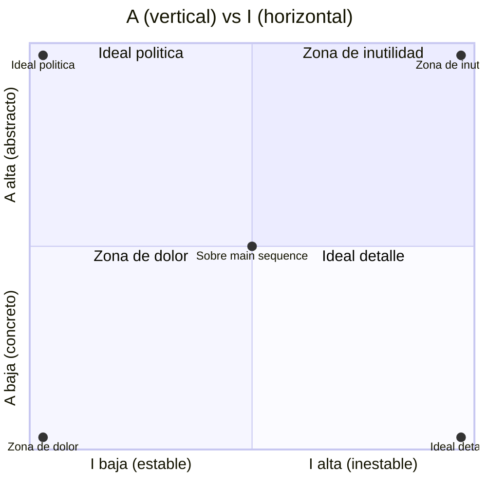

# 3. Main Sequence y tensión

Los dos documentos anteriores introdujeron dos métricas de componente:

- **I (inestabilidad):** `I = Fan-out / (Fan-in + Fan-out)`. Va de 0 (máxima estabilidad) a 1 (máxima inestabilidad).
- **A (abstracción):** `A = clases abstractas / clases totales`. Va de 0 (todo concreto) a 1 (todo abstracto).

Este documento las combina para definir dónde debería situarse un componente **bien diseñado** y qué zonas debe evitar. La herramienta central es un gráfico de **A vs I**.

## El gráfico A / I

Representamos cada componente como un punto en un plano con **A en el eje vertical** e **I en el eje horizontal**. Ambas van de 0 a 1, así que todos los componentes caen dentro de un cuadrado unitario. Sus cuatro esquinas son:

- **(I=0, A=0):** estable y concreto → **zona de dolor**.
- **(I=1, A=1):** inestable y abstracto → **zona de inutilidad**.
- **(I=0, A=1):** estable y abstracto → posición ideal para políticas.
- **(I=1, A=0):** inestable y concreto → posición ideal para detalles.



## La Main Sequence

La **main sequence** (secuencia principal) es la línea recta que une el punto **(I=0, A=1)** con el punto **(I=1, A=0)**. Sobre esa línea se cumple la relación deseada:

```
A + I = 1        =>       A = 1 - I
```

Un componente sobre la main sequence tiene la abstracción **proporcional** a su estabilidad: si es muy estable es muy abstracto, y si es muy inestable es muy concreto. Ese es el equilibrio que buscan SDP y SAP en conjunto.

Gráfico A (eje vertical) vs I (eje horizontal). La **main sequence** es la diagonal `A = 1 − I` que une la esquina superior izquierda (ideal política) con la inferior derecha (ideal detalle). Las dos esquinas restantes son las zonas a evitar:



- `*` posiciones ideales: los extremos de la main sequence (ideal política e ideal detalle).
- `X` esquinas a evitar: zona de dolor (0,0) y zona de inutilidad (1,1).
- La main sequence es la diagonal de (0,1) a (1,0), donde `A = 1 − I`.

## Zona de dolor

Esquina **(I=0, A=0)**: componente **muy estable** (muchos dependen de él) y **muy concreto** (sin abstracciones que permitan extenderlo). Es rígido: no se puede extender porque no es abstracto, y no se puede modificar porque muchos dependen de él. Ejemplos típicos: un esquema de base de datos concreto del que todo el mundo depende, o una biblioteca de utilidades concreta y omnipresente. Cambiar algo aquí duele.

## Zona de inutilidad

Esquina **(I=1, A=1)**: componente **muy abstracto** pero del que **nadie depende**. Son abstracciones que nunca se implementaron o que quedaron huérfanas: código muerto, interfaces sin clientes. No causan dolor al cambiar, pero son lastre inútil que ensucia el sistema.

## Distancia a la Main Sequence (D)

La métrica **D** mide cuán lejos está un componente de su posición ideal sobre la main sequence:

```
D = | A + I - 1 |
```

- **D = 0** → el componente está **exactamente sobre** la main sequence (ideal).
- **D ≈ 1** → el componente está en una esquina prohibida (dolor o inutilidad).

Calcular D de todos los componentes y revisar los que tienen D alta (o cuya D crece con el tiempo) es una forma objetiva de detectar deuda de diseño. Un componente con D anómala respecto a la media merece revisión.

| Zona | Coordenadas | Estabilidad | Abstracción | Diagnóstico |
|------|-------------|-------------|-------------|-------------|
| Zona de dolor | (I=0, A=0) | Muy estable | Muy concreto | Rígido, imposible de extender o cambiar |
| Zona de inutilidad | (I=1, A=1) | Muy inestable | Muy abstracto | Abstracciones huérfanas, código muerto |
| Sobre main sequence | A = 1 − I | Proporcional | Proporcional | Diseño equilibrado (D ≈ 0) |
| Ideal política | (I=0, A=1) | Máxima | Máxima | Reglas de negocio estables |
| Ideal detalle | (I=1, A=0) | Mínima | Mínima | Detalles volátiles (UI, DB, frameworks) |

## Punto clave para recordar

> Un componente sano vive **sobre la main sequence**, donde `A = 1 − I`: si es estable, es abstracto; si es inestable, es concreto. Huye de la **zona de dolor** (estable + concreto, rígido) y de la **zona de inutilidad** (abstracto + sin clientes, código muerto). La distancia `D = |A + I − 1|` cuantifica objetivamente cuánto se desvía cada componente de ese equilibrio.

---

Anterior: [2. Acoplamiento de componentes](./02-acoplamiento-de-componentes.md) · Volver al [índice del tópico](./README.md)
