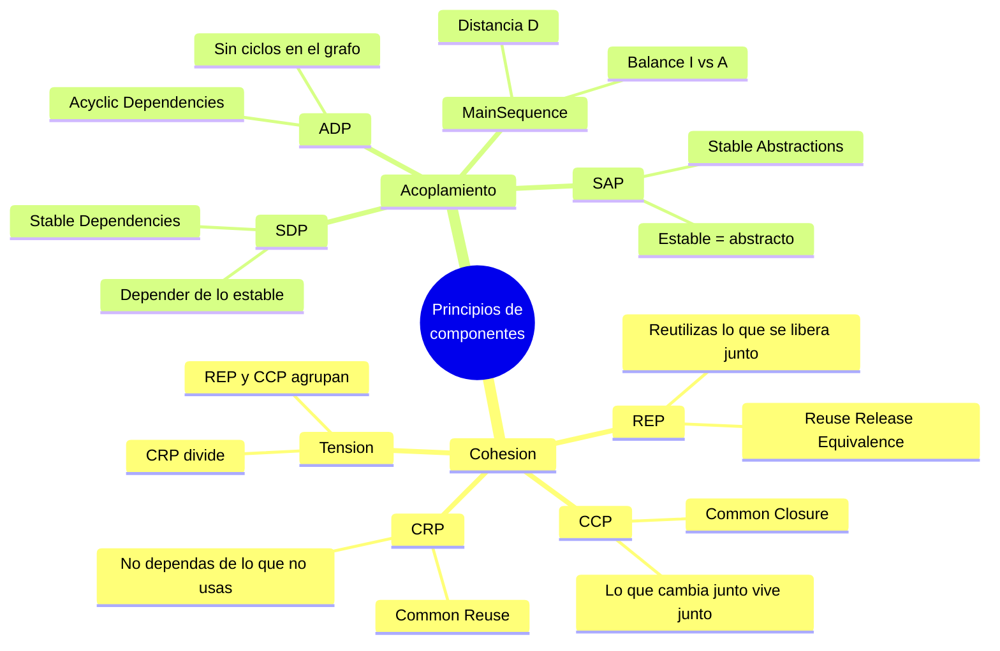

# Tópico 4 — Principios de componentes

> Un **componente** es la unidad más pequeña de despliegue: un `.jar`, un `.dll`, un `.gem`, un paquete. Los principios de componentes responden dos preguntas: *¿qué clases pertenecen al mismo componente?* (cohesión) y *¿cómo deben relacionarse los componentes entre sí?* (acoplamiento). Este tópico recoge los seis principios que Robert C. Martin propone para agrupar y conectar componentes de forma sostenible.

## Idea central del tópico

Los componentes son los ladrillos de la arquitectura. Agruparlos mal genera despliegues frágiles, ciclos imposibles de compilar y cambios que se propagan sin control. Los seis principios se dividen en dos grupos: **cohesión** (qué va junto) y **acoplamiento** (cómo se conectan). Ambos grupos están en tensión: optimizar uno degrada al otro, y el arquitecto debe equilibrarlos según el momento del proyecto.

| # | Documento | Punto que cubre |
|---|-----------|-----------------|
| 1 | [Cohesión de componentes](./01-cohesion-de-componentes.md) | REP, CCP y CRP: qué clases deben vivir en el mismo componente y la tensión entre reutilización y mantenimiento |
| 2 | [Acoplamiento de componentes](./02-acoplamiento-de-componentes.md) | ADP, SDP y SAP: cómo conectar componentes evitando ciclos y apuntando hacia la estabilidad |
| 3 | [Main Sequence y tensión](./03-main-sequence-y-tension.md) | Métricas de inestabilidad (I) y abstracción (A), la "main sequence", zona de dolor y zona de inutilidad |

## Relación con la arquitectura

La cohesión define **fronteras internas** (qué encapsula cada componente) y el acoplamiento define el **flujo de dependencias** entre esas fronteras. Cuando las dependencias apuntan siempre hacia componentes estables y abstractos, el grafo de componentes se convierte en la expresión física de la Regla de Dependencia de Clean Architecture: los detalles volátiles dependen de las políticas estables, nunca al revés. Los principios de este tópico son, por tanto, la escala "media" entre los principios SOLID (nivel de clases) y la arquitectura de alto nivel (nivel de sistema).

## Referencia

Robert C. Martin, *Clean Architecture*, Prentice Hall, 2017.
