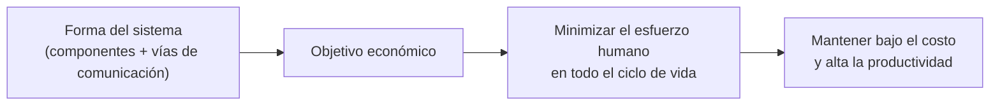

# 1. Qué es la arquitectura de un sistema

## La forma que se le da al software

La arquitectura de un sistema de software es la **forma** que le dan quienes lo construyen. Esa forma está en la manera de dividir el sistema en componentes, en cómo se disponen esos componentes y en las **vías de comunicación** que existen entre ellos.

El propósito de esa forma no es estético ni técnico por sí mismo. Es económico:

> El objetivo de la arquitectura de software es **minimizar los recursos humanos** requeridos para construir y mantener el sistema.

Cuando la arquitectura es buena, el costo por línea, por feature y por cambio se mantiene bajo con el tiempo. Cuando es mala, cada cambio cuesta más que el anterior hasta que el sistema se vuelve casi imposible de mantener.



## El arquitecto sigue programando

Una idea que Uncle Bob subraya: el arquitecto de software **es** un programador, y sigue siéndolo. No se aparta del código para dibujar diagramas: guía al equipo hacia un diseño que maximiza la productividad. La arquitectura no vive en documentos, vive en cómo está organizado el código real.

## Soporte a las cuatro fases del ciclo de vida

La arquitectura da soporte al ciclo de vida del sistema. Ese soporte se mide en cuatro fases, y una buena arquitectura las facilita todas:

| Fase | Qué debe facilitar la arquitectura |
|------|------------------------------------|
| **Desarrollo** | Que equipos puedan trabajar en paralelo sin pisarse; estructura acorde al tamaño y número de equipos |
| **Despliegue** | Que el sistema se pueda desplegar con un solo acto sencillo, sin decenas de pasos manuales |
| **Operación** | Que el sistema haga lo que debe; la arquitectura comunica las necesidades operativas a los desarrolladores |
| **Mantenimiento** | Que localizar y arreglar problemas, y agregar features, cueste poco; es la fase más cara de todas |

```
        CICLO DE VIDA DEL SISTEMA
        =========================

   ┌──────────────┐   ┌──────────────┐
   │ DESARROLLO   │   │  DESPLIEGUE  │
   │ equipos en   │   │ un solo acto │
   │ paralelo     │   │ sencillo     │
   └──────┬───────┘   └──────┬───────┘
          │                  │
          ▼                  ▼
   ┌───────────────────────────────┐
   │        ARQUITECTURA            │
   │   (da soporte a las 4 fases)   │
   └───────────────────────────────┘
          ▲                  ▲
          │                  │
   ┌──────┴───────┐   ┌──────┴───────┐
   │  OPERACIÓN   │   │ MANTENIMIENTO│
   │ hace lo que  │   │ la fase MÁS  │
   │ debe hacer   │   │ cara: bajarla│
   └──────────────┘   └──────────────┘
```

## Operación vs las otras tres

Un matiz importante: la operación suele resolverse "tirando hardware" (más servidores, más memoria). Por eso su impacto en el diseño es menor que el de las otras tres fases, que dependen casi por completo de los recursos humanos. La arquitectura, sin embargo, sí debe hacer transparentes las necesidades operativas para que el sistema sea comprensible.

El mantenimiento es, con diferencia, la fase más costosa. Gran parte de ese costo está en la **arqueología**: el esfuerzo de excavar el código existente para entender dónde y cómo hacer un cambio sin romper nada. Una buena arquitectura reduce drásticamente ese costo.

## Punto clave para recordar

> La arquitectura es la **forma** del sistema, y su meta es puramente económica: **minimizar el esfuerzo humano** a lo largo del desarrollo, despliegue, operación y mantenimiento. No se trata de que funcione hoy, sino de que siga siendo barato de cambiar mañana.

---

Siguiente: [Mantener las opciones abiertas →](./02-mantener-opciones-abiertas.md)
