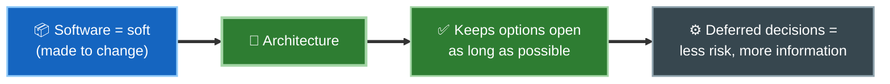
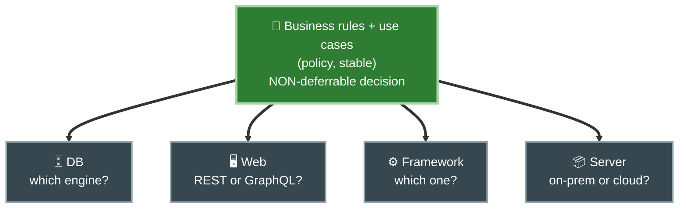
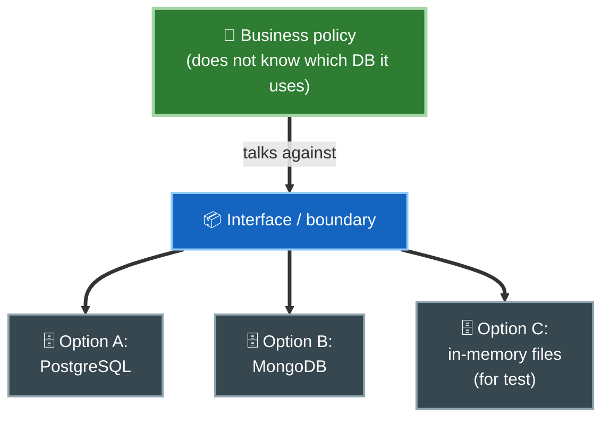

# 2. Mantener las opciones abiertas

## Software = *soft* + *ware*

La palabra *software* es un compuesto: *soft* (blando) y *ware* (producto). El software se inventó para ser **blando**, es decir, fácil de cambiar. Si la máquina no puede cambiar de comportamiento con facilidad, la habríamos llamado *hardware*.

De ahí nace la misión de la arquitectura:

> Una buena arquitectura hace que el sistema sea **fácil de cambiar**, dejando **tantas opciones abiertas como sea posible, durante el mayor tiempo posible**.

## Política vs detalles

Todo sistema de software se puede descomponer en dos elementos: **política** y **detalles**.

- La **política** encarna las reglas y procedimientos del negocio. Es el verdadero valor del sistema.
- Los **detalles** son lo que hace falta para que humanos y otros sistemas se comuniquen con esa política, pero **no impactan** en el comportamiento de la política.

Ejemplos típicos de detalles: la base de datos, el framework web, el servidor, los protocolos, el formato de entrada/salida. Son **decisiones aplazables**.

| Elemento | Qué es | ¿Impacta la regla de negocio? | ¿Se puede diferir? |
|----------|--------|-------------------------------|--------------------|
| Política | Reglas y casos de uso del negocio | Es la regla misma | No, es el núcleo |
| Base de datos | Dónde se guardan los datos | No | Sí |
| Framework web | Cómo se entrega por HTTP | No | Sí |
| Servidor / despliegue | Dónde y cómo corre | No | Sí |

El buen arquitecto **maximiza la cantidad de decisiones no tomadas**.

El núcleo (política, estable) es una decisión **no** aplazable; la periferia (DB, web, framework, servidor) son detalles **aplazables**. La política no depende de los detalles: por eso las flechas apuntan hacia ellos y no al revés.

## Diferir decisiones da poder

Aplazar una decisión sobre un detalle tiene dos beneficios concretos:

1. **Más información al decidir.** Cuanto más tarde eliges la base de datos, más sabes sobre cómo se accede realmente a los datos.
2. **Más experimentos posibles.** Si la política no depende del detalle, puedes probar varias opciones (por ejemplo, distintas bases de datos) sin reescribir el negocio.

Si la decisión de base de datos ya está tomada y clavada en el corazón del sistema, cambiarla cuesta una fortuna. Si está diferida detrás de un boundary, es solo un detalle intercambiable.

## El objetivo del arquitecto

El arquitecto quiere una estructura que:

- reconozca la política como el elemento más esencial del sistema, y
- vuelva los detalles **irrelevantes** para esa política.

Así las decisiones sobre detalles pueden retrasarse o incluso cambiarse mucho después, cuando ya no cuesta caro.

## Punto clave para recordar

> El buen arquitecto **maximiza las decisiones no tomadas**. Separa la política (el negocio, estable y valioso) de los detalles (DB, web, framework: aplazables), de modo que el sistema conserve la mayor cantidad de opciones abiertas el mayor tiempo posible.

---

Anterior: [← Qué es la arquitectura](./01-que-es-la-arquitectura.md) · Siguiente: [Independencia →](./03-independencia.md)
