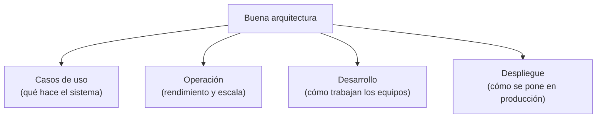
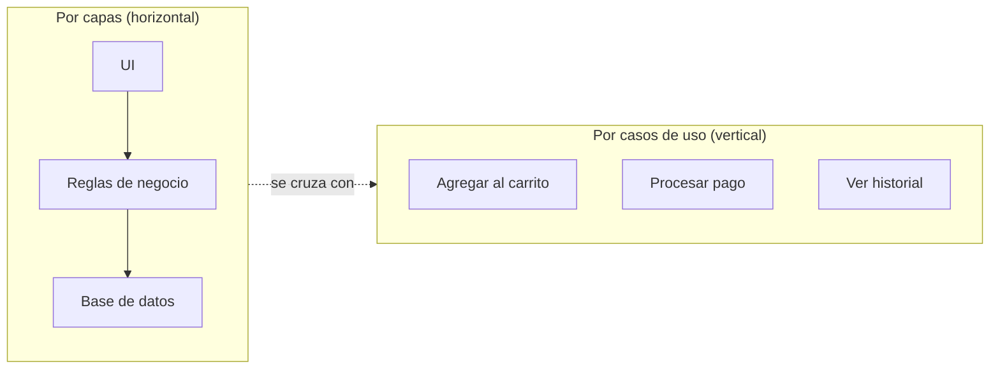

# 3. Independencia

## Una buena arquitectura sostiene cuatro cosas

Una arquitectura sana debe soportar, a la vez, los casos de uso del sistema, su operación, su desarrollo y su despliegue. Y debe hacerlo de forma que cada uno de esos aspectos se pueda evolucionar **con independencia** de los demás.



## Independencia de casos de uso

Lo primero que hace explícita una buena arquitectura son los **casos de uso**: al mirar la estructura de alto nivel debería quedar claro que es, por ejemplo, un sistema de carrito de compras, no solo "una aplicación Spring" o "una app Rails". El framework es un detalle; el caso de uso es la intención.

Además, los casos de uso deben quedar **aislados unos de otros**. Un cambio en el caso de uso "agregar al carrito" no debería obligar a tocar el caso de uso "procesar pago". Esa separación permite añadir nuevos casos de uso sin perturbar los existentes.

## Independencia de operación

Si los casos de uso están bien aislados, la arquitectura también admite las necesidades de **operación**. Un caso de uso que debe correr con alto throughput puede colocarse en su propio componente o servicio y escalar por separado, sin arrastrar al resto.

```
   Caso de uso A (alto tráfico)      Caso de uso B (bajo tráfico)
   ┌────────────────────┐           ┌────────────────────┐
   │  aislado en su      │           │  aislado en su      │
   │  propio componente  │           │  propio componente  │
   └─────────┬──────────┘           └─────────┬──────────┘
             │ escala x10                      │ escala x1
             ▼                                 ▼
      [ muchos procesos ]                [ un proceso ]
```

## Independencia de desarrollo y de despliegue

Cuando el sistema está dividido en componentes bien aislados por capas y por casos de uso:

- **Desarrollo independiente:** distintos equipos pueden trabajar sobre distintos componentes sin pisarse. La estructura se alinea con la organización (una versión práctica de la ley de Conway).
- **Despliegue independiente:** un cambio en un caso de uso puede desplegarse sin volver a desplegar todo el sistema. En el ideal, un componente se agrega o reemplaza "en caliente".

| Tipo de independencia | Qué habilita | Dependencia que se corta |
|-----------------------|--------------|--------------------------|
| De casos de uso | Añadir/cambiar un caso de uso sin tocar otros | Un caso de uso ↔ otro caso de uso |
| De operación | Escalar cada parte según su carga | Rendimiento de A ↔ rendimiento de B |
| De desarrollo | Equipos trabajando en paralelo | Equipo ↔ equipo |
| De despliegue | Desplegar por partes, sin rebuild total | Módulo ↔ módulo en el empaquetado |

## Cómo se logra: dos ejes de separación

La independencia nace de separar el sistema en dos direcciones a la vez:



- **Horizontal:** separar por capas técnicas (UI, reglas de negocio, persistencia).
- **Vertical:** separar por caso de uso, de modo que cada uno atraviese las capas pero se mantenga desacoplado de los demás.

El truco está en que las decisiones no tienen por qué tomarse una sola vez para siempre: la arquitectura debe permitir cambiar el **modo** de separación (desde simple separación de código fuente hasta servicios) a medida que el sistema crece.

## Punto clave para recordar

> La independencia es la meta práctica de la arquitectura: aislar los casos de uso entre sí y separar el sistema por capas horizontales y por casos de uso verticales. Cuando esa independencia existe, el desarrollo, el despliegue y la operación se pueden evolucionar por separado.

---

Anterior: [← Mantener las opciones abiertas](./02-mantener-opciones-abiertas.md) · Siguiente: [Desacoplamiento y duplicación →](./04-desacoplamiento-y-duplicacion.md)
