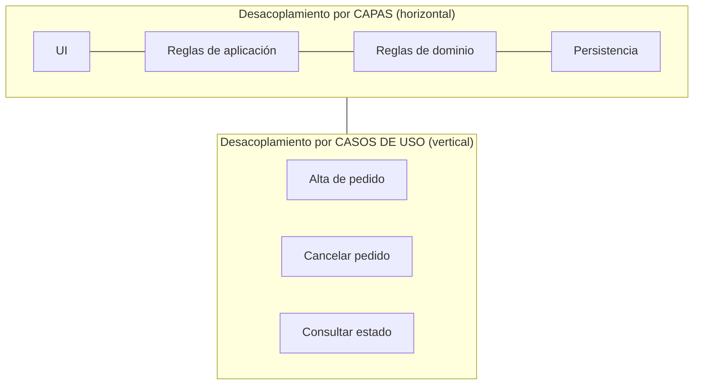
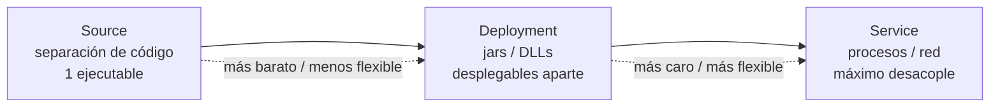

# 4. Desacoplamiento y duplicación

## Desacoplar en dos direcciones

La independencia que buscamos se materializa **desacoplando** los elementos del sistema. Ese desacoplamiento ocurre en dos ejes complementarios:

- **Por capas horizontales:** UI, reglas de negocio de aplicación, reglas de negocio del dominio y persistencia se separan porque cambian por razones y a ritmos distintos.
- **Por casos de uso verticales:** cada caso de uso corta a través de las capas, pero se mantiene aislado de los demás casos de uso.



```
        CASO A        CASO B        CASO C
        │             │             │
   UI ──┼─────────────┼─────────────┼──   ◄── capa UI cortada por caso de uso
        │             │             │
  APP ──┼─────────────┼─────────────┼──   ◄── capa de aplicación
        │             │             │
  DOM ──┼─────────────┼─────────────┼──   ◄── capa de dominio
        │             │             │
   DB ──┴─────────────┴─────────────┴──   ◄── capa de persistencia

   Vertical = por caso de uso   |   Horizontal = por capa
```

Cuando ambos cortes están hechos, cambiar un caso de uso no toca a los demás, y cambiar una capa (por ejemplo, la base de datos) no toca a las reglas de negocio.

## Duplicación real vs duplicación accidental

Al desacoplar, aparece la tentación de "unificar" trozos de código que se parecen. Aquí Uncle Bob advierte sobre una trampa clásica: no toda duplicación es mala.

- **Duplicación real (verdadera):** dos fragmentos que son iguales y que **cambiarán siempre juntos**, por la misma razón. Esta duplicación sí debe eliminarse.
- **Duplicación accidental (falsa):** dos fragmentos que hoy lucen idénticos pero que responden a caminos distintos del sistema y **evolucionarán por separado**. Unificarlos crea un acoplamiento dañino.

| Aspecto | Duplicación real | Duplicación accidental (falsa) |
|---------|------------------|--------------------------------|
| Aspecto hoy | Idéntico | Idéntico o muy parecido |
| Razón de cambio | Una sola, compartida | Distintas, independientes |
| Evolución futura | Cambian juntos, siempre | Divergen con el tiempo |
| Qué hacer | Eliminar la duplicación | **NO** unificar; dejarlas separadas |

```
   Duplicación REAL              Duplicación ACCIDENTAL
   ================              ======================
      A     A                       A         B
      │     │                       │         │
      └──┬──┘  cambian juntas        ▼         ▼
         ▼     → unificar         (con el tiempo divergen)
      [ código común ]              A'        B''
                                    → mantener separadas
```

> Si unificas dos cosas que solo *parecen* iguales, en cuanto una necesite cambiar por su cuenta tendrás que volver a separarlas, y habrás introducido un acoplamiento peligroso mientras tanto.

## Los tres modos de desacoplamiento

Separar los casos de uso y las capas se puede lograr en distintos niveles, y la arquitectura debería permitir **cambiar de nivel** según lo pida el proyecto:

1. **Nivel de código fuente (source):** los módulos se separan y se controla que uno no dependa del código de otro. Todos corren en el mismo espacio de direcciones y se comunican con llamadas a funciones. Es un solo ejecutable (monolito bien ordenado).
2. **Nivel de despliegue (deployment):** los módulos se separan en unidades desplegables independientes (jars, DLLs, gems, assemblies). Pueden desplegarse por separado, aunque suelen correr en el mismo espacio de direcciones o comunicarse por llamadas locales.
3. **Nivel de servicio (service):** los componentes se separan hasta el nivel de que solo dependan de los datos que intercambian y se comunican por red o entre procesos. Es el grado máximo de desacoplamiento (microservicios).

```
   MODO SOURCE              MODO DEPLOYMENT           MODO SERVICE
   ===========              ===============           ============
   ┌───────────────┐        ┌─────┐ ┌─────┐           ┌─────┐   ┌─────┐
   │ mod A │ mod B │        │ A   │ │ B   │           │ A   │   │ B   │
   │ mod C │ mod D │        │.jar │ │.dll │           │proc.│   │proc.│
   └───────────────┘        └─────┘ └─────┘           └──┬──┘   └──┬──┘
   1 ejecutable             unidades desplegables         │  red    │
   llamadas de función      independientes            ◄───┴─────────┴───►
   mismo proceso            mismo/otro proceso         mensajes entre procesos

   ── más simple, más acoplado ───────────────► más flexible, más costoso ──
```



| Modo | Unidad de separación | Comunicación | Cuándo conviene |
|------|----------------------|--------------|-----------------|
| Source | Módulos en el mismo build | Llamadas a función | Sistemas pequeños/medianos, un solo equipo |
| Deployment | jars, DLLs, gems | Llamadas locales / carga dinámica | Se quiere desplegar partes por separado |
| Service | Procesos independientes | Red / mensajes | Escala y equipos grandes; máxima independencia |

La recomendación de Martin: empujar la separación hasta donde sea **factible y necesario**, y estar listo para subir o bajar de nivel según evolucione el sistema. No conviene saltar a servicios antes de tiempo solo por moda; el costo de operación y comunicación es real.

## Punto clave para recordar

> Desacopla por capas y por casos de uso, elimina la duplicación **real** pero respeta la duplicación **accidental**, y elige el modo de desacoplamiento (source, deployment o service) según lo que el sistema necesita hoy, dejando abierta la posibilidad de cambiar de modo mañana.

---

Anterior: [← Independencia](./03-independencia.md) · Volver al [índice del tópico](./README.md)
