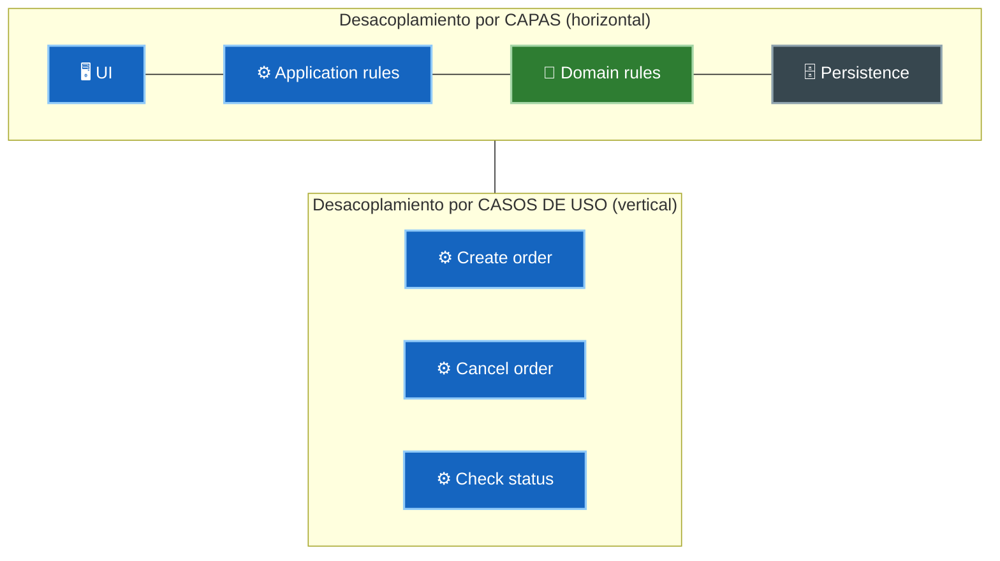
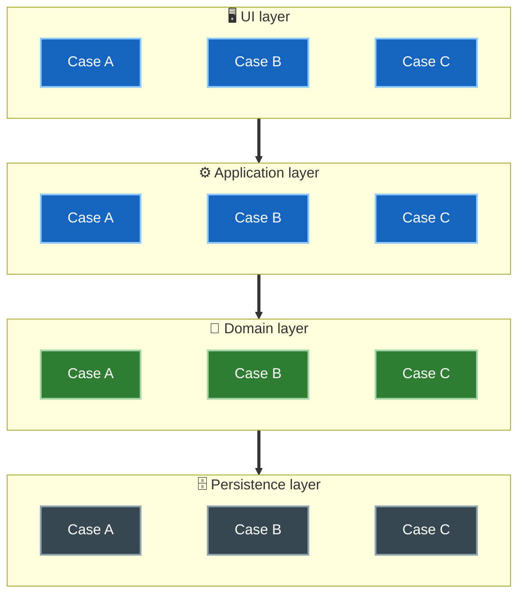
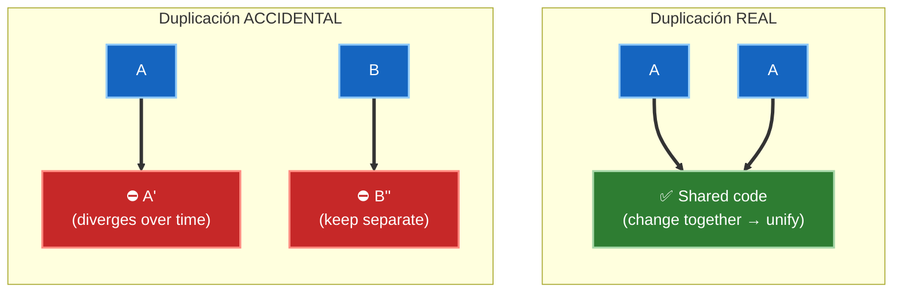
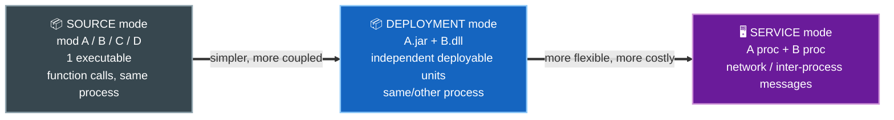
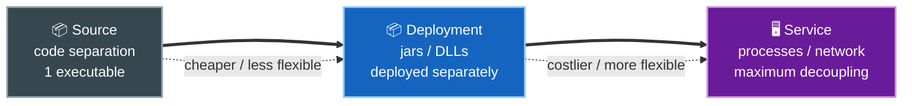

# 4. Desacoplamiento y duplicación

## Desacoplar en dos direcciones

La independencia que buscamos se materializa **desacoplando** los elementos del sistema. Ese desacoplamiento ocurre en dos ejes complementarios:

- **Por capas horizontales:** UI, reglas de negocio de aplicación, reglas de negocio del dominio y persistencia se separan porque cambian por razones y a ritmos distintos.
- **Por casos de uso verticales:** cada caso de uso corta a través de las capas, pero se mantiene aislado de los demás casos de uso.





Lo **vertical** es el corte por caso de uso (A, B, C atraviesan todas las capas); lo **horizontal** es el corte por capa (UI, aplicación, dominio, persistencia). Cada capa queda cortada por cada caso de uso.

Cuando ambos cortes están hechos, cambiar un caso de uso no toca a los demás, y cambiar una capa (por ejemplo, la base de datos) no toca a las reglas de negocio.

### Ejemplo: de acoplado a desacoplado

Un código **acoplado** mezcla en un mismo sitio la regla de negocio, el acceso a la base de datos y el HTTP. Si cambias de motor de datos o de framework, tocas la regla:

```python
# ❌ Todo mezclado: regla de negocio + SQL + HTTP en el mismo sitio
@app.post("/pedidos/{id}/cancelar")
def cancelar_pedido(id):
    row = db.execute("SELECT estado FROM pedidos WHERE id = %s", id)  # persistencia
    if row["estado"] == "ENVIADO":                                    # regla de negocio
        return {"error": "no se puede cancelar"}, 409                 # UI/HTTP
    db.execute("UPDATE pedidos SET estado = 'CANCELADO' WHERE id = %s", id)
    return {"ok": True}, 200
```

La versión **desacoplada** deja que la regla de negocio hable contra una interfaz (boundary), sin saber nada de SQL ni de HTTP. Cambiar la base de datos ya no toca la regla:

```python
# Capa de dominio: solo la regla, no sabe de DB ni de HTTP
class Pedido:
    def cancelar(self):
        if self.estado == "ENVIADO":
            raise PedidoNoCancelable()
        self.estado = "CANCELADO"

# Boundary: contrato que el dominio necesita
class RepositorioPedidos(ABC):
    @abstractmethod
    def obtener(self, id) -> Pedido: ...
    @abstractmethod
    def guardar(self, pedido: Pedido): ...

# Caso de uso: orquesta, sigue sin saber qué DB hay debajo
class CancelarPedido:
    def __init__(self, repo: RepositorioPedidos):
        self.repo = repo
    def ejecutar(self, id):
        pedido = self.repo.obtener(id)
        pedido.cancelar()
        self.repo.guardar(pedido)
```

Aquí se ven los dos cortes a la vez: el **horizontal** (dominio, caso de uso y persistencia separados) y el **vertical** (`CancelarPedido` es su propia clase, aislada de `AltaPedido` o `ConsultarEstado`).

## Duplicación real vs duplicación accidental

Al desacoplar, aparece la tentación de "unificar" trozos de código que se parecen. Aquí Uncle Bob advierte sobre una trampa clásica: no toda duplicación es mala.

- **Duplicación real (verdadera):** dos fragmentos que son iguales y que **cambiarán siempre juntos**, por la misma razón. Esta duplicación sí debe eliminarse.
- **Duplicación accidental (falsa):** dos fragmentos que hoy lucen idénticos pero que responden a caminos distintos del sistema y **evolucionarán por separado**. Unificarlos crea un acoplamiento dañino.

| Aspecto | Duplicación real | Duplicación accidental (falsa) |
|---------|------------------|--------------------------------|
| Aspecto hoy | Idéntico | Idéntico o muy parecido |
| Razón de cambio | Una sola, compartida | Distintas, independientes |
| Evolución futura | Cambian juntos, siempre | Divergen con el tiempo |
| Qué hacer | Eliminar la duplicación | **NO** unificar; dejarlas separadas |



> Si unificas dos cosas que solo *parecen* iguales, en cuanto una necesite cambiar por su cuenta tendrás que volver a separarlas, y habrás introducido un acoplamiento peligroso mientras tanto.

### Ejemplo: real vs accidental

La duplicación **real** repite la misma regla en varios sitios. Si la regla cambia, todos deben cambiar juntos, así que conviene unificarla:

```python
# ❌ Real: la misma regla de IVA repetida. Si el IVA sube al 19%, hay que tocar dos sitios.
total_factura = precio * 1.18
total_ticket  = precio * 1.18

# ✅ Unificado en un solo lugar
def aplicar_iva(precio): return precio * 1.18
```

La duplicación **accidental** son dos cálculos que hoy lucen idénticos pero responden a reglas distintas que evolucionarán por separado:

```python
# Hoy lucen iguales, pero son reglas diferentes que casualmente coinciden en el número
descuento_empleado = precio * 0.10
descuento_black_friday = precio * 0.10
```

Si los unificas en un solo `aplicar_descuento_10()`, el día que Black Friday suba al 15% pero el de empleado siga en 10% tendrás que volver a separarlos. La pista clave para distinguirlas es preguntar: **¿cambiarán por la misma razón?** El IVA sí; los descuentos no.

## Los tres modos de desacoplamiento

Separar los casos de uso y las capas se puede lograr en distintos niveles, y la arquitectura debería permitir **cambiar de nivel** según lo pida el proyecto:

1. **Nivel de código fuente (source):** los módulos se separan y se controla que uno no dependa del código de otro. Todos corren en el mismo espacio de direcciones y se comunican con llamadas a funciones. Es un solo ejecutable (monolito bien ordenado).
2. **Nivel de despliegue (deployment):** los módulos se separan en unidades desplegables independientes (jars, DLLs, gems, assemblies). Pueden desplegarse por separado, aunque suelen correr en el mismo espacio de direcciones o comunicarse por llamadas locales.
3. **Nivel de servicio (service):** los componentes se separan hasta el nivel de que solo dependan de los datos que intercambian y se comunican por red o entre procesos. Es el grado máximo de desacoplamiento (microservicios).





| Modo | Unidad de separación | Comunicación | Cuándo conviene |
|------|----------------------|--------------|-----------------|
| Source | Módulos en el mismo build | Llamadas a función | Sistemas pequeños/medianos, un solo equipo |
| Deployment | jars, DLLs, gems | Llamadas locales / carga dinámica | Se quiere desplegar partes por separado |
| Service | Procesos independientes | Red / mensajes | Escala y equipos grandes; máxima independencia |

La recomendación de Martin: empujar la separación hasta donde sea **factible y necesario**, y estar listo para subir o bajar de nivel según evolucione el sistema. No conviene saltar a servicios antes de tiempo solo por moda; el costo de operación y comunicación es real.

## Punto clave para recordar

> Desacopla por capas y por casos de uso, elimina la duplicación **real** pero respeta la duplicación **accidental**, y elige el modo de desacoplamiento (source, deployment o service) según lo que el sistema necesita hoy, dejando abierta la posibilidad de cambiar de modo mañana.

---

Anterior: [← Independencia](./03-independencia.md) · Volver al [índice del tópico](./README.md)
