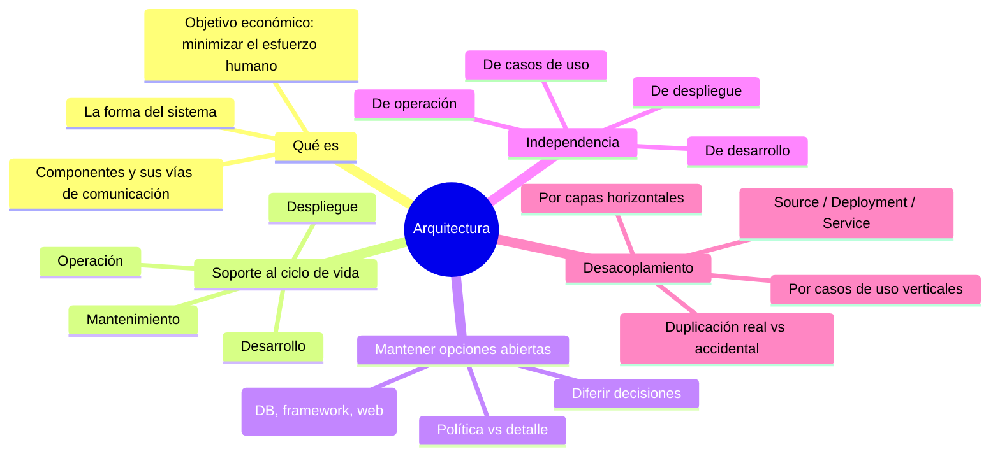

# Tópico 5 — Arquitectura: conceptos centrales

> Quinto bloque de la guía sobre **Clean Architecture** de Robert C. Martin.
> Aquí dejamos los paradigmas y los principios de componentes para responder la pregunta de fondo: ¿qué es realmente la arquitectura de un sistema y qué persigue?

## Idea central del tópico

La arquitectura de un sistema es la **forma** que le dan quienes lo construyen: la división en componentes, su disposición y las vías por las que se comunican. Esa forma no existe para lucirse, existe para un objetivo económico muy concreto:

> El objetivo de la arquitectura es **minimizar los recursos humanos** necesarios para construir y mantener el sistema durante todo su ciclo de vida.

Una buena arquitectura mantiene bajo el costo del ciclo de vida y logra ese ahorro **dejando abiertas tantas opciones como sea posible, durante el mayor tiempo posible**. Los detalles (base de datos, framework, forma de entrega web) son decisiones que la arquitectura debe permitir **aplazar** en vez de forzar temprano.

```
   Buena arquitectura  ─►  mantiene bajo el costo del ciclo de vida
                       ─►  deja opciones abiertas el mayor tiempo posible
                       ─►  separa POLÍTICA (reglas de negocio) de DETALLES (aplazables)
```

## Documentos de este tópico

| # | Documento | Punto que cubre |
|---|-----------|-----------------|
| 1 | [01-que-es-la-arquitectura.md](./01-que-es-la-arquitectura.md) | Qué es la arquitectura y cómo da soporte a las 4 fases del ciclo de vida: desarrollo, despliegue, operación y mantenimiento |
| 2 | [02-mantener-opciones-abiertas.md](./02-mantener-opciones-abiertas.md) | *Keeping options open*: diferir decisiones, separar políticas de detalles |
| 3 | [03-independencia.md](./03-independencia.md) | Independencia de casos de uso, operación, desarrollo y despliegue |
| 4 | [04-desacoplamiento-y-duplicacion.md](./04-desacoplamiento-y-duplicacion.md) | Desacoplamiento por capas y por casos de uso, duplicación real vs accidental y los tres modos de desacoplamiento |

## Diagrama del tópico



## Relación con la arquitectura

Este tópico es el corazón del libro. Con los paradigmas (Tópico 2), los principios de diseño (SOLID) y los principios de componentes ya en mano, aquí se articula el propósito unificador:

- **Mantener opciones abiertas** es la estrategia que hace posible aplazar decisiones sobre detalles.
- **La independencia** entre casos de uso y capas es la propiedad que permite desarrollar, desplegar y operar por partes.
- **El desacoplamiento** es el mecanismo concreto (source, deployment, service) que hace tangible esa independencia.

Todo esto prepara el terreno para los boundaries, la regla de dependencia y las capas de la Clean Architecture que veremos después.

## Referencia

- Robert C. Martin, *Clean Architecture*, Prentice Hall, 2017 — Parte V ("Architecture"), capítulos "What Is Architecture?", "Independence" y "Boundaries".
