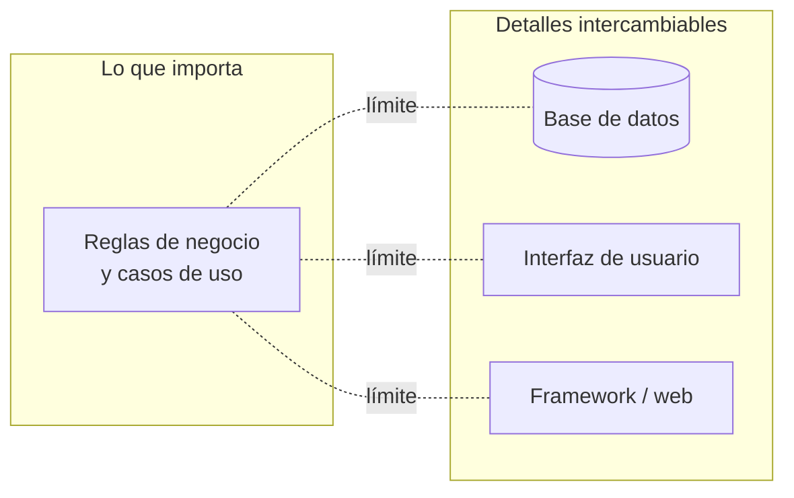

# 1. Qué son los límites y por qué trazarlos

## Qué es un límite arquitectónico

> Un **límite** (boundary) es una línea que separa elementos del software y restringe lo que los de un lado saben de los del otro.

Trazar un límite es, en el fondo, un acto de **desacoplamiento**. A un lado del límite ponemos las cosas que **importan** para el negocio (las reglas de negocio, los casos de uso, las entidades); al otro lado, las cosas que son **detalles** y que podrían cambiar por razones ajenas al negocio.

| A un lado del límite (importa) | Al otro lado (detalle, intercambiable) |
|--------------------------------|----------------------------------------|
| Reglas de negocio de la empresa | Base de datos (Oracle, MySQL, un archivo) |
| Casos de uso de la aplicación | Interfaz de usuario (web, escritorio, CLI) |
| Entidades y políticas centrales | Frameworks, la web, dispositivos, servicios externos |

La razón por la que separamos estos dos mundos es que **cambian por motivos distintos y a ritmos distintos**. La regla de negocio cambia cuando cambia el negocio; la base de datos cambia cuando cambia una decisión técnica o de infraestructura. Cada línea marca un **eje de cambio**.

## Por qué trazarlos

Trazar la línea correcta permite que cada lado evolucione sin arrastrar al otro:



Con la línea bien puesta obtienes:

- **Independencia de desarrollo**: distintos equipos trabajan a cada lado sin bloquearse.
- **Independencia de despliegue**: puedes cambiar la DB o la UI sin recompilar el núcleo.
- **Decisiones diferidas**: puedes empezar a construir el negocio antes de elegir la base de datos definitiva.

## El costo de NO trazarlos

Cuando no hay límites, las reglas de negocio quedan enredadas con los detalles. El resultado es el clásico "gran barro" acoplado: tocar la DB rompe la lógica de negocio, cambiar la UI obliga a recompilar todo, y probar una regla exige levantar la base de datos entera.

```
  SIN límite (todo acoplado)              CON límite (desacoplado)
  ┌───────────────────────────┐          ┌─────────────┐   ┌─────────────┐
  │  Negocio + DB + UI + FW    │          │  Negocio    │◄──│  DB / UI /  │
  │  todo mezclado en una masa │          │  (estable)  │   │  FW (plugin)│
  │  un cambio rompe lo demás  │          └─────────────┘   └─────────────┘
  └───────────────────────────┘           cada lado cambia por separado
        RÍGIDO Y FRÁGIL                          FLEXIBLE Y REVERSIBLE
```

El costo de no trazar límites no aparece el primer día: aparece meses después, como fricción constante. Cada decisión de detalle tomada temprano y no aislada se convierte en una atadura difícil de deshacer.

## Punto clave para recordar

> **Un límite separa lo que importa (reglas de negocio) de lo que no (detalles como DB, UI y frameworks).** Se traza donde hay un eje de cambio, y su ausencia se paga con un sistema rígido donde cualquier cambio de detalle arrastra al negocio.

---

Siguiente: [Anticipación de límites →](./02-anticipacion-de-limites.md)
