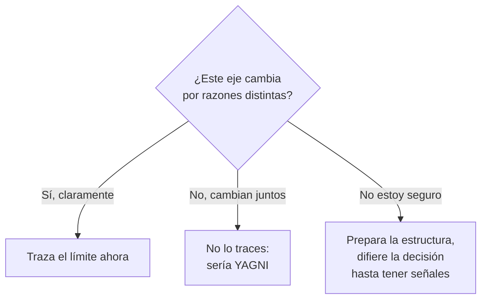
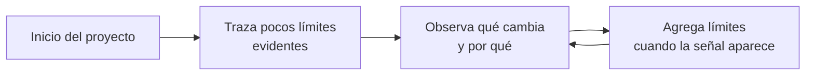

# 2. Anticipación de límites (Boundary Anticipation)

## El problema del "cuándo" y el "dónde"

Trazar límites cuesta: cada línea añade interfaces, indirección y estructura. Por eso la pregunta clave no es solo *cómo* trazar un límite, sino **cuándo y dónde** hacerlo.

> Un límite se traza **donde hay un eje de cambio**: donde algo cambia por razones distintas y a un ritmo distinto que lo que está al otro lado.

Si dos cosas siempre cambian juntas y por la misma razón, separarlas con un límite solo agrega complejidad sin beneficio. Si cambian por razones distintas, mantenerlas juntas es sembrar una atadura futura.

## Los dos errores opuestos

La anticipación de límites es un ejercicio de equilibrio entre dos peligros simétricos:

| Error | Qué es | Consecuencia |
|-------|--------|--------------|
| **Dibujar de más** | Poner límites "por si acaso", para futuros que quizá nunca lleguen | Sobre-ingeniería, indirección inútil, código difícil de seguir (viola YAGNI) |
| **Dibujar de menos** | No poner el límite que sí hacía falta | Acoplamiento, rigidez, decisiones de detalle que contaminan el negocio |



## YAGNI: el peligro de dibujar de más

*"You Aren't Gonna Need It"* — no lo vas a necesitar. Cada límite especulativo tiene un costo real hoy a cambio de un beneficio hipotético mañana. Anticipar un límite que nunca se usa deja al sistema cargado de abstracciones vacías que hay que mantener, leer y atravesar.

```
   Dibujar de MÁS                         Dibujar de MENOS
   ┌──────┐ ┌──────┐ ┌──────┐             ┌────────────────────────┐
   │ A    │→│ iface│→│ B    │             │  A y B mezclados,       │
   └──────┘ └──────┘ └──────┘             │  sin línea entre ellos  │
   límites que nadie necesita             └────────────────────────┘
   COSTO HOY, beneficio dudoso            barato hoy, CARO al cambiar
```

## La postura equilibrada

La estrategia recomendada por Uncle Bob es **no** decidir de golpe todos los límites, sino:

1. Trazar los límites que el eje de cambio **ya justifica** con claridad.
2. Para los dudosos, mantener el código estructurado de modo que **agregar el límite después sea barato**.
3. Revisar continuamente: un límite se agrega cuando la fricción del cambio empieza a aparecer, no antes por miedo ni después por descuido.



## Punto clave para recordar

> **Los límites se dibujan donde hay un eje de cambio, ni antes ni después.** Dibujar de más es sobre-ingeniería (YAGNI); dibujar de menos deja el sistema acoplado. La habilidad arquitectónica está en distinguir qué cambia por razones distintas.

---

Anterior: [← Qué son los límites](./01-que-son-los-limites.md) · Siguiente: [Arquitectura plugin →](./03-arquitectura-plugin.md)
