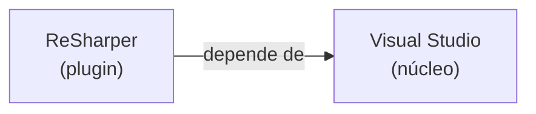
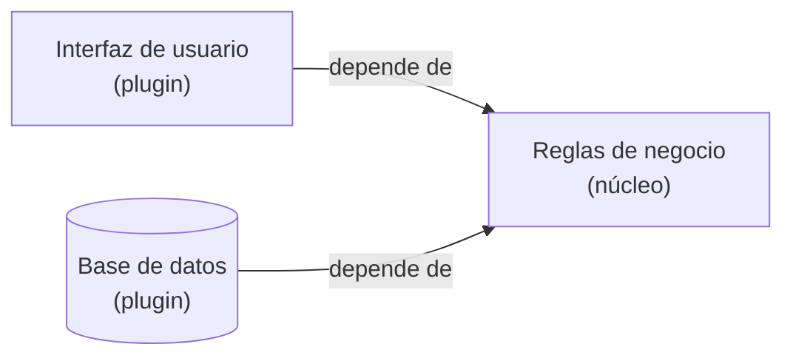

# 3. Componentes plugin y la arquitectura plugin

## La idea del plugin

> Un **plugin** es un componente que se conecta a un núcleo sin que el núcleo tenga que saber nada de él.

El ejemplo favorito de Uncle Bob es **ReSharper y Visual Studio**. ReSharper es un plugin de Visual Studio: extiende el IDE, depende de él y se conecta a sus puntos de extensión. La relación es asimétrica y muy reveladora:

- Los desarrolladores de **ReSharper** conocen y dependen del equipo de **Visual Studio**.
- Los desarrolladores de **Visual Studio** no saben nada de ReSharper y no dependen de él.



La dependencia va **en un solo sentido**: del plugin hacia el núcleo. Visual Studio puede seguir viviendo aunque ReSharper desaparezca; ReSharper no. Esa asimetría es exactamente la forma de un buen límite arquitectónico.

## El negocio como núcleo; UI y DB como plugins

La lección arquitectónica es invertir la intuición habitual. Solemos pensar que el negocio "usa" la base de datos y "vive dentro" de la UI. Clean Architecture propone lo contrario:

> Las **reglas de negocio** son el núcleo estable. La **UI** y la **base de datos** son plugins que se conectan a ese núcleo.



Fíjate en la dirección: la UI y la DB **dependen** del negocio, nunca al revés. El negocio no sabe si lo pintan en una web o en una consola, ni si lo persisten en Oracle o en un archivo de texto. Puedes arrancar y sustituir cualquier plugin sin tocar el núcleo.

```
   Modelo ingenuo (negocio en medio, atado)      Arquitectura plugin (negocio al centro)
   ┌──────┐   ┌─────────┐   ┌──────┐             ┌──────┐        ┌──────────┐        ┌──────┐
   │  UI  │──►│ Negocio │──►│  DB  │             │  UI  │───────►│ Negocio  │◄───────│  DB  │
   └──────┘   └─────────┘   └──────┘             └──────┘ plugin │ (núcleo) │ plugin └──────┘
     el negocio depende de todo                            └──────────┘
                                                    todo depende del negocio; él no depende de nada
```

## Por qué esto protege al negocio

| Cambia... | Sin arquitectura plugin | Con arquitectura plugin |
|-----------|-------------------------|-------------------------|
| La base de datos | Hay que tocar el negocio | Se sustituye el plugin de DB |
| La interfaz | Se recompila todo | Se sustituye el plugin de UI |
| El framework web | Contamina las reglas | Queda fuera del núcleo |
| Las reglas de negocio | Riesgo de romper detalles | Cambian en un núcleo aislado |

El núcleo, al no depender de nada volátil, se vuelve la parte más **estable** y protegida del sistema: justo donde queremos que viva el valor real de la empresa.

## Punto clave para recordar

> **En una arquitectura plugin, las reglas de negocio son el núcleo y la UI, la base de datos y los frameworks son plugins que dependen de ese núcleo, nunca al revés.** Igual que ReSharper depende de Visual Studio y no al contrario, los detalles se conectan al negocio y son intercambiables.

---

Anterior: [← Anticipación de límites](./02-anticipacion-de-limites.md) · Siguiente: [Anatomía y flujo de control →](./04-anatomia-y-flujo-de-control.md)
