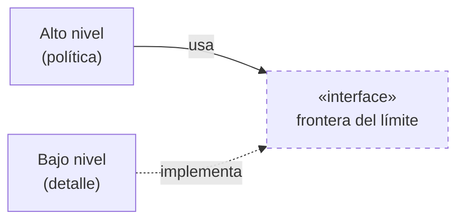
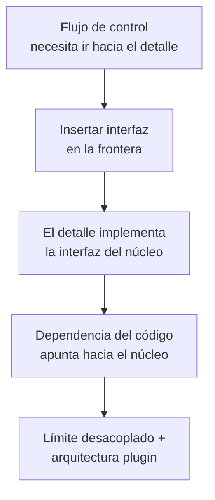

# 4. Anatomía de un boundary crossing y el flujo de control

## Qué es un boundary crossing

> Un **cruce de límite** (boundary crossing) es una llamada de una función a otra que está al otro lado de la línea, pasando datos a través de ella.

En tiempo de ejecución, cruzar un límite es simplemente una llamada de función. Lo interesante no es la llamada en sí, sino cómo se gestionan **la dirección de la dependencia del código fuente** y **la dirección del flujo de control**, que no siempre coinciden.

La anatomía típica de un cruce bien diseñado tiene tres piezas:

| Pieza | Papel |
|-------|-------|
| **Llamador de alto nivel** | Contiene la política / regla de negocio; inicia la acción |
| **Interfaz (frontera)** | Abstracción que define el contrato del cruce |
| **Implementación de bajo nivel** | El detalle (DB, UI, dispositivo) que hace el trabajo concreto |

## Flujo de control vs. dirección de las dependencias

El flujo de control es **quién llama a quién en ejecución**. La dependencia del código es **quién menciona/importa a quién en el fuente**. La clave arquitectónica de Uncle Bob:

> A veces el flujo de control cruza el límite en **un sentido** mientras la dependencia del código apunta en el sentido **contrario**. Eso se logra con la **inversión de dependencias (DIP)**.

### Cuando coinciden (sin inversión)


Aquí el alto nivel depende del detalle: cambiar el detalle obliga a tocar la política. Es lo que queremos evitar en un límite.

### Cuando se oponen (con inversión de dependencias)

Insertamos una interfaz que **el alto nivel posee** y que **el bajo nivel implementa**. Ahora el flujo de control sigue yendo del alto al bajo nivel, pero la dependencia del código apunta del bajo nivel hacia la abstracción del alto nivel.



El siguiente diagrama muestra explícitamente los **dos sentidos opuestos**: el flujo de control va de izquierda a derecha, mientras la flecha de dependencia del código va, invertida, de derecha a izquierda.

```
                          LÍMITE
                            │
   FLUJO DE CONTROL         │
   Alto nivel  ───────────────────────────►  Bajo nivel
   (política)               │                 (detalle: DB / UI)
                            │
   DEPENDENCIA DEL CÓDIGO   │
   Alto nivel               │                 Bajo nivel
       ▲                    │                     │
       │◄───────────────────┼─────────────────────┘
       │        «interface» │  (implementa)
       └─ posee la interfaz │
                            │
   ► Control cruza a la derecha.  ◄ La dependencia apunta a la izquierda.
     Son OPUESTOS gracias a DIP.
```

## Por qué esto importa

Poder invertir la dependencia respecto al flujo de control es lo que hace posible todo lo demás del tópico:

- El **negocio no depende del detalle** aunque en ejecución lo invoque.
- El detalle (DB, UI) queda como **plugin** que apunta hacia el núcleo.
- El límite se vuelve una **línea de desacoplamiento real**, no solo una separación de carpetas.



## Punto clave para recordar

> **El flujo de control y la dirección de las dependencias no tienen por qué coincidir.** Con la inversión de dependencias, el control puede cruzar el límite hacia el detalle mientras la dependencia del código apunta de vuelta al negocio. Esa oposición deliberada es lo que convierte un límite en un desacoplamiento verdadero.

---

Anterior: [← Arquitectura plugin](./03-arquitectura-plugin.md) · Volver al índice: [README del tópico](./README.md)
