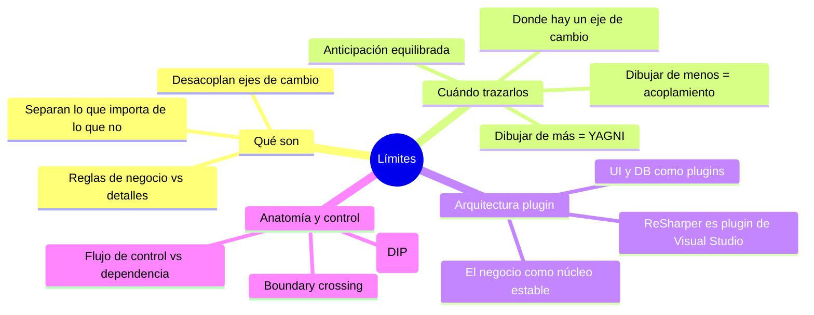

# Tópico 6 — Límites (Boundaries)

> Sexto bloque de la guía sobre **Clean Architecture** de Robert C. Martin.
> Los límites son las líneas que separan el software en partes y restringen qué sabe una parte de otra.

## Idea central del tópico

Un **límite arquitectónico** (boundary) es una línea que separa elementos del software. A un lado quedan los que **importan** (las reglas de negocio); al otro, los que **no** (los detalles: la base de datos, la UI, los frameworks, la web).

> Trazar un límite significa **desacoplar**: lo que está de un lado no debería saber nada de lo que está del otro, para poder cambiarlo, sustituirlo o diferir su decisión sin arrastrar al resto.

Uncle Bob resume el objetivo así:

```
   Lo importante (política, reglas de negocio)  │  Lo intercambiable (detalles)
   ─────────────────────────────────────────────┼──────────────────────────────
   Casos de uso, entidades                       │  DB, UI, framework, web, dispositivos
                                                  ▲
                                             LÍMITE
                            (separa un eje de cambio de otro)
```

El arte está en decidir **qué** líneas dibujar y **cuándo**: dibujar de más es sobre-ingeniería (YAGNI), dibujar de menos deja el sistema acoplado y rígido.

## Documentos de este tópico

| # | Documento | Punto que cubre |
|---|-----------|-----------------|
| 1 | [01-que-son-los-limites.md](./01-que-son-los-limites.md) | Qué son los límites, por qué trazarlos y el costo real de no hacerlo |
| 2 | [02-anticipacion-de-limites.md](./02-anticipacion-de-limites.md) | Boundary anticipation: cuándo y dónde dibujar líneas; el peligro de dibujar de más y de menos |
| 3 | [03-arquitectura-plugin.md](./03-arquitectura-plugin.md) | Componentes plugin y la arquitectura plugin (ReSharper/Visual Studio); el negocio como núcleo, UI y DB como plugins |
| 4 | [04-anatomia-y-flujo-de-control.md](./04-anatomia-y-flujo-de-control.md) | Anatomía de un boundary crossing y el flujo de control frente a la dirección de las dependencias |

## Diagrama del tópico



## Relación con la arquitectura

Los límites son el mecanismo con el que Clean Architecture logra sus objetivos:

- **Desacoplamiento** → cada lado del límite puede evolucionar por separado.
- **Decisiones diferidas** → un buen límite permite posponer la elección de DB, framework o UI.
- **Reversibilidad** → si una decisión de detalle fue mala, el límite reduce el costo de cambiarla.
- **Arquitectura plugin** → las reglas de negocio quedan en el núcleo y todo lo demás se conecta como plugin apuntando hacia adentro, gracias a la inversión de dependencias.

## Referencia

- Robert C. Martin, *Clean Architecture*, Prentice Hall, 2017 — Capítulos sobre "Boundaries: Drawing Lines", "Boundary Anticipation", "Plugin Architecture" y "The Boundaries: Drawing Lines".
