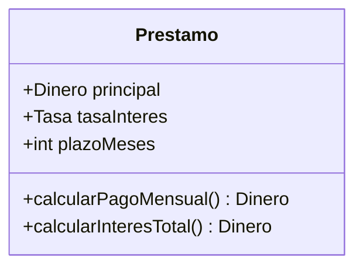

# 1. Entities: Enterprise Business Rules

## Qué es una entidad

> Una **Entity** encapsula las **reglas de negocio críticas de la empresa** (*Critical Business Rules*) junto con los **datos críticos** sobre los que operan esas reglas.

Son las reglas que **harían o ahorrarían dinero al negocio incluso si no existiera ningún sistema informático**. Si mañana la empresa operara con lápiz y papel, estas reglas seguirían siendo ciertas.

Uncle Bob las llama *Enterprise Business Rules* porque pertenecen al negocio como un todo, no a una aplicación concreta.

## Ejemplo clásico: el interés de un préstamo

Un banco cobra **N% de interés** sobre un préstamo. Esa regla y los datos que necesita (principal, tasa, plazo) existen independientemente de si el cálculo lo hace una computadora o un empleado con una calculadora.



El objeto `Prestamo` reúne los **datos críticos** (`principal`, `tasaInteres`, `plazoMeses`) y las **reglas críticas** (`calcularPagoMensual`, `calcularInteresTotal`). Esta combinación es lo que define a una entidad.

## Estructura de una entidad en las capas

Una entidad vive en el círculo más interno. No sabe nada del mundo exterior.

```
        ┌───────────────────────────────────────┐
        │  Frameworks / DB / UI  (detalles)       │
        │   ┌───────────────────────────────┐     │
        │   │  Use Cases (app rules)         │     │
        │   │    ┌───────────────────────┐   │     │
        │   │    │   ENTITIES            │   │     │
        │   │    │   principal, tasa     │   │     │
        │   │    │   calcularPago()      │   │     │
        │   │    └───────────────────────┘   │     │
        │   └───────────────────────────────┘     │
        └───────────────────────────────────────┘
                 (las flechas apuntan hacia adentro)
```

## Qué SÍ y qué NO pertenece a una entidad

| Pertenece a la entidad | NO pertenece a la entidad |
|------------------------|---------------------------|
| Reglas verdaderas del negocio | Cómo se muestra el dato en pantalla |
| Datos críticos del dominio | Cómo se guarda en la base de datos |
| Cálculos que existirían sin software | Validación de un formato de request HTTP |
| Invariantes del negocio | Qué framework se usa |

### Ejemplo ❌ — entidad contaminada con detalles

```java
class Prestamo {
    // ❌ La entidad NO debería saber de SQL ni de JSON
    void guardarEnPostgres(Connection c) { /* INSERT ... */ }
    String toJsonHttpResponse() { /* ... */ }
}
```

### Ejemplo ✅ — entidad limpia, solo reglas y datos

```java
class Prestamo {
    private final Dinero principal;
    private final Tasa tasaInteres;
    private final int plazoMeses;

    // ✅ Solo regla crítica del negocio
    Dinero calcularInteresTotal() {
        return principal.multiplicar(tasaInteres).porPlazo(plazoMeses);
    }
}
```

## Por qué esto importa

Las entidades son lo **más estable** del sistema. Los frameworks cambian, la base de datos cambia, la UI cambia; las reglas del negocio son las que menos cambian. Aislarlas las protege de todo ese ruido.

## Punto clave para recordar

> **Una entidad es una regla de negocio crítica más sus datos, que existirían aunque el sistema informático nunca se hubiera construido.** No sabe nada de bases de datos, web ni frameworks.

---

Siguiente: [Use Cases: reglas de aplicación →](./02-use-cases-reglas-de-aplicacion.md)
