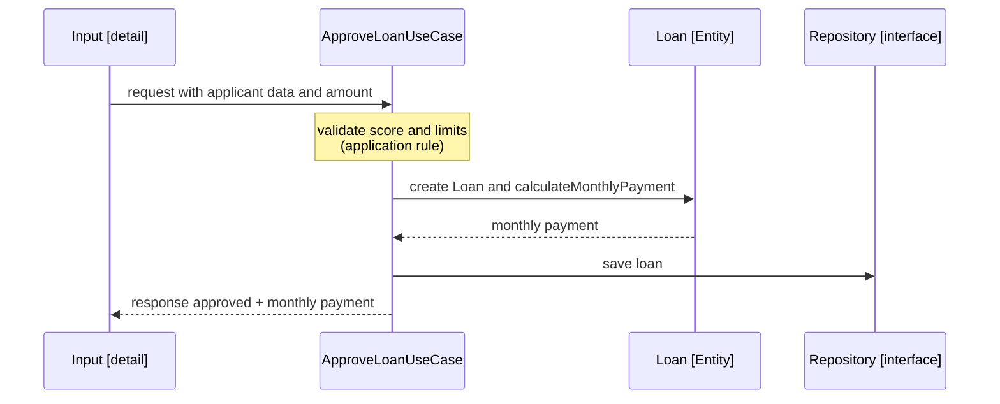
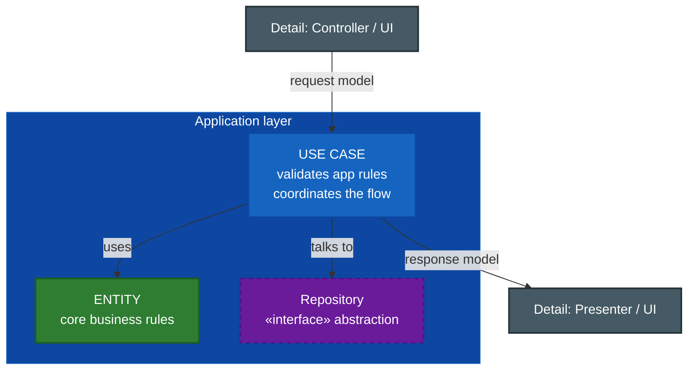

# 2. Use Cases: Application Business Rules

## Qué es un caso de uso

> Un **Use Case** describe las **reglas de negocio específicas de la aplicación** (*Application-Specific Business Rules*): cómo se **automatiza** el negocio en este sistema concreto.

Mientras la entidad dice *qué* es cierto en el negocio (el interés existe), el caso de uso dice *cómo* la aplicación lo usa: qué datos pide, en qué orden ejecuta los pasos, qué valida a nivel de aplicación y qué devuelve.

Un caso de uso define un **flujo**: la interacción entre el usuario y las entidades para conseguir un objetivo.

## Ejemplo: "Aprobar un préstamo"

```
Use case: ApproveLoan
  Input:  applicant data, requested amount
  Application rules:
    1. Verify that the applicant has score >= 650
    2. Verify that the amount <= allowed limit
    3. Create the Loan entity and ask it to calculateMonthlyPayment()
    4. Register the approved loan
  Output:  approved loan with its monthly payment, or rejection with reason
```

Nota que el **paso 3 usa la entidad** (`Loan.calculateMonthlyPayment()`), pero los pasos 1, 2 y 4 son reglas propias de **esta aplicación**: otro banco podría automatizar el mismo negocio con un flujo distinto.

## El caso de uso orquesta, la entidad calcula



## Dónde vive un caso de uso



## Diferencia entre los dos niveles de reglas

| Aspecto | Entity (empresa) | Use Case (aplicación) |
|---------|------------------|-----------------------|
| Alcance | Todo el negocio | Esta aplicación |
| Existiría sin software | Sí | No (describe la automatización) |
| Ejemplo | Fórmula del interés | Flujo de "ApproveLoan" |
| Estabilidad | Muy alta | Alta, pero cambia si cambia el proceso |
| Depende de | Nada | De las entidades |

### Ejemplo ❌ — caso de uso que mete reglas de empresa

```java
class ApproveLoanUseCase {
    Response execute(Request r) {
        // ❌ The interest formula is an ENTERPRISE rule, not an app rule
        double interest = r.amount * 0.05 * r.term;
        // ...
    }
}
```

### Ejemplo ✅ — caso de uso que delega en la entidad

```java
class ApproveLoanUseCase {
    Response execute(Request r) {
        if (r.score < 650) return Response.rejected("Insufficient score");
        Loan loan = new Loan(r.amount, currentRate, r.term);
        Money payment = loan.calculateMonthlyPayment(); // ✅ enterprise rule in the entity
        repository.save(loan);
        return Response.approved(payment);
    }
}
```

## Punto clave para recordar

> **Un caso de uso contiene las reglas específicas de la aplicación: orquesta el flujo y coordina las entidades, pero delega en ellas las reglas críticas del negocio.** Define qué entra (input) y qué sale (output).

---

Anterior: [← Entities: reglas de empresa](./01-entities-reglas-de-empresa.md) · Siguiente: [Modelos de request/response →](./03-modelos-request-response.md)
