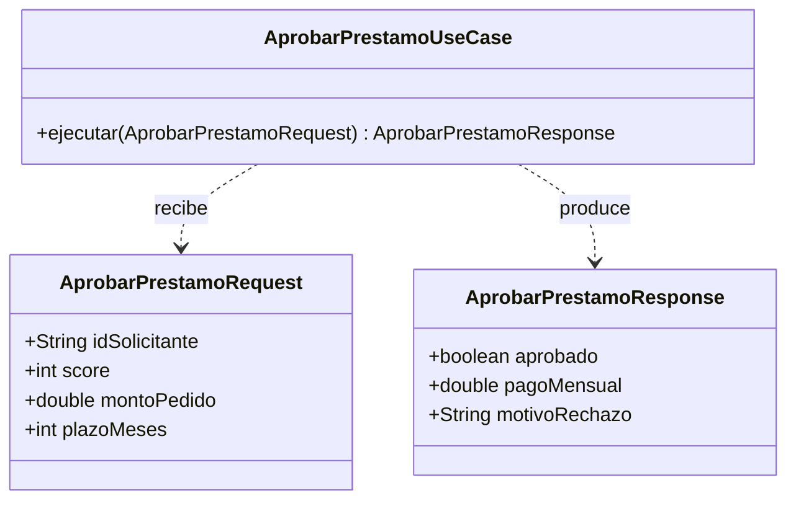

# 3. Modelos de request y response

## Qué son

> Los **modelos de request y response** son estructuras de datos **planas y simples** que un caso de uso recibe como entrada y produce como salida. No contienen lógica, no conocen HTTP y no conocen la base de datos.

Su única misión es transportar datos a través del **boundary** (límite) que rodea al caso de uso: del lado de afuera (controllers, UI) hacia adentro (use case) y de vuelta (use case hacia presenters).

## Por qué existen (y no se reutiliza la entidad)

Podría parecer natural pasarle la entidad directamente al controller o devolverla en la respuesta. Uncle Bob lo desaconseja: crearía un **acoplamiento** entre el caso de uso y su entorno.

```
   ❌ Acoplamiento fuerte              ✅ Boundary limpio
   Controller ──► Entity              Controller ──► RequestModel ──► UseCase
                                                                        │
   (el controller depende            UseCase ──► ResponseModel ──► Presenter
    de la estructura interna
    de la regla de negocio)          (nadie depende de la entidad interna)
```

Los modelos son un **contrato estable** en el borde del caso de uso, desacoplado de cómo estén hechas las entidades por dentro.

## Estructura: solo datos



## Flujo del dato a través del boundary

```
   [ Web / HTTP ]
        │  parsea JSON, arma...
        ▼
   ┌─────────────────────┐
   │  RequestModel       │  (plano: strings, números, fechas)
   └─────────┬───────────┘
             ▼
   ┌─────────────────────┐
   │  USE CASE           │  usa entidades, aplica reglas
   └─────────┬───────────┘
             ▼
   ┌─────────────────────┐
   │  ResponseModel      │  (plano: sin objetos de dominio)
   └─────────┬───────────┘
             ▼
   [ Presenter → HTML / JSON / UI ]
```

## Reglas de un buen modelo

| Regla | Motivo |
|-------|--------|
| Solo tipos simples y colecciones | Evita arrastrar dependencias |
| Sin anotaciones de framework web | No debe saber de HTTP |
| Sin anotaciones de ORM/DB | No debe saber de persistencia |
| Sin lógica de negocio | Es un contenedor de datos, no una regla |
| No contiene la entidad | Rompería el aislamiento del núcleo |

### Ejemplo ❌ — request atado a la web y a la entidad

```java
// ❌ Sabe de HTTP (anotaciones) y expone la entidad de dominio
class AprobarPrestamoRequest {
    @JsonProperty("monto") HttpServletRequest raw;
    Prestamo prestamoDominio; // filtra la entidad hacia afuera
}
```

### Ejemplo ✅ — request plano y neutral

```java
// ✅ Solo datos simples; no sabe de HTTP ni de la DB
class AprobarPrestamoRequest {
    final String idSolicitante;
    final int score;
    final double montoPedido;
    final int plazoMeses;
}
```

## Punto clave para recordar

> **Los modelos de request y response son estructuras de datos planas que cruzan el boundary del caso de uso.** No conocen HTTP ni la base de datos, y nunca deben ser reemplazados por las entidades para evitar acoplar el núcleo con el exterior.

---

Anterior: [← Use Cases: reglas de aplicación](./02-use-cases-reglas-de-aplicacion.md) · Siguiente: [Relación entities ↔ use cases →](./04-relacion-entities-usecases.md)
