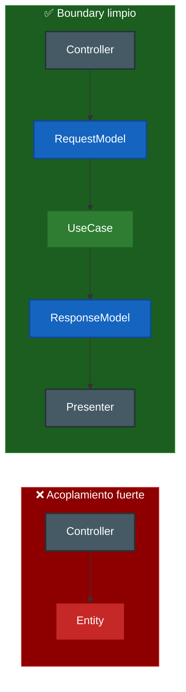
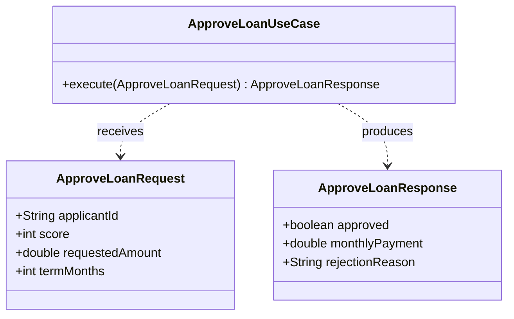
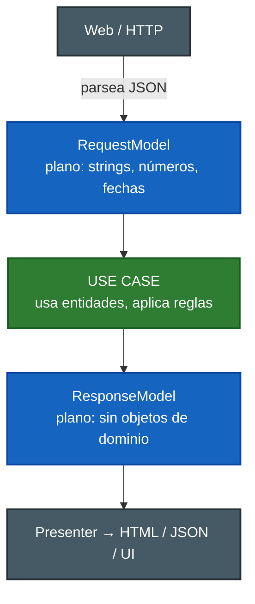

# 3. Modelos de request y response

## Qué son

> Los **modelos de request y response** son estructuras de datos **planas y simples** que un caso de uso recibe como entrada y produce como salida. No contienen lógica, no conocen HTTP y no conocen la base de datos.

Su única misión es transportar datos a través del **boundary** (límite) que rodea al caso de uso: del lado de afuera (controllers, UI) hacia adentro (use case) y de vuelta (use case hacia presenters).

## Por qué existen (y no se reutiliza la entidad)

Podría parecer natural pasarle la entidad directamente al controller o devolverla en la respuesta. Uncle Bob lo desaconseja: crearía un **acoplamiento** entre el caso de uso y su entorno.



En el lado ❌ el controller depende de la estructura interna de la regla de negocio. En el lado ✅ nadie depende de la entidad interna: los modelos son el contrato del borde.

Los modelos son un **contrato estable** en el borde del caso de uso, desacoplado de cómo estén hechas las entidades por dentro.

## Estructura: solo datos



## Flujo del dato a través del boundary



## Reglas de un buen modelo

| Regla | Motivo |
|-------|--------|
| Solo tipos simples y colecciones | Evita arrastrar dependencias |
| Sin anotaciones de framework web | No debe saber de HTTP |
| Sin anotaciones de ORM/DB | No debe saber de persistencia |
| Sin lógica de negocio | Es un contenedor de datos, no una regla |
| No contiene la entidad | Rompería el aislamiento del núcleo |

### Ejemplo ❌ — request atado a la web y a la entidad

```java
// ❌ Knows about HTTP (annotations) and exposes the domain entity
class ApproveLoanRequest {
    @JsonProperty("amount") HttpServletRequest raw;
    Loan domainLoan; // leaks the entity outward
}
```

### Ejemplo ✅ — request plano y neutral

```java
// ✅ Only simple data; knows nothing about HTTP or the DB
class ApproveLoanRequest {
    final String applicantId;
    final int score;
    final double requestedAmount;
    final int termMonths;
}
```

## Punto clave para recordar

> **Los modelos de request y response son estructuras de datos planas que cruzan el boundary del caso de uso.** No conocen HTTP ni la base de datos, y nunca deben ser reemplazados por las entidades para evitar acoplar el núcleo con el exterior.

---

Anterior: [← Use Cases: reglas de aplicación](./02-use-cases-reglas-de-aplicacion.md) · Siguiente: [Relación entities ↔ use cases →](./04-relacion-entities-usecases.md)
