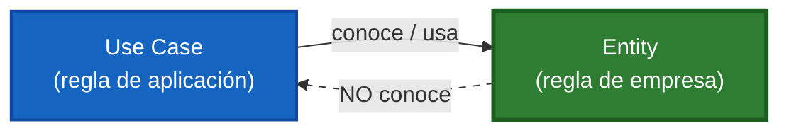
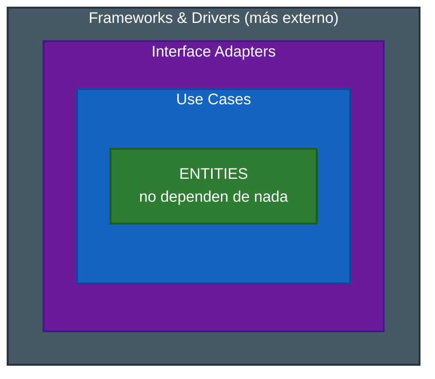

# 4. Relación entre entities y use cases

## La regla de oro

> **Los casos de uso conocen a las entidades; las entidades NO conocen a los casos de uso.** La dependencia va siempre de afuera hacia adentro: Use Case → Entity, nunca al revés.

Esta es una aplicación directa de la **Regla de la Dependencia** de Clean Architecture: el código de los círculos externos puede depender del código de los círculos internos, pero jamás al contrario.

## Por qué esta dirección y no la otra

Las entidades son el nivel **más alto** (más general, más estable). Los casos de uso son un nivel **más bajo** (más específico de la aplicación). Un nivel más bajo puede depender de uno más alto, pero un nivel alto que dependiera de uno bajo quedaría contaminado por lo específico.



Si la entidad conociera al caso de uso, un cambio en el flujo de la aplicación obligaría a tocar la regla crítica del negocio: exactamente lo que la arquitectura busca evitar.

## Visto en los círculos concéntricos



La dependencia **siempre apunta hacia adentro**: cada anillo externo depende del que tiene dentro, nunca al revés. El anillo más profundo (Entities) no depende de ninguno.

## Tabla comparativa de la relación

| Pregunta | Entity | Use Case |
|----------|--------|----------|
| ¿Conoce al otro? | No conoce al use case | Sí conoce a la entidad |
| ¿Nivel? | Más alto (empresa) | Más bajo (aplicación) |
| ¿Puede cambiar por cambios en el otro? | No cambia si cambia el use case | Puede cambiar si cambia la entidad |
| ¿Reutilizable en otras apps? | Sí, en toda la empresa | Solo en esta aplicación |

## Ejemplos ❌/✅

### ❌ — la entidad importa el caso de uso

```java
// ❌ The entity depends on the application: inverted direction
package domain;
import application.ApproveLoanUseCase; // wrong!

class Loan {
    void approveVia(ApproveLoanUseCase uc) { /* ... */ }
}
```

### ✅ — el caso de uso importa la entidad

```java
// ✅ The use case depends on the entity: correct direction
package application;
import domain.Loan;

class ApproveLoanUseCase {
    Response execute(Request r) {
        Loan loan = new Loan(r.requestedAmount, currentRate, r.termMonths);
        return Response.approved(loan.calculateMonthlyPayment());
    }
}
```

La entidad `Loan` no tiene ni una sola referencia a `ApproveLoanUseCase`: podría usarse en un batch nocturno, en un reporte o en otra aplicación distinta sin cambiar una línea.

## Punto clave para recordar

> **La flecha de la dependencia va del caso de uso a la entidad y nunca al revés.** Así la regla crítica del negocio permanece pura y estable, mientras la lógica de la aplicación se apoya en ella.

---

Anterior: [← Modelos de request/response](./03-modelos-request-response.md) · Volver al índice: [Tópico 7 — Reglas de negocio](./README.md)
