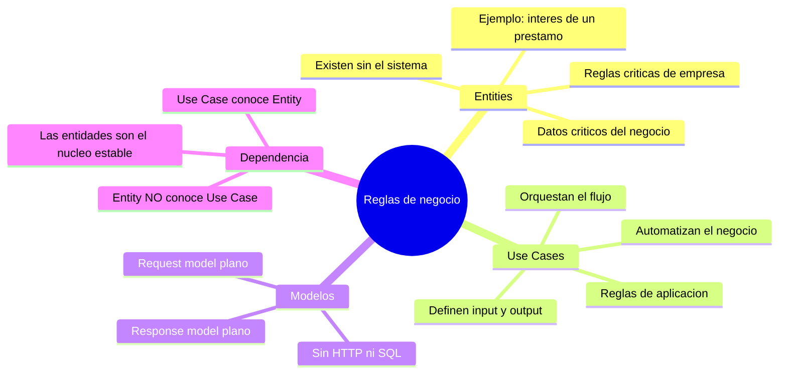

# Tópico 7 — Reglas de negocio

> Séptimo bloque de la guía sobre **Clean Architecture** de Robert C. Martin.
> Las reglas de negocio son la razón de existir de un sistema; todo lo demás (web, base de datos, frameworks) son solo detalles a su servicio.

## Idea central del tópico

Las **reglas de negocio** son las reglas o procedimientos que hacen o ahorran dinero al negocio. Existen en dos niveles, y esa distinción es la que da forma al corazón de la arquitectura:

> **Enterprise Business Rules** (Entities): reglas críticas que existirían aunque no hubiera ningún sistema informático.
> **Application Business Rules** (Use Cases): reglas que describen cómo se **automatiza** el negocio en esta aplicación concreta.

El principio que ordena todo el tópico es la **dirección de la dependencia**:

```
   Use Case  ─────────►  Entity
   (conoce a la entidad)   (NO conoce el caso de uso)
```

Las entidades son el nivel más alto y estable; los casos de uso dependen de ellas, y nunca al revés.

## Documentos de este tópico

| # | Documento | Punto que cubre |
|---|-----------|-----------------|
| 1 | [01-entities-reglas-de-empresa.md](./01-entities-reglas-de-empresa.md) | Entities: reglas y datos críticos del negocio, independientes de la aplicación |
| 2 | [02-use-cases-reglas-de-aplicacion.md](./02-use-cases-reglas-de-aplicacion.md) | Use Cases: reglas específicas de la aplicación que orquestan el flujo |
| 3 | [03-modelos-request-response.md](./03-modelos-request-response.md) | Modelos de request/response: estructuras planas sin dependencias a web ni DB |
| 4 | [04-relacion-entities-usecases.md](./04-relacion-entities-usecases.md) | Dirección de dependencia: Use Case → Entity (nunca al revés) |

## Diagrama del tópico



## Relación con la arquitectura

Las reglas de negocio ocupan los círculos más internos de Clean Architecture:

- **Entities** → el círculo más interno; el activo más valioso y estable del negocio.
- **Use Cases** → rodean a las entidades; contienen la lógica específica de la aplicación.
- **Detalles** (UI, DB, frameworks) → círculos externos, siempre apuntando hacia adentro.

Todo el sistema se organiza para **proteger** estas reglas de los detalles cambiantes.

## Referencia

- Robert C. Martin, *Clean Architecture*, Prentice Hall, 2017 — Capítulo 20 ("Business Rules").
