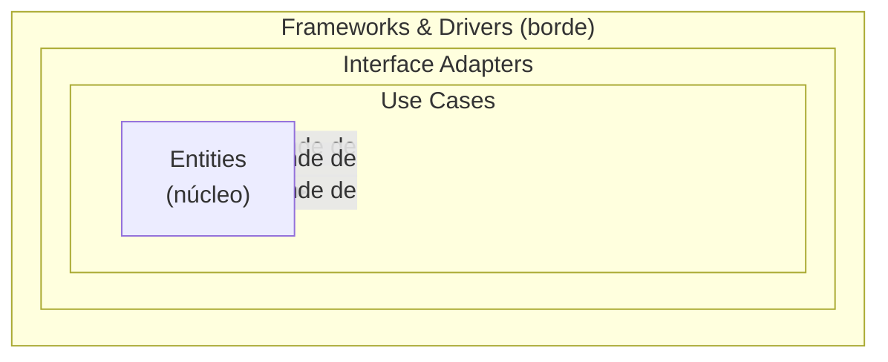

# 1. Los cuatro anillos

## De dentro hacia afuera

La Arquitectura Limpia organiza el sistema en **anillos concéntricos**. Cuanto más hacia el **centro**, más **abstracto y estable** es el código (reglas de negocio de alto nivel). Cuanto más hacia el **borde**, más **concreto y volátil** (mecanismos, detalles, frameworks).

> El número de anillos no es sagrado: pueden ser más de cuatro. Lo que nunca cambia es que las dependencias siempre apuntan hacia adentro.

### Diagrama de círculos concéntricos (ASCII)

```
        +---------------------------------------------------+
        |        FRAMEWORKS & DRIVERS  (azul)               |
        |    Web · DB · UI · Devices · External Interfaces  |
        |   +-------------------------------------------+   |
        |   |     INTERFACE ADAPTERS  (verde)           |   |
        |   |  Controllers · Presenters · Gateways      |   |
        |   |   +-----------------------------------+   |   |
        |   |   |    USE CASES  (rojo)              |   |   |
        |   |   |  Reglas de negocio de aplicación  |   |   |
        |   |   |   +---------------------------+   |   |   |
        |   |   |   |   ENTITIES  (amarillo)    |   |   |   |
        |   |   |   | Reglas de negocio de la   |   |   |   |
        |   |   |   |     empresa (críticas)    |   |   |   |
        |   |   |   +---------------------------+   |   |   |
        |   |   +-----------------------------------+   |   |
        |   +-------------------------------------------+   |
        +---------------------------------------------------+

        <---- más concreto / volátil   |   más abstracto / estable ---->
                 Las dependencias del código apuntan ──► hacia adentro
```

### Diagrama de círculos concéntricos (Mermaid)



## Qué vive en cada anillo

| Anillo | Nombre | Contenido | Volatilidad |
|--------|--------|-----------|-------------|
| Centro | **Entities** | Reglas de negocio de la empresa: objetos con los datos y métodos más generales y de más alto nivel. Las más estables. | Muy baja |
| 2.º | **Use Cases** | Reglas de negocio específicas de la **aplicación**: orquestan el flujo de datos hacia y desde las Entities. | Baja |
| 3.º | **Interface Adapters** | Convierten datos entre el formato cómodo para los casos de uso/entidades y el formato cómodo para agentes externos (Controllers, Presenters, Gateways). | Media |
| Borde | **Frameworks & Drivers** | Detalles: la web, la base de datos, la UI, dispositivos, herramientas. Aquí va "el pegamento" hacia afuera. | Muy alta |

## Detalle por anillo

- **Entities** — encapsulan las reglas más generales del negocio. Podrían existir aunque no hubiera ninguna aplicación concreta. No cambian por decisiones operativas de una app.
- **Use Cases** — contienen las reglas específicas de la aplicación e implementan todos los casos de uso del sistema. Dirigen el baile de las Entities pero no deberían verse afectados por cambios de UI o base de datos.
- **Interface Adapters** — el conjunto de adaptadores que traducen datos. El MVC de una GUI vive aquí; también los repositorios que hablan con la base de datos.
- **Frameworks & Drivers** — el anillo más externo, hecho de herramientas y detalles. Normalmente escribes poco código aquí, salvo el que conecta hacia adentro.

## Punto clave para recordar

> **Cuatro anillos, un solo orden: del núcleo estable (Entities) al borde volátil (Frameworks).** Cuanto más adentro, más abstracto y más protegido del cambio.

---

Siguiente: [La Regla de Dependencia →](./02-la-regla-de-dependencia.md)
