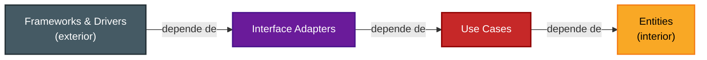
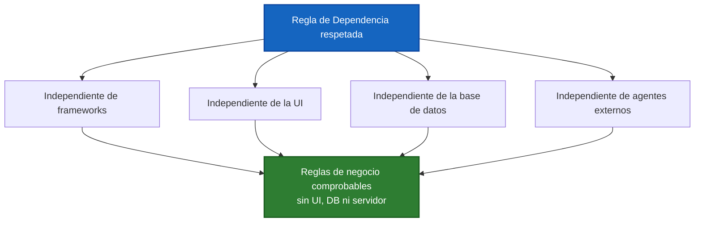

# 2. La Regla de Dependencia

## El enunciado

> **La Regla de Dependencia:** las dependencias del código fuente deben apuntar **solo hacia adentro**, hacia políticas de más alto nivel.

Dicho de otro modo: **nada en un anillo interior puede saber absolutamente nada de algo en un anillo exterior**. Los nombres declarados en un anillo externo (una función, una clase, una variable, una entidad de software) **no deben ser mencionados** por el código de un anillo interno.

La flecha significa "depende de / conoce a". Toda flecha apunta **hacia adentro**; ninguna apunta hacia afuera.

## Lo interior no conoce lo exterior

El centro no sabe que existe el borde. Las Entities no saben que hay casos de uso; los casos de uso no saben qué base de datos o qué framework web se usa.

Las flechas continuas (dependencias reales) van hacia adentro. Las flechas punteadas rojas representan un "conocimiento hacia afuera" que **está prohibido**.

## Qué NO debe cruzar hacia adentro

| Elemento del anillo externo | ¿Puede mencionarse en un anillo interno? |
|-----------------------------|-------------------------------------------|
| Nombre de una clase de framework (p. ej. `HttpServletRequest`) | No |
| Tipos del ORM o filas de la base de datos | No |
| Formatos de la UI (JSON, HTML, widgets) | No |
| Una función/variable declarada en Interface Adapters | No (desde Use Cases o Entities) |
| Una abstracción/puerto declarado en el interior | Sí — el exterior sí puede depender de ella |

## Independencia que produce la regla

Cuando el código respeta la Regla de Dependencia, el núcleo del sistema queda **independiente de los detalles**:

Por eso puedes cambiar de base de datos (de Oracle a SQL Server), de framework web o de UI **sin tocar** las reglas de negocio: esos cambios ocurren en anillos externos y la regla impide que el interior dependa de ellos.

## Punto clave para recordar

> **El código fuente solo apunta hacia adentro.** Lo interior (estable, valioso) jamás menciona nombres de lo exterior (volátil, reemplazable). Esa es la única regla que hace "limpia" a la arquitectura.

---

Anterior: [← Los cuatro anillos](./01-los-cuatro-anillos.md) · Siguiente: [Cruce de límites e inversión →](./03-cruce-de-limites-e-inversion.md)
