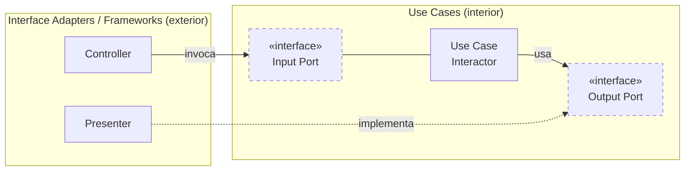
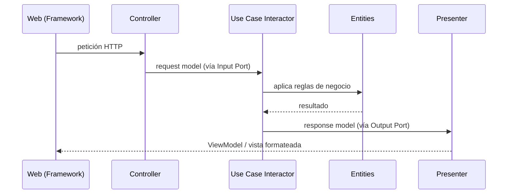

# 3. Cruce de límites e inversión

## El aparente conflicto

En algún punto el sistema **tiene que** ir hacia afuera: un caso de uso necesita mostrar algo en pantalla o guardar en la base de datos, que viven en anillos externos. Pero la Regla de Dependencia prohíbe que el interior conozca al exterior. ¿Cómo se resuelve?

> Con **inversión de dependencias**: el **flujo de control** cruza el límite hacia afuera, mientras que la **dependencia del código fuente** apunta hacia adentro.

```
   Flujo de control   :  Use Case ───────────►  Presenter / Gateway (exterior)
   Dependencia código :  Use Case ─►(«interface»)◄─── Presenter / Gateway
                                     Output Port
                                     (¡invertida respecto al flujo!)
```

El caso de uso llama a una **interfaz** (un *puerto de salida*) que él mismo declara. El anillo externo la **implementa**. Así el control sale, pero la flecha de dependencia entra.

## Puertos de entrada y de salida



- El **Controller** depende del **Input Port** (interfaz interior) → dependencia hacia adentro.
- El **Presenter** implementa el **Output Port** (interfaz interior) → la dependencia del Presenter también apunta hacia adentro, aunque el flujo de control salga hacia él.

## Flujo típico: Controller → Use Case → Presenter

```
   1) Web/Framework   ──►  Controller               (empaqueta la petición)
   2) Controller      ──►  Input Port  (interface)  (entra al caso de uso)
   3) Interactor      ──►  Entities                 (aplica reglas de negocio)
   4) Interactor      ──►  Output Port (interface)  (entrega el resultado)
   5) Presenter       ──►  ViewModel / View         (formatea la salida)

   El CONTROL fluye 1→5 (hacia afuera al final),
   pero cada DEPENDENCIA de código apunta hacia adentro (a las interfaces del interior).
```



## Tabla: control vs. dependencia en el cruce

| Elemento | Dirección del flujo de control | Dirección de la dependencia de código |
|----------|--------------------------------|----------------------------------------|
| Controller → Input Port | hacia adentro | hacia adentro |
| Interactor → Output Port | hacia afuera (conceptualmente) | hacia adentro (interfaz interior) |
| Presenter implementa Output Port | recibe el control desde adentro | hacia adentro (implementa la interfaz interior) |

En todos los casos, **la dependencia de código apunta hacia adentro**, sin importar hacia dónde vaya el control. Este es el mismo truco de la OO: el polimorfismo permite invertir la flecha de dependencia respecto al flujo.

## Punto clave para recordar

> **El control cruza hacia afuera; la dependencia siempre entra.** La inversión de dependencias (puertos de entrada y salida) es lo que permite que un caso de uso "hable" con el exterior sin conocerlo.

---

Anterior: [← La Regla de Dependencia](./02-la-regla-de-dependencia.md) · Siguiente: [Datos que cruzan fronteras →](./04-datos-que-cruzan-fronteras.md)
