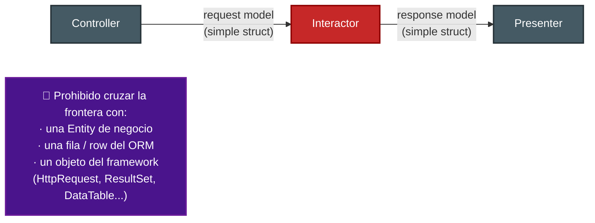
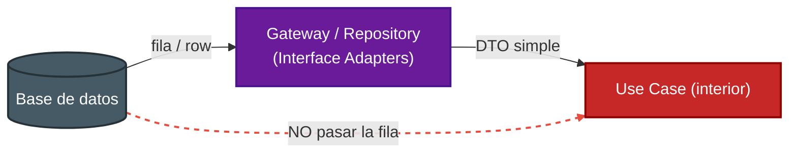
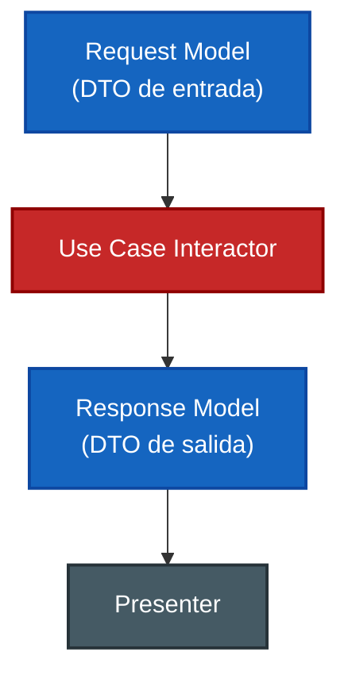

# 4. Datos que cruzan fronteras

## La regla sobre los datos

Cuando un dato cruza un límite entre anillos, debe hacerlo en la forma **más simple y aislada** posible.

> Lo que cruza las fronteras son **estructuras de datos simples** (DTOs / *request* y *response models*): objetos planos, sin comportamiento ligado a un anillo externo. **Nunca** deben cruzar Entities, ni filas de la base de datos, ni objetos atados a un framework.

## Por qué no una Entity ni una fila de DB

Si pasas una fila de la base de datos hacia adentro, un anillo interior terminaría **conociendo** un detalle del anillo exterior (la estructura de la tabla). Eso **viola la Regla de Dependencia**: el interior no debe saber nada del exterior.

El repositorio **traduce** la fila a una estructura simple antes de entregarla al caso de uso. Así el interior nunca ve el formato del ORM.

## Forma recomendada de los datos que cruzan

Los modelos son **objetos planos**, inmutables si es posible, sin dependencias hacia frameworks.

## Comparativa: qué cruza y qué no

| ¿Cruza la frontera? | Ejemplo | ¿Permitido? |
|---------------------|---------|-------------|
| DTO / request model | `CreateOrderRequest { itemId, quantity }` | Sí |
| DTO / response model | `OrderResponse { total, status }` | Sí |
| Estructura de datos simple | mapa, registro plano, tupla | Sí |
| Entity de negocio | `Order` con reglas y métodos | No |
| Fila / registro del ORM | `OrderRow`, `ResultSet` | No |
| Objeto del framework | `HttpServletRequest`, `DataTable` | No |

## Regla práctica

De esta forma, un cambio en la base de datos o en el framework se queda contenido en el anillo externo: solo cambia la traducción, no las estructuras que viajan hacia adentro ni las reglas de negocio.

## Punto clave para recordar

> **Por las fronteras solo viajan DTOs y estructuras simples y aisladas.** Nunca Entities ni objetos atados a la base de datos o al framework, porque eso obligaría al interior a conocer al exterior y rompería la Regla de Dependencia.

---

Anterior: [← Cruce de límites e inversión](./03-cruce-de-limites-e-inversion.md) · Volver al índice: [Tópico 8 — La arquitectura limpia](./README.md)
