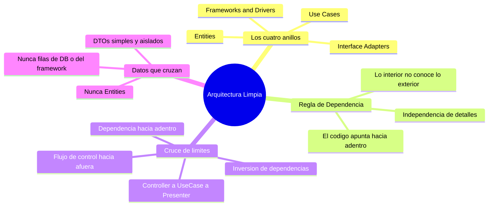

# Tópico 8 — La arquitectura limpia (el modelo de círculos)

> Octavo bloque de la guía sobre **Clean Architecture** de Robert C. Martin.
> Aquí converge todo lo anterior: paradigmas, principios y componentes se ordenan en un solo diagrama de círculos concéntricos.

## Idea central del tópico

La **Arquitectura Limpia** no es un framework ni una estructura de carpetas: es una forma de organizar el software en **anillos concéntricos** donde las reglas de negocio quedan en el centro y los detalles (UI, base de datos, frameworks) quedan en el borde.

> Una única regla lo gobierna todo: **la Regla de Dependencia**. El código fuente solo puede apuntar **hacia adentro**. Nada de un anillo interior debe conocer algo de un anillo exterior.

El resultado es un sistema **independiente de frameworks, de la UI, de la base de datos y de cualquier agente externo**, y por tanto comprobable y sostenible en el tiempo.

```
                +-----------------------------+
                |   Frameworks & Drivers      |   (lo más volátil)
                |   +---------------------+   |
                |   | Interface Adapters  |   |
                |   |   +-------------+   |   |
                |   |   | Use Cases   |   |   |
                |   |   |  +-------+  |   |   |
                |   |   |  |Entities| |   |   |   (lo más estable)
                |   |   |  +-------+  |   |   |
                |   |   +-------------+   |   |
                |   +---------------------+   |
                +-----------------------------+
                   Dependencias ──► hacia adentro
```

## Documentos de este tópico

| # | Documento | Punto que cubre |
|---|-----------|-----------------|
| 1 | [01-los-cuatro-anillos.md](./01-los-cuatro-anillos.md) | Los 4 anillos: Entities, Use Cases, Interface Adapters, Frameworks & Drivers |
| 2 | [02-la-regla-de-dependencia.md](./02-la-regla-de-dependencia.md) | La Regla de Dependencia: el código fuente solo apunta hacia adentro |
| 3 | [03-cruce-de-limites-e-inversion.md](./03-cruce-de-limites-e-inversion.md) | Cruce de límites e inversión: el flujo de control cruza hacia afuera, la dependencia hacia adentro |
| 4 | [04-datos-que-cruzan-fronteras.md](./04-datos-que-cruzan-fronteras.md) | Qué datos cruzan las fronteras: DTOs y estructuras simples, no entidades ni filas de DB |

## Diagrama del tópico



## Relación con la arquitectura

- Los **cuatro anillos** son la materialización visual de todo lo estudiado antes: los **paradigmas** (Tópico 2), los **principios SOLID** (Tópico 5) y los **componentes** (Tópicos 6–7).
- La **Regla de Dependencia** es la aplicación directa del **Principio de Inversión de Dependencias (DIP)**: los detalles dependen de las políticas, nunca al revés.
- El **cruce de límites** con puertos de entrada y salida es el mecanismo concreto que mantiene estables las reglas de negocio frente a los cambios de UI, base de datos y frameworks.

## Referencia

- Robert C. Martin, *Clean Architecture*, Prentice Hall, 2017 — Capítulo 22 ("The Clean Architecture").
