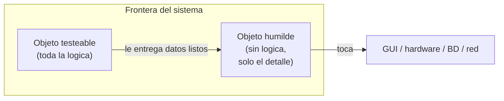
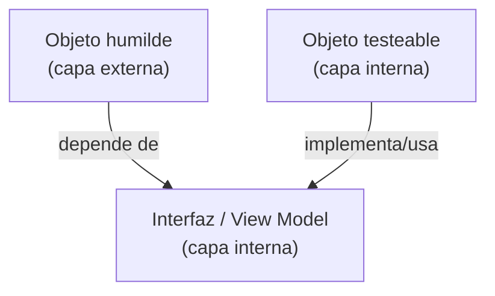

# 1. Humble Object Pattern

## El problema: comportamientos difíciles de testear

En los bordes de un sistema siempre aparece código que es **muy difícil de probar con tests unitarios**: pintar una GUI, hablar con hardware, ejecutar SQL, leer de la red. No porque tenga mucha lógica, sino porque depende del entorno.

La tentación es mezclar esa lógica frágil con las reglas importantes. El resultado es que **nada** queda testeable, porque todo cuelga del detalle técnico.

> El **Humble Object Pattern** es una forma de separar los comportamientos difíciles de testear de los comportamientos fáciles de testear.

## La solución: partir en dos objetos

La idea es dividir la frontera en dos piezas:

1. Un objeto **humilde** (*humble*): contiene solo el código que no se puede probar. Es lo más pequeño y tonto posible; no toma decisiones.
2. Un objeto **comprobable** (*testable*): contiene toda la lógica que se sacó del objeto humilde. Aquí vive lo que realmente importa y se prueba a fondo.



El objeto testeable prepara el trabajo; el objeto humilde solo lo ejecuta contra el mundo real.

## Cómo se ve el reparto

```
   ┌───────────────────────────────────────────────┐
   │                 FRONTERA                        │
   │                                                 │
   │   TESTEABLE                    HUMILDE          │
   │   ─────────                    ───────          │
   │   • decide qué mostrar         • pinta píxeles  │
   │   • calcula, formatea          • lee/escribe    │
   │   • aplica reglas                el detalle     │
   │   • 90% del código             • 10% del código │
   │   • cubierto por tests         • casi sin tests │
   └───────────────────────────────────────────────┘
```

La meta es empujar hacia el objeto humilde la **menor cantidad de código posible**: solo lo que es imposible de probar.

## Dónde aparece este patrón

| Frontera | Objeto humilde (difícil de testear) | Objeto testeable (la lógica) |
|----------|-------------------------------------|------------------------------|
| Interfaz de usuario | View | Presenter |
| Base de datos | Implementación del Gateway (SQL) | Caso de uso + interfaz Gateway |
| Servicios externos | Cliente HTTP concreto | Lógica que arma la petición |
| Hardware / dispositivos | Driver del dispositivo | Controlador con las reglas |

El patrón se repite en cada límite: el detalle queda humilde, la política queda comprobable.

## Ejemplo: mezclar vs separar

❌ Todo junto, imposible de testear sin la pantalla real:

```java
class SaldoView {
    void mostrar(Cuenta cuenta) {
        double s = cuenta.getSaldo();
        String texto = (s < 0 ? "-$" : "$") + Math.abs(s); // lógica escondida en la vista
        etiqueta.setText(texto);        // dibujo real (no testeable)
        etiqueta.setColor(s < 0 ? ROJO : NEGRO);
    }
}
```

✅ Lógica en un objeto testeable, la vista queda humilde:

```java
// Testeable: decide texto y color, no dibuja nada
class SaldoPresenter {
    SaldoViewModel preparar(Cuenta cuenta) {
        double s = cuenta.getSaldo();
        String texto = (s < 0 ? "-$" : "$") + Math.abs(s);
        String color = s < 0 ? "ROJO" : "NEGRO";
        return new SaldoViewModel(texto, color);
    }
}

// Humilde: solo pinta lo que ya viene decidido
class SaldoView {
    void mostrar(SaldoViewModel vm) {
        etiqueta.setText(vm.texto);
        etiqueta.setColor(vm.color);
    }
}
```

Ahora `SaldoPresenter` se prueba con simples asserts, sin arrancar la interfaz gráfica.

## Por qué también es un boundary arquitectónico

El objeto humilde y el testeable suelen quedar en **capas distintas**, con la dependencia apuntando hacia adentro. El Humble Object no es solo un truco de testeo: es una manera de dibujar y reforzar un límite arquitectónico.



## Punto clave para recordar

> **Separa lo que puedes probar de lo que no.** Deja en el objeto humilde solo el detalle imposible de testear (dibujar, hablar con hardware o BD) y mueve toda la lógica al objeto comprobable. Así maximizas la parte del sistema cubierta por tests.

---

Siguiente: [Presenters y View Models →](./02-presenters-y-view-models.md)
