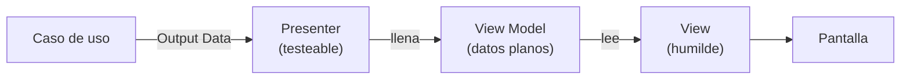
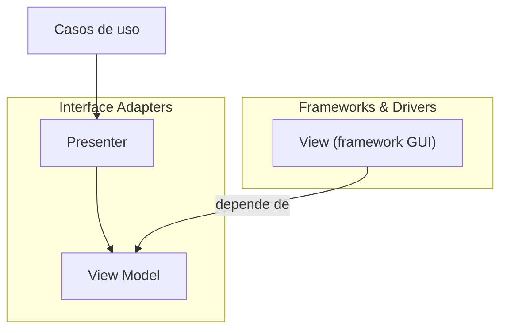

# 2. Presenters y View Models

## El caso más claro de Humble Object

La interfaz de usuario es difícil de testear: hay que arrancar la pantalla, mover el ratón, leer píxeles. Por eso se aplica el Humble Object Pattern justo ahí y nacen dos piezas:

- **Presenter**: objeto **testeable**. Toma el resultado del caso de uso y lo transforma en un **View Model**.
- **View**: objeto **humilde**. No decide nada; solo mueve los campos del View Model a los widgets.

> El trabajo de la View se reduce a copiar datos del View Model a la pantalla. La View no procesa esos datos de ninguna forma.

## Qué es un View Model

El **View Model** es una estructura de datos plana con **todo ya resuelto**: textos formateados, banderas de estado, colores como strings, listas listas para pintar. No tiene lógica.

```
   Caso de uso  ──►  Presenter  ──►  View Model  ──►  View
   (resultado)       (decide y        (datos ya      (solo
                      formatea)        cocinados)      pinta)
```

Todo lo que requiere una **decisión** ocurre en el Presenter, que sí se puede probar. La View recibe el plato terminado.

## Flujo completo



El Presenter transforma un objeto de salida (Output Data) en un View Model; la View simplemente lo muestra.

## Qué decide el Presenter (y la View no)

| Decisión | Responsable |
|----------|-------------|
| Formatear una fecha como `"22/06/2017"` | Presenter |
| Convertir un número a `"$1.200,50"` | Presenter |
| Poner un botón en gris cuando algo está deshabilitado | Presenter (bandera en el VM) |
| Elegir el texto de un mensaje de error | Presenter |
| Colocar ese texto en la etiqueta correspondiente | View |
| Dibujar la etiqueta en pantalla | View |

Nada en la columna "Presenter" toca la pantalla; nada en la columna "View" toma decisiones.

## Ejemplo

❌ La View calcula y formatea (no testeable sin GUI):

```java
class PedidoView {
    void render(Pedido pedido) {
        fecha.setText(new SimpleDateFormat("dd/MM/yyyy").format(pedido.getFecha()));
        total.setText("$" + String.format("%.2f", pedido.getTotal()));
        boton.setEnabled(pedido.getEstado() == PAGADO); // decisión en la vista
    }
}
```

✅ El Presenter prepara un View Model; la View solo lo copia:

```java
// Testeable
class PedidoPresenter {
    PedidoViewModel presentar(PedidoOutput out) {
        PedidoViewModel vm = new PedidoViewModel();
        vm.fecha = new SimpleDateFormat("dd/MM/yyyy").format(out.fecha);
        vm.total = "$" + String.format("%.2f", out.total);
        vm.botonHabilitado = out.estado == PAGADO;
        return vm;
    }
}

// Humilde
class PedidoView {
    void render(PedidoViewModel vm) {
        fecha.setText(vm.fecha);
        total.setText(vm.total);
        boton.setEnabled(vm.botonHabilitado);
    }
}
```

Con esto, `PedidoPresenter` se prueba con asserts sobre el View Model, sin abrir una sola ventana.

## En qué capa vive cada pieza



El Presenter y el View Model quedan del lado interno (adaptadores de interfaz); la View, atada al framework gráfico, queda en el borde y depende hacia adentro.

## Punto clave para recordar

> **El Presenter piensa, la View pinta.** Toda decisión (formato, color, habilitado/deshabilitado, mensajes) se resuelve en el Presenter y se guarda en un View Model plano. La View es humilde: solo copia esos datos a la pantalla, así que casi no hay nada frágil que testear.

---

Anterior: [← Humble Object Pattern](./01-humble-object-pattern.md) · Siguiente: [Gateways →](./03-gateways.md)
