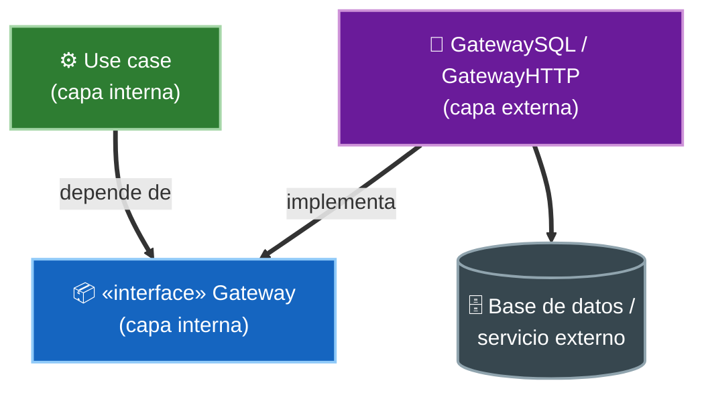

# 3. Gateways de base de datos y de servicios

## El caso de uso no debe conocer la base de datos

Un caso de uso necesita guardar y leer datos, pero **no** debe saber si detrás hay MySQL, un archivo o un servicio REST. Si el caso de uso llamara directamente a SQL, la dependencia apuntaría hacia afuera y el detalle contaminaría la política.

La solución es un **Gateway**: una interfaz (un *puerto*) que el caso de uso declara en su propia capa, con los métodos que necesita, expresados en su propio lenguaje.

> Los casos de uso no dependen directamente de la base de datos. En su lugar, dependen de una interfaz de gateway con métodos como `findById`, `save` o `delete`, definida en la capa interna.

## Quién declara y quién implementa

```mermaid
flowchart TD
    subgraph UseCaseLayer["capa de casos de uso"]
        UC["⚙️ Use case"]
        G["📦 «interface» OrderGateway<br/>findById(id)<br/>save(order)"]
    end
    subgraph DetailLayer["capa de BD / servicios (detalle)"]
        IMPL["🗄️ OrderGatewaySQL<br/>implements OrderGateway<br/>(ejecuta el SQL de verdad)"]
    end
    UC ==>|usa| G
    IMPL ==>|implements (hacia adentro)| G

    style UC fill:#2e7d32,stroke:#a5d6a7,color:#fff,stroke-width:2px
    style G fill:#1565c0,stroke:#90caf9,color:#fff,stroke-width:2px
    style IMPL fill:#37474f,stroke:#90a4ae,color:#fff,stroke-width:2px
```

La **interfaz vive adentro**; la **implementación vive afuera**. La flecha de dependencia (el `implements`) apunta hacia adentro, respetando la regla de dependencia.

## Inversión de dependencias en acción



En tiempo de ejecución el caso de uso usa la implementación concreta, pero en tiempo de compilación **no la conoce**: solo conoce la interfaz. Ese es el mecanismo que mantiene el detalle afuera.

## Gateway de base de datos y gateway de servicio

El patrón es el mismo para persistencia y para servicios externos:

| Aspecto | Gateway de base de datos | Gateway de servicio |
|---------|--------------------------|---------------------|
| Interfaz declarada por | El caso de uso | El caso de uso |
| Métodos | `buscar`, `guardar`, `borrar` | `cotizar`, `notificar`, `consultar` |
| Implementación | SQL, ORM, archivo | Cliente HTTP, gRPC, SDK del proveedor |
| Objeto humilde | La implementación (toca la BD) | La implementación (toca la red) |
| Lo que se testea | El caso de uso con un gateway falso | El caso de uso con un gateway falso |

## Ejemplo

❌ El caso de uso amarrado al detalle de SQL:

```java
class RegisterOrder {
    void execute(Order order) {
        Connection c = DriverManager.getConnection(URL);      // detail
        PreparedStatement ps = c.prepareStatement("INSERT ..."); // SQL
        ps.setString(1, order.getId());
        ps.executeUpdate();
    }
}
```

✅ El caso de uso depende de un Gateway; el SQL queda afuera:

```java
// Inner layer: the port
interface OrderGateway {
    void save(Order order);
    Order findById(String id);
}

// Inner layer: the policy, testable with a fake gateway
class RegisterOrder {
    private final OrderGateway gateway;
    RegisterOrder(OrderGateway gateway) { this.gateway = gateway; }
    void execute(Order order) { gateway.save(order); }
}

// Outer layer: the detail (humble object)
class OrderGatewaySQL implements OrderGateway {
    public void save(Order order) { /* real INSERT */ }
    public Order findById(String id) { /* real SELECT */ }
}
```

En los tests se inyecta un `OrderGateway` en memoria y se prueba `RegisterOrder` sin base de datos.

## Beneficios

- **Testeabilidad**: el caso de uso se prueba con un gateway falso, sin infraestructura.
- **Independencia**: cambiar de MySQL a otro motor solo afecta la implementación externa.
- **Regla de dependencia intacta**: el detalle depende de la política, nunca al revés.

## Punto clave para recordar

> **El caso de uso define el puerto; el mundo exterior lo cumple.** Un Gateway es una interfaz declarada en la capa interna con el vocabulario del negocio; la base de datos o el servicio la implementan afuera. Así la política nunca depende del detalle.

---

Anterior: [← Presenters y View Models](./02-presenters-y-view-models.md) · Siguiente: [Mappers entre capas →](./04-mappers-entre-capas.md)
