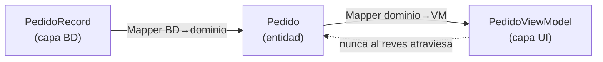
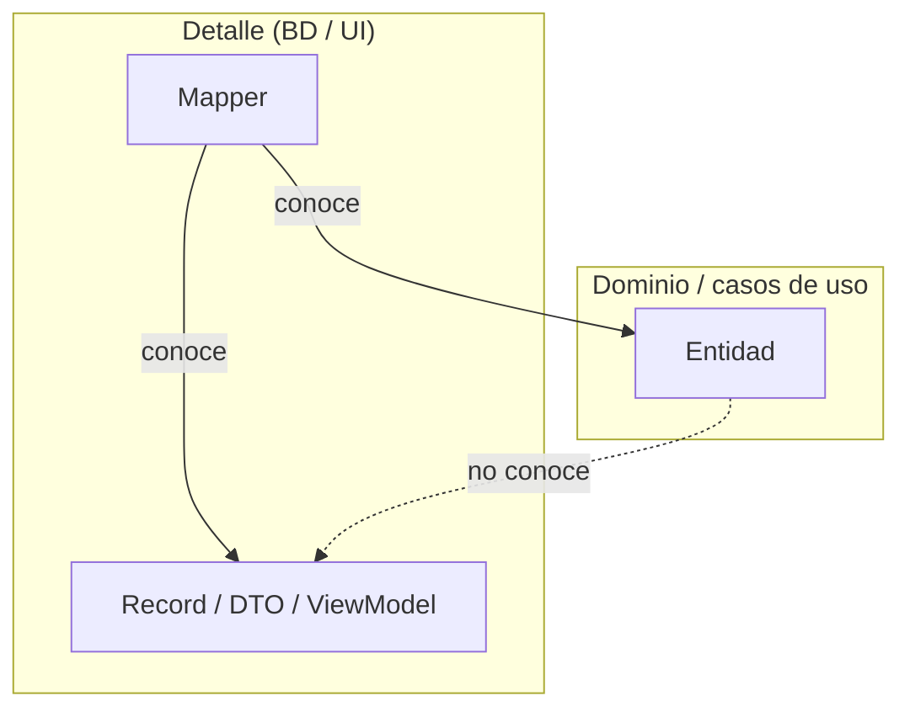

# 4. Mappers entre capas

## Por qué los datos cambian de forma al cruzar un límite

Cada capa de Clean Architecture tiene su **propia representación de los datos**, adaptada a lo que esa capa necesita. Cuando la información cruza un límite, se **traduce** de una forma a otra mediante un **Mapper**.

> Es una violación de la regla de dependencia pasar una fila de base de datos hacia adentro. No queremos que las capas internas conozcan nada de las externas.

Si dejáramos que la misma estructura viajara por todas las capas, la forma del detalle (una fila de BD, un JSON de la API) se filtraría hacia el núcleo y ataría las reglas de negocio al framework.

## Una estructura por capa

```
   Base de datos        Caso de uso          Interfaz (UI)
   ─────────────        ───────────          ─────────────
   PedidoRecord    ──►  Pedido (entidad) ──►  PedidoViewModel
   (columnas SQL)  Map  (reglas de neg.) Map  (textos listos)
```

Cada frontera tiene un mapper que convierte de la estructura de una capa a la de la otra. Así los datos entran "traducidos" al idioma de cada capa.

## Qué hace y qué no hace un Mapper



El Mapper copia y transforma campos; **no** contiene reglas de negocio. Es un traductor, no un lugar para esconder lógica.

## La dependencia siempre apunta hacia adentro



El Mapper vive en la capa externa y conoce **ambas** formas. La entidad interna, en cambio, **no conoce** la estructura externa. Por eso el mapper puede tocar los dos lados sin romper la regla de dependencia.

## Comparación de estructuras

| Capa | Estructura | Contiene | Ejemplo de campo |
|------|-----------|----------|------------------|
| Base de datos | Record / Row | Columnas tal cual | `estado_id = 2` |
| Casos de uso / dominio | Entidad | Reglas y tipos ricos | `estado = PAGADO` |
| Interfaz | View Model | Textos ya formateados | `estadoTexto = "Pagado"` |

Un mismo pedido se ve distinto en cada capa; el mapper hace las conversiones entre esas vistas.

## Ejemplo

❌ La fila de la BD viaja hasta el dominio y lo contamina:

```java
class CalcularEnvio {
    double calcular(ResultSet fila) throws SQLException { // depende de JDBC
        return fila.getDouble("peso") * TARIFA;           // detalle en el núcleo
    }
}
```

✅ Un mapper traduce a entidad; el dominio ignora la BD:

```java
// Mapper en la capa externa
class PedidoMapper {
    Pedido aDominio(ResultSet fila) throws SQLException {
        return new Pedido(
            fila.getString("id"),
            fila.getDouble("peso"),
            Estado.desde(fila.getInt("estado_id"))
        );
    }
}

// Dominio: limpio, testeable, sin JDBC
class CalcularEnvio {
    double calcular(Pedido pedido) {
        return pedido.getPeso() * TARIFA;
    }
}
```

El detalle de `ResultSet` se queda en el mapper; el caso de uso solo ve una `Pedido`.

## Punto clave para recordar

> **Al cruzar un límite, traduce los datos.** Cada capa tiene su propia estructura y un Mapper convierte entre ellas. Así nunca dejas que la forma de la base de datos o de la UI se filtre hacia las reglas de negocio, y la dependencia sigue apuntando siempre hacia adentro.

---

Anterior: [← Gateways](./03-gateways.md) · Volver al [índice del tópico](./README.md)
