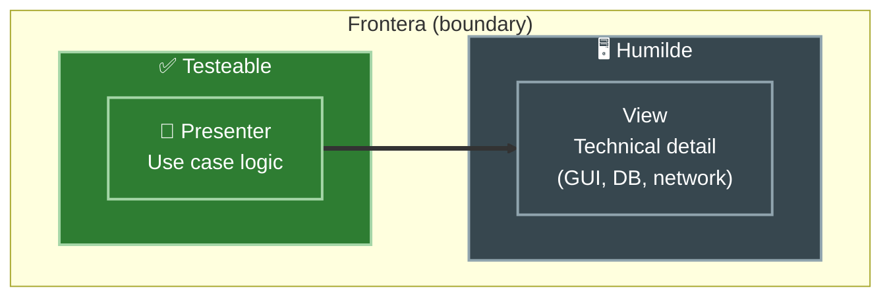
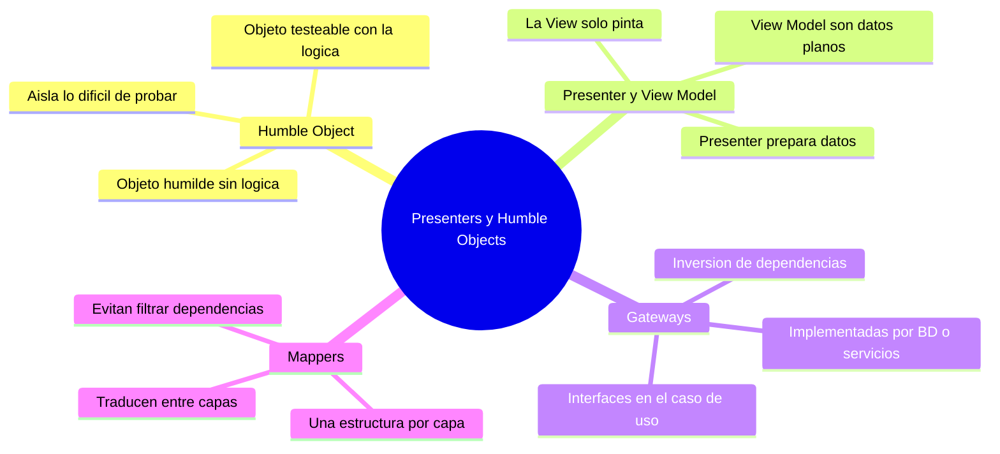

# Tópico 9 — Presenters, Humble Objects y adaptadores

> Noveno bloque de la guía sobre **Clean Architecture** de Robert C. Martin.
> Cómo cruzar los límites del sistema sin ensuciar la lógica ni perder la testeabilidad.

## Idea central del tópico

En los bordes de la arquitectura (la GUI, la base de datos, los servicios externos) vive código **difícil de testear**: pintar pantallas, hablar con hardware, ejecutar SQL. La estrategia de Clean Architecture es separar ese comportamiento de la **lógica que sí queremos probar**.

El **Humble Object Pattern** parte una frontera en dos: un objeto "humilde" con lo que no se puede testear (mínimo, casi sin lógica) y un objeto comprobable con todo lo importante.

De esa idea nacen los **Presenters** (llenan un View Model, la View solo lo pinta), los **Gateways** (interfaces que declaran los casos de uso y otros implementan afuera) y los **Mappers** (transforman los datos al cruzar cada límite para que no se filtren dependencias).

## Documentos de este tópico

| # | Documento | Punto que cubre |
|---|-----------|-----------------|
| 1 | [01-humble-object-pattern.md](./01-humble-object-pattern.md) | Separar lo testeable de lo difícil de testear en dos objetos |
| 2 | [02-presenters-y-view-models.md](./02-presenters-y-view-models.md) | El Presenter llena un View Model y la View es humilde |
| 3 | [03-gateways.md](./03-gateways.md) | Gateways de BD y de servicios: interfaces del caso de uso implementadas afuera |
| 4 | [04-mappers-entre-capas.md](./04-mappers-entre-capas.md) | Mappers entre capas y por qué los datos se transforman al cruzar límites |

## Diagrama del tópico

## Relación con la arquitectura

Todo este tópico protege la **regla de dependencia**: las líneas apuntan hacia adentro, hacia las políticas.

- El **Humble Object** empuja los detalles frágiles al borde para que el núcleo quede probable.
- El **Presenter/View Model** convierte el resultado de un caso de uso en algo que la interfaz humilde muestra sin decidir nada.
- Los **Gateways** invierten la dependencia hacia la base de datos y los servicios: el caso de uso define el puerto, el detalle lo cumple.
- Los **Mappers** garantizan que cada capa tenga su propia forma de los datos, de modo que un cambio en el borde no atraviese hacia adentro.

## Referencia

- Robert C. Martin, *Clean Architecture*, Prentice Hall, 2017 — capítulos sobre "The Humble Object Pattern" y "Partial Boundaries" (Parte VI, Details).
