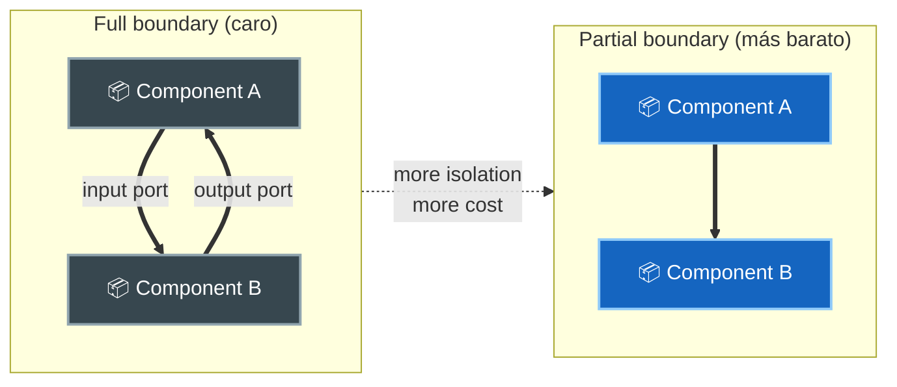
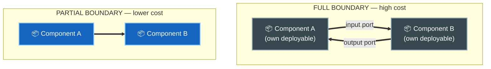

# 1. Full boundaries vs partial boundaries

## El costo de un límite completo

Un **full boundary** (límite completo) es la forma más rigurosa de separar dos partes de un sistema. Para construirlo, el arquitecto debe crear puertos recíprocos: interfaces de entrada y de salida a cada lado del límite, junto con las estructuras de datos que cruzan de ida y de vuelta. Además, cada lado del límite suele vivir en su propio componente desplegable independiente (un jar, un gem, una DLL, un servicio).

Todo ese andamiaje cuesta. Cuesta escribirlo, cuesta mantenerlo y cuesta administrar los componentes separados. Cuando el arquitecto no está seguro de que ese eje de cambio realmente exista, pagar el precio completo por anticipado puede ser un desperdicio. Pero ignorar el límite por completo también es riesgoso: si el eje resulta real, refactorizar desde cero será caro.

Entre estos dos extremos aparecen los **partial boundaries** (límites parciales).

## Qué preserva un límite parcial

Un límite parcial hace *parte* del trabajo de un límite completo. Reduce el costo inicial a cambio de sacrificar algo de aislamiento. La idea es dejar plantada la semilla del límite —la estructura de código que facilita separar más adelante— sin pagar aún por la separación total de despliegue o por la doble dirección de las interfaces.

## Comparación visual del andamiaje

En el full boundary hay doble dirección (puerto de entrada y de salida) con despliegue separado; en el partial boundary la relación es de una sola dirección y con despliegue compartido.

## Costo/beneficio de cada opción

| Aspecto | Full boundary | Partial boundary |
|---------|---------------|------------------|
| Puertos | Entrada y salida recíprocos | Uno solo o ninguno |
| Componentes desplegables | Separados e independientes | Normalmente el mismo |
| Aislamiento frente al cambio | Máximo | Reducido |
| Costo inicial | Alto | Bajo o medio |
| Costo de mantenimiento | Alto (más artefactos) | Bajo |
| Facilidad de promover luego | Ya está hecho | Requiere trabajo adicional |

El beneficio de un full boundary es el máximo desacoplamiento: cada lado puede compilarse, desplegarse y razonarse por separado. Su costo es todo el andamiaje y su administración continua. El partial boundary invierte la balanza: menos aislamiento hoy a cambio de menos código y menos artefactos que mantener, aceptando que promoverlo a completo más tarde tendrá su propio precio.

## Punto clave para recordar

> Un límite completo exige puertos recíprocos y componentes separados: es potente pero caro. Un límite parcial conserva la intención de separación pagando solo una fracción de ese costo, a cambio de menos aislamiento.

---

Siguiente: [Estrategias de partial boundaries](./02-estrategias-partial-boundaries.md)
