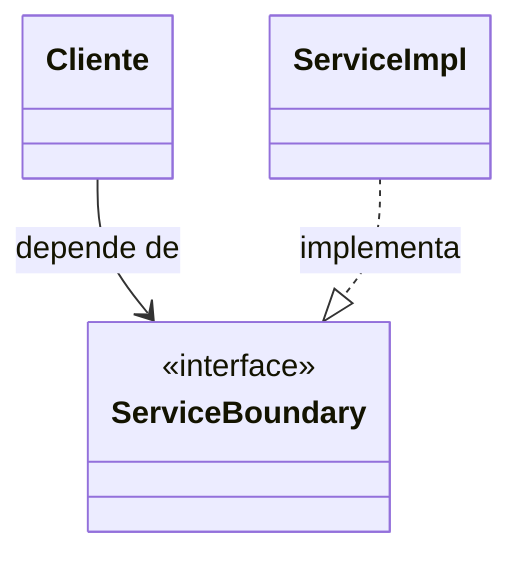
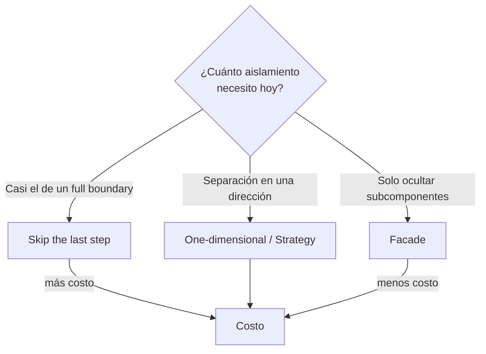

# 2. Estrategias de partial boundaries

Existen tres formas típicas de construir un límite parcial, ordenadas de mayor a menor aislamiento: **skip the last step**, **one-dimensional boundary** y **facade**. Cada una sacrifica un poco más de rigor a cambio de un poco menos de costo.

## Skip the last step (saltarse el último paso)

Esta estrategia consiste en hacer todo el trabajo de crear un límite completo —diseñar los componentes de forma independiente, con sus interfaces y sus estructuras de datos recíprocas— pero **saltarse el último paso**: en lugar de compilarlos y desplegarlos como artefactos separados, se mantienen juntos en el mismo componente desplegable.

El código ya está organizado como si fueran componentes independientes, pero conviven en un único jar o ensamblado. Si más adelante se necesita el aislamiento de despliegue, la promoción es casi mecánica: solo hay que separar los artefactos.

El costo que se ahorra no es trivial: administrar múltiples componentes desplegables (versionado, empaquetado, seguimiento) es una carga continua. El costo que permanece es el del diseño recíproco completo: se escribe y se mantiene todo el andamiaje de interfaces igual que en un full boundary.

## One-dimensional boundary (límite unidimensional)

El full boundary usa interfaces recíprocas (doble dirección) para aislar completamente ambos lados. Eso es costoso de configurar y de mantener. Una alternativa más simple es un límite **de una sola dimensión**: una única interfaz que apunta en una sola dirección, típicamente aplicando el patrón **Strategy**.



Aquí queda plantada la interfaz que separa al cliente de la implementación, dejando lista la costura para un futuro límite completo. Pero falta la dirección de retorno: no hay puerto de salida que proteja al servicio del cliente. El riesgo es que, sin la disciplina de la doble dirección, alguien deje pasar dependencias por atrás y erosione la separación con el tiempo.

## Facade (fachada)

La opción más simple de todas es la **facade**. No hay ni siquiera una interfaz de límite: solo una clase fachada que expone métodos como servicios y delega cada llamada a las clases de servicio que el cliente no debería tocar directamente.

```
        +------------------+
        |     Cliente      |
        +------------------+
                 |
                 v
        +------------------+
        |     Facade       |   (una sola clase, sin interfaz)
        +------------------+
          |      |       |
          v      v       v
      +------++------++------+
      |Serv A||Serv B||Serv C|
      +------++------++------+
```

El cliente depende directamente de la fachada, y la fachada depende de todos los servicios. Se oculta la existencia de los subcomponentes, pero el aislamiento es el menor de las tres estrategias: no hay inversión de dependencias, el cliente sigue dependiendo transitivamente de cada clase de servicio (por ejemplo, al compilar), y cualquier cambio en un servicio puede forzar recompilar al cliente.

## Comparación de las tres estrategias

| Estrategia | Interfaz(es) | Doble dirección | Despliegue | Aislamiento | Costo inicial |
|------------|--------------|-----------------|------------|-------------|---------------|
| Skip the last step | Recíprocas completas | Sí | Mismo componente | Alto | Medio-alto |
| One-dimensional | Una (Strategy) | No | Mismo componente | Medio | Bajo-medio |
| Facade | Ninguna | No | Mismo componente | Bajo | Bajo |



## Punto clave para recordar

> Las tres estrategias forman un espectro: skip the last step conserva casi todo el aislamiento cambiando solo el despliegue; el one-dimensional boundary usa una interfaz Strategy sin la dirección de retorno; y la facade renuncia incluso a la interfaz, ofreciendo el menor aislamiento al menor costo.

---

Anterior: [Full vs partial boundaries](./01-full-vs-partial-boundaries.md)

Siguiente: [Elegir el nivel de rigor](./03-elegir-nivel-de-rigor.md)
